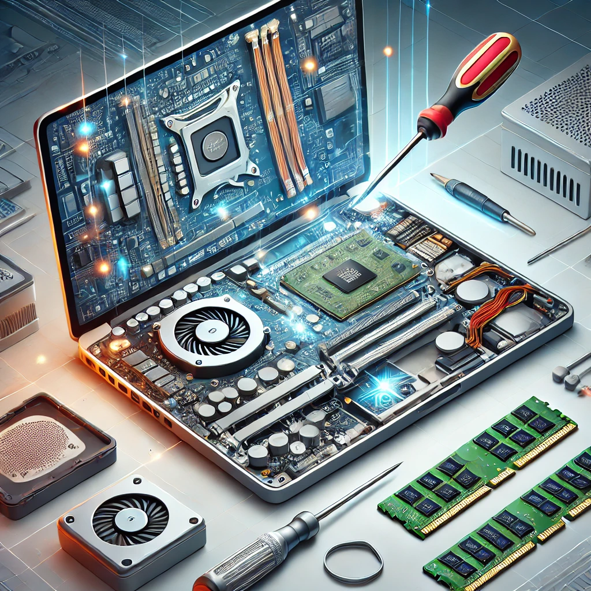
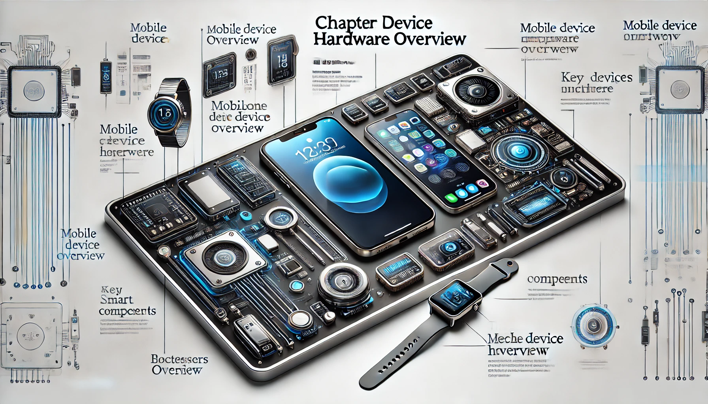

<!--
author: Jan Müller

titel: Lernfeld 14 Einzelplatz-Computersysteme konfigurieren und in Be-trieb nehmen (II)

icon: assets/BSO_LOGO_1.png

email:  Jan.Mueller4@schule.hessen.de

version:  0.1.0

language: Deutsch

narrator: Deutsch Female

comment: https://liascript.github.io/course/?https://raw.githubusercontent.com/JMueller-edu/SJ2425/refs/heads/main/LF14BFIT.md#1

link:     https://cdn.jsdelivr.net/chartist.js/latest/chartist.min.css

script:   https://cdn.jsdelivr.net/chartist.js/latest/chartist.min.js

import: https://raw.githubusercontent.com/liaScript/mermaid_template/master/README.md

-->

# LF14 Einzelplatz-Computersysteme konfigurieren und in Betrieb nehmen (II)

**Zielsetzung**

Die Schülerinnen und Schüler erstellen ein Pflichtenheft aufgrund der Kundenanforderungen.

Sie wählen Hard- und Softwarekomponenten auftragsbezogen aus. Sie installieren die Komponenten und konfigurieren das Gesamtsystem. Die Schülerinnen und Schüler nehmen das Computersystem in Betrieb, verfassen einen Prüfbericht und stellen die Geräteunterlagen für die Übergabe an den Kunden zusammen.

Die Schülerinnen und Schüler übergeben das System dem Kunden und präsentieren die Realisierung seiner Anforderungen.

[qr-code](https://liascript.github.io/course/?https://raw.githubusercontent.com/JMueller-edu/SJ2425/refs/heads/main/LF14BFIT.md#1)

https://tinyurl.com/25wtgg99

## 1. Halbjahr 24/25

```@mermaid
gantt
    dateFormat YYYY-MM-DDg
    axisFormat %W
    tickInterval 1week
    weekday monday
    section Advanced Computer Hardware
        KW38Fr     :2024-09-20, 1d
        KW39Fr     :2024-09-27, 1d
        KW40Fr     :2024-10-04, 1d
        KW41Fr     :2024-10-11, 1d
    section Preventive Maintenance and Troubleshooting
        KW44Fr     :2024-11-01, 1d
        KW45Fr     :2024-11-08, 1d
        KW46Fr     :2024-11-15, 1d
        KW47Fr     :2024-11-22, 1d
        KW48Fr     :2024-11-29, 1d
    Klausur    :milestone, 2024-12-06, 0d
    section Characteristics of Laptops and Other Mobile Devices
        KW50Fr     :2024-12-13, 1d
        KW51Fr     :2024-12-20, 1d
        KW02Fr     :2025-01-17, 1d
        KW03Fr     :2025-01-24, 1d
        KW04Fr     :2025-01-31, 1d
```

### Erweiterte Computer Hardware

```@mermaid
timeline
          Teilkompetenz Booten eines Computers
          : W1 BIOS and UEFI Settings
          : S1 Konfigurieren von BIOS and UEFI Settings
          : Die Lernenden können die Begriffe POST, BIOS, CMOS and UEFI beschreiben und die Firmenware eines Computers konfigurieren.
          
          Teilkompetenz Elektrische Leistung
          : W2 Elektrische Leistung
          : S2 Elektrischen Leistung verstehen
          : Die Lernenden können die Begriffe Leistung und Spannung erläutern. Sie kennen Stromschwankungen und Geräte, die vor Schäden durch diese schützen.

          Teilkompetenz Erweiterte Computerfunktionalität
          : W3 Erweiterte Computerfunktionalität
          : S3 Erweiterte Computerfunktionalität kennen lernen
          : Die Lernenden können die CPU-Architektur erläutern, kennen verschiedene RAID Systeme und können verschiedene Anschlüsse benennen. Darüber hinaus kennen Sie unterschiedliche Monitoreigenschaften.
              
          Teilkompetenz Computer Konfigurieren
          : W4 Komponenten zum Aufrüsten eines Computers
          : S4 Auswahl von Komponenten, um einen Computer nach Anforderung zu aktualisieren.
          : Die Lernenden können Komponenten hinsichtlich unterschiedlicher Anforderung zur Aktualisierung eines Computers auswählen.

          Teilkompetenz Umweltschutz
          : W5 Umweltschutz in der IT
          : S5 Sichere Entsorgungsmethoden zum Schutz der Umwelt
          : Die Lernenden kennen sichere Entsorgungsmethoden.

          Kompetenz <br> Optimieren von Computer
          : Die Lernenden können Computer optimieren, einschließlich der sicheren Entsorgung von elektronischem Abfall.
```
#### S1 3.1 Booten des Computers

**Arbeitsauftrag:**

1. Rufe den [Login der Cisco Networking Academy](https://www.netacad.com/) auf!

2. Melde dich dort mit deinen Zugangsdaten an.
   
3. Wähle nach dem Login im Dashboard unter `My Classes` den Kurs `IT Essentials 8` aus.
   
4. Wähle in der Kapitelübersicht das `Modul 3: Advanced Computer Hardware` aus.
   
5. Bearbeite die Unterkapitel `3.0` und `3.1`!

     - *Die Laborübungen brauchst du nicht zu absolvieren.*

6. Füge dem [Kahoot-Template](https://bsomichelstadtde-my.sharepoint.com/:x:/g/personal/jan_mueller_bso-michelstadt_de/ERRn9ekKVJtIl1kgHX1rb0wB2H1EFlfyvEqMYn9HBmosEA?e=B4VbaB) eine Quizzfrage pro Unterkapitel hinzu!

#### S2 3.2 Elektrische Leistung

**Arbeitsauftrag:**

1. Rufe den [Login der Cisco Networking Academy](https://www.netacad.com/) auf!

2. Melde dich dort mit deinen Zugangsdaten an.
   
3. Wähle nach dem Login im Dashboard unter `My Classes` den Kurs `IT Essentials 8` aus.
   
4. Wähle in der Kapitelübersicht das `Modul 3: Advanced Computer Hardware` aus.
   
5. Bearbeite das Unterkapitel `3.2`!

     - *Die Laborübungen brauchst du nicht zu absolvieren.*

6. Füge dem [Kahoot-Template](https://bsomichelstadtde-my.sharepoint.com/:x:/g/personal/jan_mueller_bso-michelstadt_de/ERRn9ekKVJtIl1kgHX1rb0wB2H1EFlfyvEqMYn9HBmosEA?e=B4VbaB) eine Quizzfrage pro Unterkapitel hinzu!

#### S3 3.3 Erweiterte Computerfunktionalität

**Arbeitsauftrag:**

1. Rufe den [Login der Cisco Networking Academy](https://www.netacad.com/) auf!

2. Melde dich dort mit deinen Zugangsdaten an.
   
3. Wähle nach dem Login im Dashboard unter `My Classes` den Kurs `IT Essentials 8` aus.
   
4. Wähle in der Kapitelübersicht das `Modul 3: Advanced Computer Hardware` aus.
   
5. Bearbeite das Unterkapitel `3.3`!

     - *Die Laborübungen brauchst du nicht zu absolvieren.*

#### S4 3.4 Computer Konfigurieren

**Arbeitsauftrag:**

1. Rufe den [Login der Cisco Networking Academy](https://www.netacad.com/) auf!

2. Melde dich dort mit deinen Zugangsdaten an.
   
3. Wähle nach dem Login im Dashboard unter `My Classes` den Kurs `IT Essentials 8` aus.
   
4. Wähle in der Kapitelübersicht das `Modul 3: Advanced Computer Hardware` aus.
   
5. Bearbeite das Unterkapitel `3.4`!

     - *Die Laborübungen brauchst du nicht zu absolvieren.*

#### S5 3.5 Umweltschutz in der IT

**Arbeitsauftrag:**

1. Rufe den [Login der Cisco Networking Academy](https://www.netacad.com/) auf!

2. Melde dich dort mit deinen Zugangsdaten an.
   
3. Wähle nach dem Login im Dashboard unter `My Classes` den Kurs `IT Essentials 8` aus.
   
4. Wähle in der Kapitelübersicht das `Modul 3: Advanced Computer Hardware` aus.
   
5. Bearbeite das Unterkapitel `3.5`!

     - *Die Laborübungen brauchst du nicht zu absolvieren.*

#### S6 3.6 + 3.7 Zusammenfassung und Test

**Arbeitsauftrag:**

1. Rufe den [Login der Cisco Networking Academy](https://www.netacad.com/) auf!

2. Melde dich dort mit deinen Zugangsdaten an.
   
3. Wähle nach dem Login im Dashboard unter `My Classes` den Kurs `IT Essentials 8` aus.
   
4. Wähle in der Kapitelübersicht das `Modul 3: Advanced Computer Hardware` aus.
   
5. Bearbeite das Unterkapitel `3.6`
   
6. Öffne das Modul Examen `3.7` und führe es durch!

- ***dein erster Versuch wird bewertet.***
- *Zum Anschließenden Üben kannst du beliebig viele weiteren Versuche durchführen.*


### Präventive Maßnahmen und Fehlerbehebung

```@mermaid
timeline
          Teilkompetenz Präventive Maßnahmen
          : W1 Warum sind präventive Maßnahmen notwendig
          : S1 präventive Maßnahmen kennenlernen
          : Die Lernenden wissen warum präventive Maßnahmen notwendig sind und  kennen diese.
          
          Teilkompetenz Prozess der Fehlerbehebung
          : W2 Fehlerbehebungsmaßnahmen kennenlernen
          : S2 Fehlerbehebungsmaßnahmen kennen
          : Die Lernenden kennen Fehlerbehebungsmaßnahmen für PCs und deren Perepherie.

          Kompetenz <br> Fehlerbehebung an Personalcomputern durchführen.
          : Die Lernenden können Fehler in Computersysteme beheben und verhindern.
```

#### S1 4.0 + 4.1 Präventive Maßnahmen

**Arbeitsauftrag:**

1. Rufe den [Login der Cisco Networking Academy](https://www.netacad.com/) auf!

2. Melde dich dort mit deinen Zugangsdaten an.
   
3. Wähle nach dem Login im Dashboard unter `My Classes` den Kurs `IT Essentials 8` aus.
   
4. Wähle in der Kapitelübersicht das `Modul 4: Preventive Maintenance and Troubleshooting` aus.
   
5. Bearbeite das Unterkapitel `4.0` und `4.1`

     ***Notiere dir dabei Wichtiges und halte für dich noch offene Fragen fest.*** 

6. Beantworte dir deine noch offenen Fragen mit Hilfe von Recherchen schriftlich.

7.  Reiche deine Notizen im [Schulportal](https://start.schulportal.hessen.de/index.php) in `mein Unterricht` in der Kursmappe `LF14 12BFIT` für die Stunde am `15.11.2024` ein.

8. Teile hier während der Schulstunde einer deiner Fragen.
   
   a) Öffne dazu im Arbeitsauftrag das Menü `Share` und tritt folgendem `Classroom` bei:
   
      - Backend = GUN
   
      - room = LF1420241115

    b) Schreibe deine Frage in folgendes Textfeld:

        [[___ ___]]  

##### FAQs

<details>

<summary>**Wie fördert vorbeugende Wartung die Stabilität eines IT-Systems?**</summary>

>Durch die Wartung wird zum Beispiel eine Ansammlung von Staub, Feuchtigkeit und anderen Fremdkörpern auf der empfindlichen Elektronik vermieden. Durch einen rechtzeitigen Tausch von Komponenten mit bestimmter Lebensdauer kann ein Ausfall verhindert werden. Regelmäßige Software-Updates und Sicherheitsüberprüfungen tragen ebenfalls zur Stabilität bei, indem sie Schwachstellen beheben und die Systemleistung optimieren.

</details>

<details>

<summary>**Warum sollte Staub im Computerinneren vermieden werden?**</summary>

>Der Staub kann Lüfter blockieren und Luftzugänge verschließen, was zu einem Wärmestau führen kann, der die Hardware beschädigt. Zudem kann Staub elektrische Kontakte beeinträchtigen und Kurzschlüsse verursachen. Regelmäßige Reinigung hilft, die Lebensdauer und Leistung des Computers zu erhalten.

</details>

<details>

<summary>**Wie wirkt sich Überhitzung auf die Lebensdauer eines Computers aus?**</summary>

>Zu hohe Hitze kann die Hardwarestrukturen verändern und damit schädigen. Dies kann zu einer Verkürzung der Lebensdauer von Komponenten wie der CPU, GPU und Festplatte führen. Überhitzung kann auch zu Systeminstabilität, Datenverlust und unerwarteten Abstürzen führen. Regelmäßige Wartung und ausreichende Kühlung sind daher entscheidend, um die Lebensdauer und Leistung des Computers zu erhalten.

</details>

<details>

<summary>**Welche Risiken bestehen bei der Verwendung von Druckluft für die Reinigung?**</summary>

>Der hohe Druck könnte Bauelemente lösen. Zudem kann Druckluft Feuchtigkeit enthalten, die empfindliche elektronische Komponenten beschädigen kann. Es besteht auch die Gefahr, dass Staub und Schmutz tiefer in das Gerät gedrückt werden, anstatt entfernt zu werden. Daher sollte Druckluft mit Vorsicht und in kurzen Stößen verwendet werden, und es ist ratsam, spezielle Druckluftdosen für die Elektronikreinigung zu verwenden, die trocken und ölfrei sind.

</details>

<details>

<summary>**Wie sieht eine PC-Wartung aus?** </summary>

>Eine PC-Wartung umfasst mehrere Schritte, um die Lebensdauer und Leistung des Computers zu erhalten:
> 
>>1. **Reinigung**: Entfernen von Staub und Schmutz aus dem Gehäuse, den Lüftern und den Kühlkörpern.
>>2. **Überprüfung der Hardware**: Sicherstellen, dass alle Komponenten ordnungsgemäß funktionieren und keine sichtbaren Schäden aufweisen.
>>3. **Software-Updates**: Installieren der neuesten Betriebssystem- und Treiber-Updates.
>>4. **Virenscan**: Durchführen eines vollständigen Scans auf Malware und Viren.
>>5. **Datensicherung**: Regelmäßiges Sichern wichtiger Daten auf externen Speichermedien.
>>6. **Überprüfung der Festplatte**: Überprüfen der Festplatte auf Fehler und defragmentieren, falls erforderlich.
>>7. **Überprüfung der Kühlung**: Sicherstellen, dass die Lüfter und Kühlkörper ordnungsgemäß funktionieren und keine Überhitzung auftritt.
>>8. **Überprüfung der Kabelverbindungen**: Sicherstellen, dass alle Kabel fest und sicher angeschlossen sind.

</details>

<details>

<summary> **Welche Vor- und Nachteile hat die kabellose Verbindung gegenüber der kabelgebundenen Verbindung in einem Netzwerk, besonders im Hinblick auf Geschwindigkeit, Sicherheit und Flexibilität?** </summary>

>**Vorteile der kabellosen Verbindung:**
>
>>- **Flexibilität:** Geräte können sich frei bewegen und bleiben dennoch verbunden.
>>- **Einfache Installation:** Keine Notwendigkeit, Kabel zu verlegen, was besonders in großen Gebäuden oder historischen Gebäuden vorteilhaft ist.
>>- **Zugänglichkeit:** Ermöglicht den einfachen Zugang zu Netzwerken in Bereichen, in denen Kabelverbindungen unpraktisch oder unmöglich sind.
>
>**Nachteile der kabellosen Verbindung:**
>
>>- **Geschwindigkeit:** Kabellose Verbindungen sind in der Regel langsamer als kabelgebundene Verbindungen, insbesondere bei hoher Netzwerkauslastung.
>>- **Sicherheit:** Kabellose Netzwerke sind anfälliger für Sicherheitsbedrohungen wie Abhören und unbefugten Zugriff.
>>- **Interferenzen:** Kabellose Signale können durch physische Hindernisse und andere elektronische Geräte gestört werden.
>
>**Vorteile der kabelgebundenen Verbindung:**
>
>>- **Geschwindigkeit:** Bietet in der Regel höhere und stabilere Geschwindigkeiten im Vergleich zu kabellosen Verbindungen.
>>- **Sicherheit:** Kabelgebundene Netzwerke sind weniger anfällig für Abhören und bieten eine sicherere Verbindung.
>>- **Zuverlässigkeit:** Weniger anfällig für Interferenzen und Signalverluste.
>
>**Nachteile der kabelgebundenen Verbindung:**
>
>>- **Beweglichkeit:** Geräte sind an ihre Kabel gebunden und können sich nicht frei bewegen.
>>- **Installation:** Das Verlegen von Kabeln kann zeitaufwendig und teuer sein, insbesondere in großen oder komplexen Umgebungen.
>>- **Ästhetik:** Sichtbare Kabel können unansehnlich sein und die Raumgestaltung beeinträchtigen.

</details>

<details>

<summary> **Wieso sollte man seine Lüfter beim (aus)blasen festhalten?** </summary>

>Beim Ausblasen der Lüfter sollte man diese festhalten, um zu verhindern, dass sie sich zu schnell drehen. Eine übermäßige Drehgeschwindigkeit kann die Lager beschädigen und die Lebensdauer des Lüfters verkürzen.

</details>

<details>

<summary> **In welchen regelmäßigen Abständen sollte ich meinen PC reinigen?** </summary>

>Es wird empfohlen, den PC alle 3 bis 6 Monate zu reinigen, abhängig von der Umgebung und der Staubbelastung. In staubigen Umgebungen oder bei intensiver Nutzung kann eine häufigere Reinigung notwendig sein.

</details>

#### S2 4.2 + 4.3 Prozess der Fehlerbehebung

**Arbeitsauftrag:**

1. Rufe den [Login der Cisco Networking Academy](https://www.netacad.com/) auf!

2. Melde dich dort mit deinen Zugangsdaten an.
   
3. Wähle nach dem Login im Dashboard unter `My Classes` den Kurs `IT Essentials 8` aus.
   
4. Wähle in der Kapitelübersicht das `Modul 4: Preventive Maintenance and Troubleshooting` aus.
   
5. Bearbeite das Unterkapitel `4.2` und `4.3`

     ***Notiere dir dabei Wichtiges und halte für dich noch offene Fragen fest.*** 

6. Beantworte dir deine noch offenen Fragen mit Hilfe von Recherchen schriftlich.
   
7. Teile hier während der Schulstunde einer deiner Fragen.
   
   a) Öffne dazu im Arbeitsauftrag das Menü `Share` und tritt folgendem `Classroom` bei:
   
      - Backend = GUN
   
      - room = LF1420241122

    b) Schreibe deine Frage in folgendes Textfeld:

        [[___ ___]]  

8. Reiche deine Notizen im [Schulportal](https://start.schulportal.hessen.de/index.php) in `mein Unterricht` in der Kursmappe `LF14 12BFIT` für die Stunde am `22.11.2024` ein.

#### Kompetenztest

**Arbeitsauftrag:**

1. Rufe den [Login der Cisco Networking Academy](https://www.netacad.com/) auf!

2. Melde dich dort mit deinen Zugangsdaten an.
   
3. Wähle nach dem Login im Dashboard unter `My Classes` den Kurs `IT Essentials 8` aus.
   
4. Wähle in der Kapitelübersicht das `Modul 4: Preventive Maintenance and Troubleshooting` aus.
   
5. Öffne das Module Examen `4.4` und führe dies durch!

   - ***dein erster Versuch wird bewertet.***
   - *Zum Anschließenden Üben kannst du beliebig viele weiteren Versuche durchführen.*

6. Notiere dir bei der Auswertung deines Examens die Fragen, bei denen dir die Antwort unverständlich vorkommt.

7. Teile hier während der Schulstunde einer dieser Fragen.
   
   - a) Öffne dazu im Arbeitsauftrag das Menü `Share` und tritt folgendem `Classroom` bei:

        - Backend = GUN

        - room = LF1420241129

    - b) Schreibe deine Frage in folgendes Textfeld:

        [[___ ___]]  


### Laptops und anderen mobilen Geräten

```@mermaid
timeline
          Teilkompetenz
          : S1 Eigenschaften von Laptops und anderen mobilen Geräten
          : Verstehen der Unterschiede und Gemeinsamkeiten von Laptops, Smartphones, Tablets und Wearables, einschließlich ihrer Anwendungsbereiche und grundlegender Komponenten.

          Teilkompetenz
          : S2 Laptop Konfiguration
          : Konfigurieren von Laptops, einschließlich Energieverwaltungsoptionen, BIOS-Einstellungen und drahtloser Konnektivität, um eine optimale Leistung sicherzustellen.

          Teilkompetenz
          : S3 Laptop-Hardware und Komponenteninstallation und -konfiguration      
          : Installieren und Konfigurieren von Hardwarekomponenten wie RAM, Erweiterungskarten oder Speicher, um die Funktionalität und Leistung eines Laptops zu verbessern.

          Teilkompetenz
          : S4 Übersicht über die Hardware anderer mobiler Geräte
          : Verständnis der Hardwarestruktur und Wartung von mobilen Geräten wie Smartphones und Spezialgeräten, einschließlich der Konnektivitätsoptionen und Austauschmöglichkeiten.

          Teilkompetenz
          : S5 Netzwerkverbindung und E-Mail
          : Einrichten von WLAN- und Mobilfunknetzwerken sowie Konfigurieren von E-Mail-Konten auf mobilen Geräten, um reibungslose Kommunikation sicherzustellen.

          Teilkompetenz
          : S6 Präventive Wartung für Laptops und andere mobile Geräte
          : Entwicklung von Wartungsstrategien zur Verlängerung der Lebensdauer und Verbesserung der Zuverlässigkeit von Laptops und mobilen Geräten.

          Teilkompetenz
          : S7 Grundlegender Fehlerbehebungsprozess für Laptops und andere mobile Geräte      
          :  Systematisches Analysieren und Beheben häufiger Probleme, die bei Laptops und mobilen Geräten auftreten können, einschließlich Hardware- und Softwareproblemen.

          Kompetenz <br> Laptops und andere mobile Geräte
          : Lernende erwerben die Fähigkeit, Laptops und mobile Geräte hinsichtlich ihrer Eigenschaften, Konfiguration, Wartung und Fehlerdiagnose zu verstehen und anzuwenden. Sie lernen Netzwerkverbindungen, moderne mobile Technologien und präventive Wartungsstrategien effektiv zu nutzen, um die Geräteleistung zu optimieren und typische Probleme zu beheben.
```

#### S1 Eigenschaften von Laptops und anderen mobilen Geräten


>**Stellt euch vor, ihr müsst eine Woche lang ohne Laptop, Smartphone oder Tablet auskommen – wie würde euer Alltag aussehen?**

>**Schaut euch kurz die Geräte um euch herum an – wer hat ein Smartphone oder Laptop dabei? Warum habt ihr euch genau für dieses Gerät entschieden?**

Willkommen in der Welt der mobilen Technologie! Dieses Kapitel zeigt dir, was moderne Geräte wie Laptops, Smartphones, Tablets und Wearables so besonders macht. Entdecke, wie sie funktionieren, was sie einzigartig macht und wie sie unser Leben revolutionieren. Egal, ob du ein Technikfreak bist oder einfach nur neugierig, was in deinem Smartphone oder Laptop steckt – hier findest du spannende Einblicke in die Technologien, die uns überall begleiten.

---

**Einzelarbeit:**

1. Rufe den [Login der Cisco Networking Academy](https://www.netacad.com/) auf!

2. Melde dich dort mit deinen Zugangsdaten an.
   
3. Wähle nach dem Login im Dashboard unter `My Classes` den Kurs `IT Essentials 8` aus.
   
4. Wähle in der Kapitelübersicht das `Modul 7: Laptops and Other Mobile Devices` aus.
   
5. Bearbeite das Unterkapitel `7.1`!

    - ***Erstelle dir dabei Notizen nach der [Cornell-Methode](https://www.youtube.com/watch?v=nX-xshA_0m8)*** 

    - ***Du kannst dafür dieses [Vorlage](assets/cornellNotes.pdf) verwenden***
   
---

**Plenumsdiskussion:**

>**1. Was unterscheidet eurer Meinung nach einen Laptop von einem Tablet? Wann würdet ihr welches Gerät nutzen?**

<details>

<summary>*Unterschiede zwischen Laptop und Tablet*</summary>

**Laptop:**

- **Bauweise:** Klappbar mit einer festen Tastatur und größerem Bildschirm.
- **Leistung:** In der Regel leistungsstärker mit einem vollwertigen Betriebssystem (z. B. Windows, macOS).
- **Anschlüsse:** Mehr physische Ports wie USB, HDMI und Ethernet.
- **Einsatzbereich:** Ideal für Arbeiten, die viel Rechenleistung oder umfangreiche Programme erfordern, wie Textverarbeitung, Videobearbeitung oder Programmierung.
- **Mobilität:** Mobil, aber weniger kompakt und schwerer als ein Tablet.

**Tablet:**

- **Bauweise:** Flach, ohne physische Tastatur (oft optional erhältlich), Touchscreen-basiert.
- **Leistung:** Weniger leistungsstark als ein Laptop, läuft meist auf mobilen Betriebssystemen (z. B. iOS, Android).
- **Anschlüsse:** Weniger oder keine physischen Ports, oft auf drahtlose Verbindungen angewiesen.
- **Einsatzbereich:** Perfekt für Medienkonsum (Filme, E-Books, Spiele), Videokonferenzen oder einfache Aufgaben wie E-Mails und Web-Recherchen.
- **Mobilität:** Sehr leicht und kompakt, ideal für unterwegs.

---

**Wann welches Gerät nutzen?**

- **Laptop:**
  
  - **Berufliche Arbeiten:** Schreiben von längeren Texten, komplexe Tabellenkalkulationen, Grafikdesign oder Softwareentwicklung.
  - **Bildung:** Online-Kurse, Hausarbeiten und Präsentationen.
  - **Gaming:** Für Spiele, die mehr Leistung und bessere Grafik benötigen.

- **Tablet:**

  - **Unterwegs:** Lesen, leichte Aufgaben oder Unterhaltung wie Filme und Spiele.
  - **Präsentationen:** Dank der Kompaktheit und der Möglichkeit, schnell Inhalte zu zeigen.
  - **Freizeit:** Zum Lesen von E-Books, Ansehen von Videos oder Surfen im Internet auf der Couch.

**Fazit:**

Die Wahl zwischen Laptop und Tablet hängt von den spezifischen Anforderungen ab. Wer produktiv arbeiten möchte, greift zum Laptop. Für leichte, mobile Anwendungen und Unterhaltung ist ein Tablet oft praktischer.

</details>

>**2. Welche Eigenschaften machen ein Smartphone für dich unverzichtbar, und was glaubst du, wie sich diese Geräte in den nächsten Jahren entwickeln werden?**

<details>

<summary> *Eigenschaften, die ein Smartphone unverzichtbar machen und deren Zukunft* </summary>

**Eigenschaften, die ein Smartphone unverzichtbar machen:**

1. **Konnektivität:**  
   
   - Smartphones ermöglichen durch WLAN, mobile Daten und Bluetooth eine ständige Verbindung mit der Welt. Kommunikation via Anruf, Nachricht oder Videochat ist jederzeit möglich.
   - Hotspot-Funktion, um andere Geräte zu verbinden, ist besonders praktisch.

2. **Flexibilität und Mobilität:**  
   
   - Klein, leicht und überall mitnehmbar – ein Smartphone ist wie ein Mini-Computer in der Tasche.
   - Kann für viele Aufgaben verwendet werden: Navigation, Einkaufen, Arbeiten, Lernen oder Unterhaltung.

3. **Apps und Funktionalitäten:**  
   
   - Eine App für nahezu jede Situation: Von Banking über Fitness-Tracker bis hin zu sozialen Medien.
   - Vielseitigkeit macht das Smartphone zu einem Allround-Tool.

4. **Kamera:**  
   
   - Hochwertige Kameras machen das Smartphone zum ständigen Begleiter für Foto- und Videoaufnahmen.
   - Funktionen wie Bildbearbeitung und Sharing in Echtzeit erhöhen die Attraktivität.

5. **Unterhaltung:**  
   
   - Smartphones bieten Zugang zu Streaming-Diensten, Spielen, E-Books und mehr – perfekt für unterwegs.

6. **Produktivität:**  
   
   - Mit Funktionen wie E-Mail, Cloud-Speicher und Dokumentenbearbeitung wird das Smartphone zum unverzichtbaren Arbeitsgerät.

---

**Zukunft der Smartphones:**

1. **Erweiterte Realität (AR):**  
   
   - AR-Technologien könnten immer mehr in den Alltag integriert werden, z. B. durch virtuelle Anleitungen oder Spiele, die mit der realen Welt interagieren.

2. **Noch smartere KI:**  
   
   - Künstliche Intelligenz wird immer leistungsstärker. Sprachassistenten wie Siri oder Google Assistant werden noch intuitiver, persönliche Empfehlungen noch präziser.

3. **Faltbare und anpassbare Displays:**  
   
   - Flexible und faltbare Displays werden populärer, um größere Bildschirme bei kompakter Bauweise zu ermöglichen.

4. **Verbesserte Batterietechnologien:**  
   
   - Schnellere Ladezeiten, längere Akkulaufzeit und möglicherweise neue Ansätze wie Solar- oder kinetisches Laden könnten Standard werden.

5. **Integration in den Alltag:**  
   
   - Noch engere Vernetzung mit Smart-Home-Geräten, Wearables und sogar implantierbaren Technologien.

6. **Umweltfreundlichere Ansätze:**  
   
   - Smartphones könnten nachhaltiger werden, z. B. durch modulare Designs, recyclebare Materialien und energieeffizientere Komponenten.

7. **Erweiterte Sicherheitsfeatures:**  
   
   - Fortschrittliche Biometrie wie Gesichtserkennung und Fingerabdruck-Scanner werden sicherer und zuverlässiger.

---

**Fazit:**

Ein Smartphone ist heute ein unverzichtbarer Begleiter, weil es alle Aspekte des modernen Lebens abdeckt: Kommunikation, Produktivität, Unterhaltung und mehr. In der Zukunft werden Smartphones immer smarter, vielseitiger und enger in unseren Alltag integriert – eine spannende Entwicklung, die unseren Umgang mit Technologie weiter verändern wird.

</details>

>**3. In welchen Situationen bevorzugt du Wearables wie Smartwatches, und wo seht du ihre Grenzen?**

<details>

<summary> *Situationen, in denen Wearables wie Smartwatches bevorzugt werden und deren Grenzen* </summary>

**Situationen, in denen Wearables wie Smartwatches bevorzugt werden:**

1. **Fitness und Gesundheit:**  
   
   - Beim Training, Laufen oder Radfahren sind Smartwatches ideal, um Schritte, Herzfrequenz, Kalorienverbrauch oder zurückgelegte Strecken zu messen.
   - Gesundheitsüberwachung: Funktionen wie Schlaftracking, Sauerstoffsättigung oder sogar die Erkennung von Herzrhythmusstörungen machen sie für die Gesundheitsvorsorge unverzichtbar.

2. **Unterwegs und Reisen:**  
   
   - Navigation am Handgelenk: Turn-by-Turn-Anweisungen, ohne das Smartphone herauszuholen, sind besonders praktisch beim Radfahren oder Wandern.
   - Kontaktloses Bezahlen über NFC macht sie zu einem handlichen Begleiter auf Reisen.

3. **Benachrichtigungen und Kommunikation:**  
   
   - Schneller Zugriff auf Benachrichtigungen, Anrufe oder Nachrichten, ohne ständig auf das Smartphone zu schauen.
   - Praktisch bei Meetings oder anderen Situationen, in denen ein Smartphone unpassend wäre.

4. **Zeiterfassung und Organisation:**  
   
   - Kalendereinträge und Erinnerungen direkt am Handgelenk – ideal für einen gut organisierten Alltag.
   - Zeiterfassung für berufliche oder persönliche Projekte.

5. **Freizeit und Musiksteuerung:**  
   
   - Musik direkt über die Smartwatch steuern oder beim Training ohne Smartphone Musik hören (bei LTE-Modellen).

---

**Grenzen von Wearables wie Smartwatches:**

1. **Abhängigkeit von Smartphones:**  
   
   - Viele Modelle benötigen ein verbundenes Smartphone, um die meisten Funktionen zu nutzen, was die Unabhängigkeit einschränkt.

2. **Begrenzte Akkulaufzeit:**  
   
   - Im Vergleich zu herkömmlichen Uhren muss eine Smartwatch oft täglich oder alle paar Tage geladen werden, was unbequem sein kann.

3. **Kleine Bildschirme:**  
   
   - Eingaben oder längere Texte auf dem kleinen Display sind oft mühsam und unpraktisch.

4. **Begrenzte Leistung:**  
   
   - Im Vergleich zu Smartphones sind Smartwatches weniger leistungsfähig und können keine anspruchsvollen Apps oder Programme ausführen.

5. **Kosten:**  
   
   - Hochwertige Wearables können teuer sein, insbesondere wenn man regelmäßig auf neue Modelle wechselt.

6. **Design und Tragekomfort:**  
   
   - Manche Smartwatches sind klobig oder unkomfortabel, insbesondere bei intensiven Aktivitäten oder langfristigem Tragen.

7. **Datenschutz:**  
   
   - Wearables sammeln viele persönliche Daten, was bei unzureichender Datensicherheit ein Risiko darstellen kann.

---

**Fazit:**

Smartwatches sind in vielen Alltagssituationen äußerst praktisch, besonders wenn es um Fitness, Gesundheit und schnelle Kommunikation geht. Ihre Grenzen liegen jedoch in der Abhängigkeit von Smartphones, der begrenzten Akkulaufzeit und der eingeschränkten Leistungsfähigkeit. Sie sind eine perfekte Ergänzung, aber kein vollständiger Ersatz für Smartphones oder traditionelle Uhren.

</details>

#### S2 Laptop Konfiguration


>**Stellt euch vor, euer Laptop ist plötzlich super langsam, der Akku hält nur noch eine Stunde, und das WLAN funktioniert nicht richtig. Was würdet ihr tun, um ihn wieder fit zu machen?**

>**Denkt an eure eigenen Geräte: Wann habt ihr zuletzt Einstellungen wie die Energiesparmodi, Bildschirmhelligkeit oder die Netzwerkeinstellungen geändert? Hat es einen Unterschied gemacht?**

Stell dir vor, du kannst deinen Laptop so anpassen, dass er perfekt auf dich zugeschnitten ist – egal, ob du ihn für Gaming, Schule oder kreatives Arbeiten nutzt. In diesem Kapitel lernst du, wie du die Leistung deines Laptops optimierst, Akkulaufzeiten verlängerst und drahtlose Verbindungen einrichtest. Entdecke, wie du mit ein paar Klicks die volle Kontrolle über dein Gerät übernimmst und das Beste aus deinem Laptop herausholst. Lass uns gemeinsam in die Welt der Laptop-Konfiguration eintauchen und dein technisches Know-how aufs nächste Level bringen!

---

**Einzelarbeit:**

1. Rufe den [Login der Cisco Networking Academy](https://www.netacad.com/) auf!

2. Melde dich dort mit deinen Zugangsdaten an.
   
3. Wähle nach dem Login im Dashboard unter `My Classes` den Kurs `IT Essentials 8` aus.
   
4. Wähle in der Kapitelübersicht das `Modul 7: Laptops and Other Mobile Devices` aus.
   
5. Bearbeite das Unterkapitel `7.2`!

    - ***Erstelle dir dabei Notizen nach der [Cornell-Methode](https://www.youtube.com/watch?v=nX-xshA_0m8)*** 

    - ***Du kannst dafür dieses [Vorlage](assets/cornellNotes.pdf) verwenden***

---

**Plenumsdiskussion:**

>**1. Was denkt ihr, welche Einstellungen ein neuer Laptop direkt nach dem Kauf braucht? Warum?**

<details>

<summary> *Wichtige Einstellungen für einen neuen Laptop nach dem Kauf und ihre Gründe* </summary>

1. **Betriebssystem-Updates:**  
   
   - **Warum?** Um sicherzustellen, dass der Laptop mit den neuesten Sicherheitsupdates und Funktionen ausgestattet ist. Dies schützt vor Schwachstellen und verbessert die Leistung.  
   - **Wie?** Über die Windows- oder macOS-Einstellungen die Option "Nach Updates suchen" aktivieren.

2. **Antivirensoftware einrichten:**  
   
   - **Warum?** Ein neuer Laptop ist ohne Schutz vor Malware und Viren anfällig. Eine Antivirensoftware sorgt für grundlegende Sicherheit.  
   - **Wie?** Eine vertrauenswürdige Antivirensoftware installieren oder die integrierte Software (z. B. Windows Defender) aktivieren.

3. **Energieoptionen konfigurieren:**  
   
   - **Warum?** Um die Akkulaufzeit zu optimieren und sicherzustellen, dass der Laptop effizient arbeitet, insbesondere bei mobiler Nutzung.  
   - **Wie?** Im Energieoptionen-Menü den Modus „Energiesparmodus“ oder „Ausbalanciert“ einstellen.

4. **WLAN-Verbindung einrichten:**  
   
   - **Warum?** Um den Laptop mit dem Internet zu verbinden und wichtige Funktionen wie Updates, Cloud-Dienste und Synchronisation zu nutzen.  
   - **Wie?** Netzwerkname (SSID) auswählen, Passwort eingeben und Verbindung herstellen.

5. **Benutzerkonto einrichten:**  
   
   - **Warum?** Ein persönliches Benutzerkonto erhöht die Sicherheit und ermöglicht die Individualisierung des Laptops.  
   - **Wie?** Während der Einrichtung ein Microsoft-, Apple- oder lokales Konto erstellen.

6. **Datensicherung einrichten:**  
   
   - **Warum?** Um wichtige Dateien vor Verlust zu schützen. Dies ist besonders wichtig bei unerwarteten Fehlern oder Datenverlust.  
   - **Wie?** Cloud-Dienste wie OneDrive, iCloud oder Google Drive aktivieren oder eine externe Festplatte konfigurieren.

7. **Standardprogramme installieren:**  
   
   - **Warum?** Um sicherzustellen, dass der Laptop für persönliche oder berufliche Bedürfnisse bereit ist, z. B. durch Office-Programme, Browser oder Multimedia-Software.  
   - **Wie?** Notwendige Software herunterladen und installieren.

8. **Bildschirmauflösung und Helligkeit einstellen:**  
   
   - **Warum?** Für ein optimales visuelles Erlebnis und zur Reduzierung der Belastung für die Augen.  
   - **Wie?** In den Anzeigeeinstellungen die empfohlene Auflösung und eine angenehme Helligkeit wählen.

9.  **Tastatur- und Spracheinstellungen anpassen:**  
    
   - **Warum?** Um sicherzustellen, dass das Layout und die Eingabesprache den eigenen Bedürfnissen entsprechen.  
   - **Wie?** Im Menü „Einstellungen“ die gewünschte Sprache und das Tastaturlayout auswählen.

10. **Datenschutz- und Berechtigungseinstellungen prüfen:**  
    
    - **Warum?** Um sicherzustellen, dass Apps nur auf die nötigen Daten zugreifen und persönliche Informationen geschützt sind.  
    - **Wie?** In den Datenschutz- oder Sicherheitseinstellungen die Berechtigungen überprüfen und anpassen.

---

**Fazit:**

Diese Einstellungen sind entscheidend, um den Laptop sicher, effizient und benutzerfreundlich zu machen. Indem man sich direkt nach dem Kauf darum kümmert, wird die Grundlage für eine langfristig problemlose Nutzung geschaffen.

</details>

>**2. Welche Einstellungen am Laptop können die Akkulaufzeit verlängern oder die Leistung verbessern? Nutzt ihr diese?**

<details>

<summary> *Einstellungen zur Verlängerung der Akkulaufzeit oder Verbesserung der Leistung* </summary>

**Akkulaufzeit verlängern:**

1. **Energiesparmodus aktivieren:**  

   - **Warum?** Der Energiesparmodus reduziert die Leistung von Prozessor und GPU und schaltet nicht benötigte Funktionen ab, um Energie zu sparen.  
   - **Wie?** Über die Energieoptionen das Profil "Energiesparmodus" wählen.  
   - **Nutzt ihr das?** Viele nutzen diese Einstellung bei längerer mobiler Nutzung, z. B. unterwegs oder im Unterricht.

2. **Bildschirmhelligkeit reduzieren:**  

   - **Warum?** Das Display ist einer der größten Energieverbraucher. Eine niedrigere Helligkeit spart erheblich Akku.  
   - **Wie?** Mit den Funktionstasten (z. B. "Fn" + Helligkeitstasten) oder in den Anzeigeeinstellungen anpassen.  
   - **Nutzt ihr das?** Häufig, besonders bei Innenräumen mit weniger Lichtbedarf.

3. **Hintergrund-Apps deaktivieren:**  

   - **Warum?** Apps, die im Hintergrund laufen, verbrauchen Strom, auch wenn sie nicht aktiv genutzt werden.  
   - **Wie?** In den Datenschutzeinstellungen unnötige Apps deaktivieren.  
   - **Nutzt ihr das?** Ja, vor allem bei Apps, die selten verwendet werden.

4. **WLAN und Bluetooth ausschalten:**  

   - **Warum?** Beide Technologien verbrauchen kontinuierlich Energie, auch wenn sie nicht aktiv genutzt werden.  
   - **Wie?** Über die Schnelleinstellungen deaktivieren, wenn keine Verbindung erforderlich ist.  
   - **Nutzt ihr das?** Oft, wenn man offline arbeitet oder unterwegs ist.

5. **Unnötige Animationen und Effekte ausschalten:**  

   - **Warum?** Visuelle Effekte wie Animationen benötigen zusätzliche Systemressourcen und Energie.  
   - **Wie?** In den Systemeinstellungen die "Leistung optimieren"-Option wählen.  
   - **Nutzt ihr das?** Manchmal, besonders bei älteren Geräten.

---

**Leistung verbessern:**

1. **Hochleistungsmodus aktivieren:**  

   - **Warum?** Er maximiert die Prozessorleistung und ermöglicht schnellere Reaktionszeiten, z. B. beim Gaming oder bei rechenintensiven Anwendungen.  
   - **Wie?** In den Energieoptionen den "Hochleistungsmodus" wählen.  
   - **Nutzt ihr das?** Ja, bei anspruchsvollen Anwendungen wie Videobearbeitung oder Spielen.

2. **Unnötige Programme beim Start deaktivieren:**  

   - **Warum?** Programme, die automatisch starten, verlangsamen das System und verbrauchen Ressourcen.  
   - **Wie?** Im Task-Manager unter "Autostart" die Liste bereinigen.  
   - **Nutzt ihr das?** Regelmäßig, um die Systemleistung hoch zu halten.

3. **Aktuelle Treiber und Software installieren:**  

   - **Warum?** Neue Treiber sorgen für bessere Hardware-Kompatibilität und optimieren die Leistung.  
   - **Wie?** Über den Geräte-Manager oder Hersteller-Websites die Treiber aktualisieren.  
   - **Nutzt ihr das?** Oft, vor allem nach Updates oder bei Leistungsproblemen.

4. **Zwischenspeicher und temporäre Dateien bereinigen:**  

   - **Warum?** Temporäre Dateien belegen Speicherplatz und können das System verlangsamen.  
   - **Wie?** Über Tools wie die Datenträgerbereinigung oder Drittanbieter-Programme wie CCleaner.  
   - **Nutzt ihr das?** Ja, besonders bei älteren Geräten.

5. **Grafikeinstellungen anpassen:**  

   - **Warum?** Reduzierte Grafikqualität bei weniger anspruchsvollen Aufgaben entlastet die GPU und spart Energie.  
   - **Wie?** In den Einstellungen des Betriebssystems oder in Software von Grafikkartenherstellern (z. B. NVIDIA oder AMD).  
   - **Nutzt ihr das?** Ja, bei älteren Laptops oder Geräten mit integrierten Grafikkarten.

---

**Fazit:**

Die richtige Balance zwischen Akkulaufzeit und Leistung hängt von der Nutzung ab. Viele Einstellungen können je nach Situation angepasst werden, z. B. für mobiles Arbeiten oder rechenintensive Aufgaben. Die Nutzung dieser Optionen ermöglicht eine optimale und flexible Laptop-Nutzung.

</details>

>**3. Wie wichtig sind Netzwerkeinstellungen wie WLAN- und Bluetooth-Konfigurationen? Welche Herausforderungen habt ihr dabei erlebt?**

<details>

<summary> *Bedeutung von Netzwerkeinstellungen wie WLAN- und Bluetooth-Konfigurationen* </summary>

**Wichtigkeit:**

1. **Zugriff auf das Internet:**  

   - **WLAN:** Essenziell, um Zugriff auf Online-Ressourcen, Cloud-Dienste, Streaming-Plattformen und Kommunikationstools wie E-Mails und Videoanrufe zu erhalten.  
   - Ohne eine korrekte WLAN-Konfiguration kann ein Laptop kaum produktiv genutzt werden.

2. **Datenübertragung und Geräteverbindung:**  

   - **Bluetooth:** Wichtige Technologie für die kabellose Verbindung mit Peripheriegeräten wie Kopfhörern, Mäusen, Tastaturen oder Smartphones.  
   - Erleichtert den Datenaustausch und ermöglicht den Einsatz moderner Technologien wie Smartwatches oder IoT-Geräten.

3. **Effiziente Nutzung:**  

   - Richtig konfigurierte Netzwerkeinstellungen optimieren die Geschwindigkeit und Stabilität der Verbindungen, was besonders bei Videokonferenzen, Online-Gaming oder großen Downloads wichtig ist.

4. **Sicherheit:**  

   - Netzwerkeinstellungen wie WPA3-Verschlüsselung oder sichere Bluetooth-Kopplung schützen persönliche Daten und verhindern unbefugten Zugriff.  
   - Fehlerhafte oder veraltete Konfigurationen können die Sicherheit gefährden.

---

**Herausforderungen:**

1. **Verbindungsprobleme:**  

   - **Beispiele:** WLAN wird nicht erkannt, Bluetooth-Geräte koppeln nicht oder die Verbindung ist instabil.  
   - **Lösung:** Netzwerktreiber aktualisieren, Router neu starten oder Störungen durch andere Geräte (z. B. Mikrowellen) vermeiden.

2. **Komplexe Netzwerkeinstellungen:**  

   - **Beispiele:** Einstellungen wie IP-Adressen, DNS-Server oder Proxy-Konfigurationen können für Laien verwirrend sein.  
   - **Lösung:** Automatische Konfiguration nutzen oder Anleitungen und Support-Tools verwenden.

3. **Sicherheitsprobleme:**  

   - **Beispiele:** Unsichere WLAN-Netzwerke, offene Hotspots oder veraltete Bluetooth-Protokolle, die Angriffe ermöglichen könnten.  
   - **Lösung:** Sichere Netzwerke bevorzugen, regelmäßige Updates durchführen und ungenutzte Verbindungen deaktivieren.

4. **Reichweitenprobleme:**  

   - **Beispiele:** WLAN-Signale sind in bestimmten Bereichen schwach oder Bluetooth-Verbindungen reißen bei zu großer Entfernung ab.  
   - **Lösung:** WLAN-Repeater einsetzen, Geräte näher an den Router bringen oder die Frequenzbänder (2,4 GHz vs. 5 GHz) wechseln.

5. **Kompatibilitätsprobleme:**  

   - **Beispiele:** Ältere Bluetooth-Geräte funktionieren nicht mit modernen Laptops oder Netzwerkkarten unterstützen keine aktuellen Standards wie Wi-Fi 6.  
   - **Lösung:** Kompatible Geräte nutzen oder Hardware aufrüsten.

---

**Fazit:**
Netzwerkeinstellungen sind unverzichtbar für die Funktionalität und Sicherheit moderner Laptops. Herausforderungen wie Verbindungsprobleme, Sicherheitsrisiken oder technische Inkompatibilitäten sind häufig, lassen sich aber mit den richtigen Einstellungen, aktuellen Treibern und einer grundlegenden Kenntnis der Netzwerktechnologie gut bewältigen. Ein korrekt konfiguriertes Netzwerk ist der Schlüssel für eine reibungslose Nutzung in nahezu allen digitalen Bereichen.

</details>


#### S3 Laptop-Hardware und Komponenteninstallation und -konfiguration



>**Stellt euch vor, euer Laptop läuft nicht mehr richtig, und ihr wisst, dass der Arbeitsspeicher (RAM) erweitert werden muss. Traut ihr euch zu, das selbst zu machen, oder lasst ihr lieber einen Profi ran?**

>**Wer von euch hat schon einmal die Hardware eines Laptops geöffnet, sei es, um etwas zu reparieren oder zu upgraden? Was war dabei die größte Herausforderung?**

Bist du bereit, deinen Laptop von innen kennenzulernen? In diesem Kapitel tauchst du in die Welt der Hardware ein und lernst, wie du Komponenten wie RAM, SSDs und Adapterkarten selbst installieren und konfigurieren kannst. Egal, ob du deinen Laptop aufrüsten oder einfach nur verstehen möchtest, wie er funktioniert – hier wirst du zum Technikprofi und machst dich fit für praktische Herausforderungen.

---

**Einzellarbeit:**

1. Rufe den [Login der Cisco Networking Academy](https://www.netacad.com/) auf!

2. Melde dich dort mit deinen Zugangsdaten an.
   
3. Wähle nach dem Login im Dashboard unter `My Classes` den Kurs `IT Essentials 8` aus.
   
4. Wähle in der Kapitelübersicht das `Modul 7: Laptops and Other Mobile Devices` aus.
   
5. Bearbeite das Unterkapitel `7.3`!

    - ***Erstelle dir dabei Notizen nach der [Cornell-Methode](https://www.youtube.com/watch?v=nX-xshA_0m8)*** 

    - ***Du kannst dafür dieses [Vorlage](assets/cornellNotes.pdf) verwenden***

---

**Plenumsdiskussion:**

>**1. Was sind die ersten Schritte, bevor ihr die Hardware eines Laptops verändert? Welche Werkzeuge braucht man dafür?**

<details>

<summary> *Erste Schritte vor der Änderung der Laptop-Hardware und Werkzeuge* </summary>

**Erste Schritte vor der Änderung der Laptop-Hardware**

1. **Daten sichern:**  

   - **Warum?** Es besteht immer ein Risiko, dass bei der Arbeit an der Hardware Daten verloren gehen könnten. Ein Backup wichtiger Dateien auf einer externen Festplatte oder in der Cloud ist essenziell.  
   - **Wie?** Tools wie OneDrive, Google Drive oder ein externes Speichermedium nutzen.

2. **Laptop ausschalten und vom Strom trennen:**  

   - **Warum?** Elektrische Verbindungen können zu Schäden an den Komponenten oder zur Verletzung führen.  
   - **Wie?** Gerät ausschalten, Netzteil abstecken und Akku (wenn möglich) entfernen.

3. **ESD-Schutz sicherstellen:**  

   - **Warum?** Elektrostatische Entladung (ESD) kann empfindliche elektronische Bauteile beschädigen.  
   - **Wie?** Mit einer antistatischen Matte oder einem ESD-Armband arbeiten und auf einem sauberen, nicht leitfähigen Arbeitsplatz arbeiten.

4. **Dokumentation prüfen:**  

   - **Warum?** Herstelleranleitungen bieten wichtige Hinweise zur genauen Position der Komponenten und zur Vorgehensweise.  
   - **Wie?** Service-Handbücher oder Online-Ressourcen des Herstellers konsultieren.

5. **Arbeitsbereich vorbereiten:**  

   - **Warum?** Ein aufgeräumter, gut beleuchteter Arbeitsplatz erleichtert die Arbeit und verhindert das Verlieren von Kleinteilen wie Schrauben.  
   - **Wie?** Kleine Behälter für Schrauben bereitstellen und Werkzeug griffbereit legen.

---

**Benötigte Werkzeuge**

1. **Grundlegende Werkzeuge:**

   - **Schraubendreher-Set:**  
     - Für die meisten Laptops sind Kreuzschlitz- und Torx-Schraubendreher in verschiedenen Größen nötig.
   - **Spudger (Kunststoffhebelwerkzeug):**  
     - Zum vorsichtigen Öffnen von Gehäusen ohne Beschädigungen.
   - **Pinzette:**  
     - Zum Entfernen oder Platzieren kleiner Bauteile und Schrauben.

2. **Spezielle Werkzeuge:**

   - **Antistatisches Armband oder Matte:**  
     - Verhindert Schäden durch elektrostatische Entladungen.
   - **Lötkolben (bei Bedarf):**  
     - Für fortgeschrittene Reparaturen, z. B. am Netzanschluss.
   - **Thermalpaste:**  
     - Wird benötigt, wenn der Prozessor oder die Kühlung ausgetauscht wird.

3. **Organisationshilfen:**

   - **Behälter für Schrauben:**  
     - Um kleine Teile nicht zu verlieren.
   - **Magnetische Matte:**  
     - Um Schrauben sicher aufzubewahren.

4. **Reinigungswerkzeuge:**

   - **Druckluftspray:**  
     - Zum Entfernen von Staub und Schmutz.
   - **Mikrofasertuch:**  
     - Zum Reinigen empfindlicher Oberflächen.

---

**Fazit:**

Die Vorbereitung ist entscheidend für eine erfolgreiche Hardwareänderung. Mit den richtigen Schritten und Werkzeugen minimierst du Risiken und machst den Prozess effizienter und sicherer. Gut vorbereitet zu sein, spart nicht nur Zeit, sondern schützt auch deinen Laptop vor unnötigen Schäden.

</details>

>**2. Welche Herausforderungen können bei der Installation von RAM oder einer SSD auftreten, und wie löst ihr sie?**

<details>

<summary> *Herausforderungen bei der Installation von RAM oder einer SSD und deren Lösungen* </summary>

**Herausforderungen bei der Installation von RAM:**

1. **Kompatibilitätsprobleme:**  

   - **Problem:** Der neue RAM ist nicht kompatibel mit dem Mainboard (z. B. falscher Typ wie DDR4 statt DDR3) oder unterstützt nicht die Kapazität oder Geschwindigkeit.  
   - **Lösung:** Vor dem Kauf die technischen Spezifikationen des Laptops prüfen. Hersteller-Websites oder Tools wie "Crucial System Scanner" helfen, kompatible RAM-Module zu finden.

2. **Falsche Installation:**  

   - **Problem:** Der RAM wird nicht richtig eingesetzt, z. B. nicht vollständig eingerastet oder falsch herum eingesetzt.  
   - **Lösung:** Sicherstellen, dass der RAM in der richtigen Ausrichtung in den Steckplatz eingesetzt wird, bis er hörbar einrastet. Dabei sanften Druck verwenden.

3. **Keine Erkennung durch das System:**  

   - **Problem:** Nach der Installation wird der RAM vom Laptop nicht erkannt.  
   - **Lösung:** Laptop neu starten und BIOS/UEFI prüfen, ob der neue RAM angezeigt wird. Falls nicht, den RAM erneut einbauen und die Kontakte auf Verschmutzungen prüfen.

4. **Beschränkungen durch das Betriebssystem:**  

   - **Problem:** Das Betriebssystem erkennt nicht die volle RAM-Kapazität (z. B. bei einer 32-Bit-Version von Windows).  
   - **Lösung:** Auf ein 64-Bit-Betriebssystem upgraden, das größere RAM-Kapazitäten unterstützt.

---

**Herausforderungen bei der Installation einer SSD:**

1. **Falscher Anschluss:**  

   - **Problem:** Die SSD passt nicht in den vorgesehenen Anschluss, z. B. eine NVMe-SSD in einem SATA-Steckplatz.  
   - **Lösung:** Vorher prüfen, ob der Laptop SATA- oder NVMe-SSDs unterstützt, und den passenden Formfaktor (z. B. 2,5 Zoll oder M.2) wählen.

2. **SSD wird nicht erkannt:**  

   - **Problem:** Nach dem Einbau zeigt das System die neue SSD nicht an.  
   - **Lösung:** Im BIOS/UEFI prüfen, ob die SSD erkannt wird. Falls nicht, sicherstellen, dass die SSD korrekt angeschlossen ist. Anschließend die SSD in der Datenträgerverwaltung initialisieren und formatieren.

3. **Befestigungsprobleme:**  

   - **Problem:** Die SSD sitzt nicht sicher im Steckplatz oder das Gehäuse bietet keine Befestigungspunkte.  
   - **Lösung:** Geeignete Schrauben oder Adapter verwenden, um die SSD sicher zu fixieren. Für M.2-SSDs auf die richtige Schraubengröße achten.

4. **Klonen des Betriebssystems:**  

   - **Problem:** Der Umzug von einer alten Festplatte auf die neue SSD (Klonen) schlägt fehl oder das Betriebssystem startet nicht korrekt.  
   - **Lösung:** Ein zuverlässiges Klon-Tool wie "Macrium Reflect" oder "AOMEI Backupper" verwenden. Vor dem Klonen sicherstellen, dass die Partitionen korrekt ausgerichtet sind (GPT/MBR).

5. **Performanceprobleme:**  

   - **Problem:** Die SSD erreicht nicht die erwartete Geschwindigkeit.  
   - **Lösung:** Prüfen, ob der Anschluss im richtigen Modus läuft (z. B. AHCI für SATA-SSDs) und ob alle Treiber aktuell sind. Für NVMe-SSDs den entsprechenden Treiber des Herstellers installieren.

---

**Allgemeine Tipps zur Fehlervermeidung:**

1. **Vorbereitung:**  

   - Dokumentation des Laptops lesen, um die Position der Steckplätze und Kompatibilitätsanforderungen zu kennen.
   
2. **Sicherheitsmaßnahmen:**  

   - Den Laptop ausschalten, vom Stromnetz trennen und den Akku (falls möglich) entfernen. Mit einem antistatischen Armband arbeiten, um ESD-Schäden zu vermeiden.

3. **System überprüfen:**  

   - Nach der Installation das BIOS/UEFI und das Betriebssystem auf korrekte Erkennung prüfen.

---

**Fazit:**

Die häufigsten Herausforderungen bei der Installation von RAM oder einer SSD lassen sich durch sorgfältige Planung und richtige Werkzeuge einfach lösen. Kompatibilität prüfen, Dokumentation beachten und auf mögliche Fehlerquellen vorbereitet sein – das macht den Prozess reibungslos und erfolgreich.

</details>

>**3. Was muss man tun, nachdem die Hardware eingebaut ist? Wie testet ihr, ob alles funktioniert?"**

<details>

<summary> *Schritte nach dem Einbau von Hardware und Tests zur Funktionsüberprüfung* </summary>

**1. Sichtprüfung und Endmontage**

- **Schrauben überprüfen:** Sicherstellen, dass alle Schrauben festgezogen und keine Teile lose sind.
- **Kabel prüfen:** Kontrollieren, dass alle Kabelverbindungen korrekt eingesteckt sind, z. B. SATA-Kabel für SSDs oder Netzteilkabel.
- **Gehäuse schließen:** Das Gehäuse des Laptops vorsichtig schließen und prüfen, ob es korrekt einrastet.

---

**2. Laptop starten**

- **Erster Start:** Den Laptop einschalten und sicherstellen, dass er ohne Fehlermeldungen hochfährt.
- **BIOS/UEFI aufrufen:** Beim Start ins BIOS/UEFI gehen (meist durch Drücken von Tasten wie F2, F12 oder DEL) und prüfen, ob die neue Hardware erkannt wird:
  - **RAM:** Die installierte Menge und Geschwindigkeit des Arbeitsspeichers überprüfen.
  - **SSD:** Sicherstellen, dass die neue SSD in der Geräteübersicht erscheint.

---

**3. Betriebssystem überprüfen**

- **RAM-Test im Betriebssystem:**
  - Unter Windows: Im Task-Manager (Strg + Shift + Esc) die verfügbare Speichermenge prüfen.
  - Unter macOS: Im "Über diesen Mac"-Menü die installierte RAM-Menge überprüfen.
- **SSD-Test im Betriebssystem:**
  - Im Festplatten- oder Datenträgermanagement sicherstellen, dass die SSD erkannt wurde. Falls nötig, die SSD initialisieren und formatieren.

---

**4. Hardware-Tests durchführen**

- **RAM-Test:**
  - Tools wie **MemTest86** oder die Windows-Speicherdiagnose verwenden, um den RAM auf Fehler zu prüfen.
- **SSD-Test:**
  - Mit Tools wie **CrystalDiskInfo**, **Samsung Magician** oder dem Hersteller-Tool die Lese- und Schreibgeschwindigkeit überprüfen und sicherstellen, dass die SSD korrekt funktioniert.

---

**5. Funktionalität des gesamten Systems testen**

- **Leistung überprüfen:**
  - Das System unter normalen und höheren Belastungen (z. B. durch Multitasking oder Benchmarks) testen, um sicherzustellen, dass die Hardware stabil läuft.
- **Temperatur prüfen:**
  - Tools wie **HWMonitor** oder **Core Temp** verwenden, um die Temperaturen der Komponenten (z. B. RAM und SSD) zu überwachen. Überhitzung könnte auf Installationsfehler hindeuten.
- **Fehler im Betrieb beobachten:**
  - Nach ungewöhnlichen Geräuschen, Abstürzen oder Performanceeinbrüchen Ausschau halten.

---

**6. Software und Treiber aktualisieren**

- **Aktuelle Treiber installieren:**
  - RAM benötigt in der Regel keine Treiber, aber für SSDs (insbesondere NVMe) sollten die neuesten Treiber vom Hersteller installiert werden.
- **Firmware aktualisieren:**
  - Für SSDs kann ein Firmware-Update die Stabilität und Leistung verbessern.

---

**7. Datensicherung und Konfiguration**

- **Backup erstellen:** Vor dem ersten intensiven Gebrauch eine Sicherung der neuen Konfiguration und Daten anlegen.
- **Einstellungen anpassen:** Die neue Hardware an die eigenen Bedürfnisse anpassen, z. B. Partitionen für eine SSD erstellen.

---

**Fazit:**

Nach dem Einbau von Hardware sind gründliche Tests und Überprüfungen entscheidend, um die Funktionalität sicherzustellen. Mit den richtigen Tools und Schritten können potenzielle Probleme schnell erkannt und behoben werden, bevor der Laptop in den Alltag integriert wird.
</details>

#### S4 Übersicht über die Hardware anderer mobiler Geräte



>**Impulsfragen:**
>
>>**Was glaubst du, welche Hardwarekomponente in einem Smartphone am wichtigsten ist – der Prozessor, der Akku oder der Speicher? Warum?**
>
>>**Hast du dich schon mal gefragt, wie viele Sensoren in einem Smartphone stecken und welche Rolle sie in deinem Alltag spielen?**

Tauche ein in die faszinierende Welt der mobilen Hardware! Smartphones, Tablets und Smartwatches sind kleine technische Wunderwerke, die nur deshalb so leistungsfähig sind, weil sie eine Vielzahl perfekt aufeinander abgestimmter Komponenten besitzen. In diesem Kapitel lernst du, was in diesen Geräten steckt und wie Akkus, Prozessoren, Sensoren und Speicher zusammenarbeiten, um dein digitales Leben zu erleichtern.

---

**Einzellarbeit:**

1. Rufe den [Login der Cisco Networking Academy](https://www.netacad.com/) auf!

2. Melde dich dort mit deinen Zugangsdaten an.
   
3. Wähle nach dem Login im Dashboard unter `My Classes` den Kurs `IT Essentials 8` aus.
   
4. Wähle in der Kapitelübersicht das `Modul 7: Laptops and Other Mobile Devices` aus.
   
5. Bearbeite das Unterkapitel `7.4`!

    - ***Erstelle dir dabei Notizen nach der [Cornell-Methode](https://www.youtube.com/watch?v=nX-xshA_0m8)*** 

    - ***Du kannst dafür dieses [Vorlage](assets/cornellNotes.pdf) verwenden***

---

**Plenumsdiskussion:**

>**1. Welche Hauptkomponenten findest du in einem Smartphone, und welche Aufgaben übernehmen sie?**

<details>

<summary> *Hauptkomponenten mit Funktionalität* </summary>

- **Prozessor (CPU):** Führt Rechenaufgaben aus und steuert das gesamte System.  
- **Akku:** Versorgt das Gerät mit Energie und beeinflusst die Laufzeit.  
- **Speicher (RAM und ROM):** RAM ermöglicht schnelles Arbeiten mit Anwendungen, während der ROM-Speicher die dauerhafte Datenspeicherung übernimmt.  
- **Sensoren:** Ermöglichen Funktionen wie Gesichtserkennung, Bewegungserkennung oder Standortbestimmung (z. B. Gyroskop, GPS).  
- **Display:** Zeigt Inhalte an und ermöglicht Interaktionen über den Touchscreen.

</details>

>**2. Warum sind Akkus ein kritischer Bestandteil mobiler Geräte, und welche Technologien tragen zur Verbesserung ihrer Laufzeit bei?**

<details>

<summary> *Akkutechnologien* </summary>

- Akkus liefern die Energie, ohne die ein mobiles Gerät nicht funktionieren kann. Ein effizienter Akku bestimmt maßgeblich, wie lange ein Smartphone oder Tablet verwendet werden kann.  
- **Verbesserungen:**  

  - **Lithium-Ionen-Technologie:** Bietet eine hohe Energiedichte und lange Lebensdauer.  
  - **Schnellladetechnologie:** Reduziert die Ladezeit durch höhere Ladeleistungen.  
  - **Adaptive Energieverwaltung:** Optimiert den Energieverbrauch durch intelligente Steuerung der Ressourcen.  
  - **Energiesparmodi:** Reduzieren den Stromverbrauch durch Abschaltung nicht benötigter Funktionen.

</details>

>**3. Welche Rolle spielen Sensoren in mobilen Geräten, und wie beeinflussen sie den Alltag der Nutzer?**

<details>

<summary> *Die Macht der Sensoren* </summary>

- Sensoren machen mobile Geräte vielseitig und interaktiv. Sie erfassen Umweltdaten oder Bewegungen und ermöglichen Funktionen, die den Alltag erleichtern.  
- **Beispiele:**  
  
  - **Gyroskop und Beschleunigungssensor:** Erkennen die Ausrichtung und Bewegung des Geräts, wichtig für Spiele, Navigation und Augmented Reality.  
  - **Nähe- und Helligkeitssensor:** Optimieren das Display basierend auf Umgebungslicht oder schalten den Bildschirm beim Telefonieren aus.  
  - **GPS:** Dient zur Navigation und Standortbestimmung für Apps wie Karten oder Tracking-Services.  
  - **Fingerabdrucksensor:** Sorgt für Sicherheit durch biometrische Authentifizierung.  
  - **Barometer:** Ermöglicht präzise Höhenerkennung und Wettervorhersagen.

</details> 