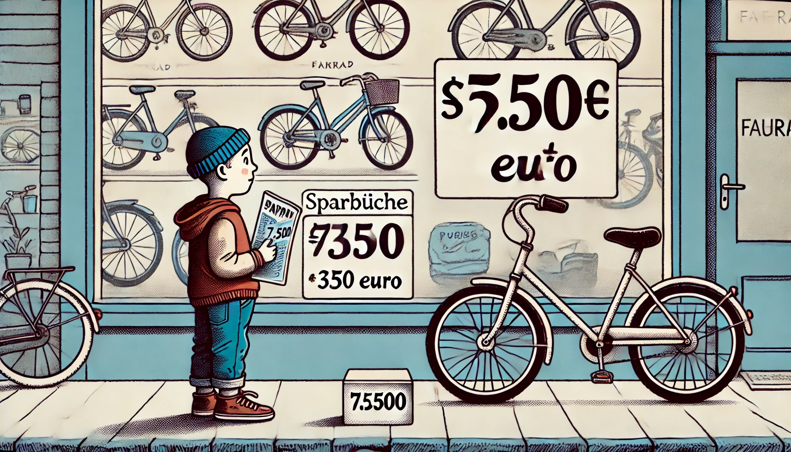
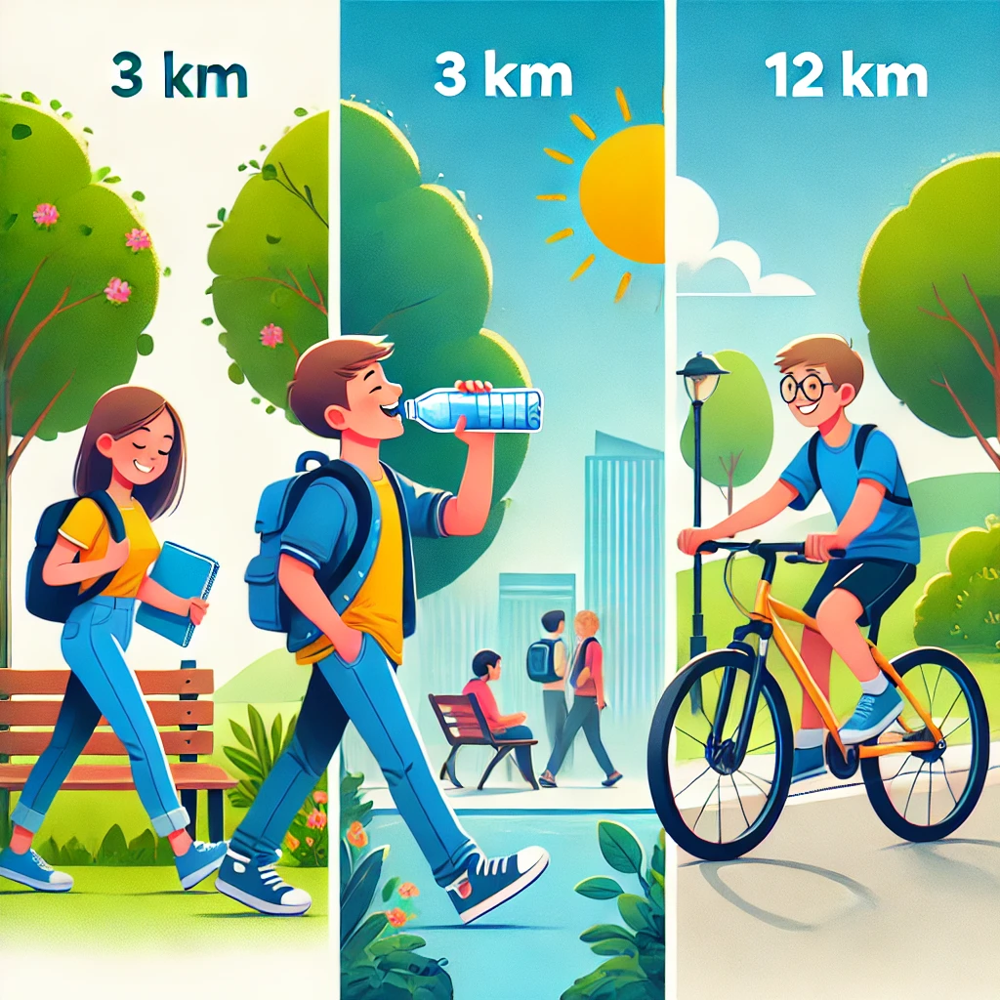

<!--
author: Jan Müller

titel: Mathematik Bildungsgang zur Berufsvorbereitung

icon: assets/BSO_LOGO_1.png

email:  Jan.Mueller4@schule.hessen.de

version:  0.1.0

language: Deutsch

narrator: Deutsch Female

comment: https://liascript.github.io/course/?https://raw.githubusercontent.com/JMueller-edu/SJ2425/main/MatheBzB.md#1

link:     https://cdn.jsdelivr.net/chartist.js/latest/chartist.min.css

script:   https://cdn.jsdelivr.net/chartist.js/latest/chartist.min.js

script:   https://cdnjs.cloudflare.com/ajax/libs/mathjs/13.2.0/math.min.js

import: https://raw.githubusercontent.com/liaScript/mermaid_template/master/README.md

import: https://raw.githubusercontent.com/LiaTemplates/CollaborativeDrawing/main/README.md

@style
.flex-container {
    display: flex;
    flex-wrap: wrap; /* Allows the items to wrap as needed */
    align-items: stretch;
    gap: 20px; /* Adds both horizontal and vertical spacing between items */
}

.flex-child { 
    flex: 1;
    margin-right: 20px; /* Adds space between the columns */
}

@media (max-width: 600px) {
    .flex-child {
        flex: 100%; /* Makes the child divs take up the full width on slim devices */
        margin-right: 0; /* Removes the right margin */
    }
}
@end

-->

# Mathematik Bildungsgang zur Berufsvorbereitung

```@mermaid
gantt
    dateFormat YYYY-MM-DDg
    axisFormat %W
    tickInterval 1week
    weekday monday
        section Ganze Zahlen
        KW35Di     :2024-08-27, 1d
        KW35Fr     :2024-08-30, 1d
        KW36Di     :2024-09-03, 1d
        KW36Fr     :2024-09-06, 1d
        KW37Di     :2024-09-10, 1d
        KW37Fr     :2024-09-13, 1d
        section Brüche
        KW38Di     :2024-09-17, 1d
        KW38Fr     :2024-09-20, 1d
        KW39Di     :2024-09-24, 1d
        KW39Fr     :2024-09-27, 1d
        KW40Di     :2024-10-01, 1d
        KW40Fr     :2024-10-04, 1d
        1. Klausur : milestone, 2024-10-08
        section Größen
        KW41Di     :2024-10-08, 1d
        KW41Fr     :2024-10-11, 1d
        KW44Di     :2024-10-29, 1d
        KW44Fr     :2024-11-01, 1d
        KW48Di     :2024-11-26, 1d
        KW48Fr     :2024-11-29, 1d
        section Zuordnung und Dreisatz
        KW49Di     :2024-12-03, 1d
        KW49Fr     :2024-12-06, 1d
        KW50Di     :2024-12-10, 1d
        KW50Fr     :2024-12-13, 1d
        KW51Di     :2024-12-17, 1d
        2. Klausur : milestone, 2024-12-17
        KW51Fr     :2024-12-20, 1d
        section Prozentrechnung
        KW09Di     :2025-02-25, 1d
        KW09Fr     :2025-02-28, 1d
        KW10Fr     :2025-03-07, 1d
        KW11Di     :2025-03-11, 1d
        3. Klausur : milestone, 2025-03-14
        section Zinsrechnung
        KW17Di     :2025-04-22, 1d
        KW17Fr     :2025-04-25, 1d
        section Oberflächen
        KW18Di     :2025-04-29, 1d
        KW18Fr     :2025-05-02, 1d
        Vergleichsarbeit : milestone, 2025-05-06
        section Rauminhalte
        KW19Fr     :2025-05-09, 1d
        KW20Di     :2025-05-13, 1d
        section Prüfungsvorbereitung
        KW20Fr     :2025-05-16, 1d
        KW21Di     :2025-05-20, 1d
        KW21Fr     :2025-05-23, 1d

```

## Ganze Zahlen

```@mermaid
timeline
          Teilkompetenz Addieren von Ganzen Zahlen
          : W1 schriftliche Addition
          : S1 schriftliche Addition von Ganzen Zahlen
          : Die Lernenden können positive Ganze Zahlen schriftlich Addieren.

          Teilkompetenz Subtrahieren von Ganzen Zahlen
          : W2 schriftliche Subtraktion
          : S2 schriftliche Subtraktion von Ganzen Zahlen.
          : Die Lernenden können positive Ganze Zahlen schriftlich subtrahieren.

          Teilkompetenz Multiplizieren von Ganzen Zahlen
          : W3 schriftliche Multiplikation
          : S3 schriftliche Multiplikation von Ganzen Zahlen
          : Die Lernenden können positive Ganze Zahlen schriftlich multiplizieren.
              
          Teilkompetenz Dividieren von Ganzen Zahlen
          : W4 schriftliche Division
          : S4 schriftliche Division von Ganzen Zahlen
          : Die Lernenden können positive Ganze Zahlen schriftlich dividieren.

          Teilkompetenz Rechenregeln anwenden
          : W5 Rechenregeln
          : S5 Anwenden von Rechenregeln auf Grundrechenarten bei Ganzen Zahlen
          : Die Lernenden können die Rechenregeln auf die Grundrechenarten im Bereich der Ganzen Zahlen anwenden.

          Teilkompetenz Auflösen von Textaufgaben
          : W6 Auflösen von Textaufgaben 
          : S6 Auflösen und Lösen von Textaufgaben
          : Die Lernenden können Textaufgaben Auflösen.

          Kompetenz <br> Auflösen und Lösen von einfachen Textaufgaben.
          : Die Lernenden können Textaufgaben Auflösen und diese anschließend mithilfe der Grundrechenarten lösen.
```
### W1 schriftliche Addition

!?[Video: schriftliches Addieren](https://www.youtube.com/watch?v=R1zmiQJqOJ4)

---

***Weitere Erklärungen:***

- [Matheretter-Video: Grundrechenarten](https://he.matheretter.de/do/videoplayer?id=1&t=07)
- [Anton-Übung: Rechenbegriffe verwenden](https://anton.app/de/lernen/mathematik-3-klasse/thema-03-plus-minus-bis-1000/uebungen-12-rechenbegriffe/)
- [Matheretter-Wiki: Schriftliche Addition von natürlichen Zahlen](https://www.matheretter.de/wiki/schriftliche-addition)
- [Matheretter-Wiki: Schriftliche Addition mit Übertrag](https://www.matheretter.de/wiki/schriftliche-addition-ubertrag)

### S1 schriftliche Addition von Ganzen Zahlen

**Arbeitsauftrag:**

- **Bearbeite im Buch *Grundwissen für den Beruf Mathematik - Technik* auf Seite 7,8 und 17 jeweils mindestens eine Aufgabe pro Abschnitt!**

   - Löse die Aufgaben schriftlich in deinem Matheheft.
  
   - Schreibe vor deine Lösung auch die Aufgabenstellung, sowie die Buchseite und die Aufgabennummer.
  
   - Verwende pro Ziffer jeweils ein Karokästchen.

    - !?[Beispiel](https://www.youtube.com/watch?v=tEBKFoD9LeI)

---

***Weitere Übungen:***

- [Anton-App: Schriftliche Addition](https://anton.app/de/lernen/mathematik-3-klasse/thema-04-schriftlich-addieren-subtrahieren/uebungen-02-schriftlich-addieren-ohne-uebertrag/)
- [Anton-App: Schriftliche Addition mit Übertrag](https://anton.app/de/lernen/mathematik-3-klasse/thema-04-schriftlich-addieren-subtrahieren/uebungen-03-schriftlich-addieren-mit-uebertrag/)

#### Ergebnissicherung

### W2 schriftliche Subtraktion

!?[Erklärvideo von MathemaTrick zum schriftliches Subtrahieren](https://www.youtube.com/watch?v=FVKBfnkkLS8)

---

***Weitere Erklärungen:***

- [Matheretter-Wiki: Subtraktion: Minuend - Subtrahend = Differenz](https://www.matheretter.de/wiki/subtraktion)
- [Matheretter-Wiki: Schriftliche Subtraktion von natürlichen Zahlen](https://www.matheretter.de/wiki/schriftliche-subtraktion)

### S2 schriftliche Subtraktion von Ganzen Zahlen

**Arbeitsauftrag:**

- **Bearbeite im Buch *Grundwissen für den Beruf Mathematik - Technik* auf Seite 9,10 und 18 jeweils mindestens eine Aufgabe pro Abschnitt!**

   - Löse die Aufgaben schriftlich in deinem Matheheft.
  
   - Schreibe vor deine Lösung auch die Aufgabenstellung, sowie die Buchseite und die Aufgabennummer.
  
   - Verwende pro Ziffer jeweils ein Karokästchen.

    - !?[Beispielvideo von Lehrerschmidt zum schriftlichen Subtrahieren](https://www.youtube.com/watch?v=U7H76rpe1p8)

---

***Weitere Übungen:***

- [Anton-App: Schriftliche Subtraktion](https://anton.app/de/lernen/mathematik-3-klasse/thema-04-schriftlich-addieren-subtrahieren/uebungen-05-schriftlich-subtrahieren-ohne-uebertrag/)
- [Anton-App: Schriftliche Subtraktion mit Übertrag](https://anton.app/de/lernen/mathematik-3-klasse/thema-04-schriftlich-addieren-subtrahieren/uebungen-06-schriftlich-subtrahieren-mit-uebertrag/)

#### Ergebnissicherung

### W3 schriftliche Multiplikation

!?[Erklärvideo von MathemaTrick zum schriftlichen Multiplizieren](https://www.youtube.com/watch?v=I1xCXvArEgk)

---

***Weitere Erklärungen:***

- [Matheretter-Wiki: Multiplikation: Faktor · Faktor = Produkt](https://www.matheretter.de/wiki/multiplikation)
- [Matheretter-Wiki: Schriftliche Multiplikation von natürlichen Zahlen](https://www.matheretter.de/wiki/schriftliche-multiplikation)

### S3 schriftliche Multiplikation von Ganzen Zahlen

**Arbeitsauftrag:**

- **Bearbeite im Buch *Grundwissen für den Beruf Mathematik - Technik* auf Seite 11,12 und 19 jeweils mindestens eine Aufgabe pro Abschnitt!**

   - Löse die Aufgaben schriftlich in deinem Matheheft.
  
   - Schreibe vor deine Lösung auch die Aufgabenstellung, sowie die Buchseite und die Aufgabennummer.
  
   - Verwende pro Ziffer jeweils ein Karokästchen.

    - !?[Beispielvideo von Lehrerschmidt zum schriftlichen Multiplizieren](https://www.youtube.com/watch?v=MZQSGKKCioU)

---

***Weitere Übungen:***

- [Anton-App: Schriftliche Multiplikation](https://anton.app/de/lernen/mathematik-5-klasse/thema-04-schriftliche-multiplikation-und-division/uebungen-01-schriftliche-multiplikation/)
- [Anton-App: Schriftliche Subtraktion mit Kommazahlen](https://anton.app/de/lernen/mathematik-5-klasse/thema-04-schriftliche-multiplikation-und-division/uebungen-02-schriftliche-multiplikation-mit-kommazahlen/)

#### Ergebnissicherung

### W4 schriftliche Division

!?[Erklärvideo von MathemaTrick zum schriftlichen Dividieren](https://www.youtube.com/watch?v=OcDqFkaz3K4)

---

***Weitere Erklärungen:***

- [Matheretter-Wiki: Division](https://www.matheretter.de/wiki/division)
- [Matheretter-Wiki: Schriftliche Division von natürlichen Zahlen](https://www.matheretter.de/wiki/schriftliche-division)

### S4 schriftliche Division von Ganzen Zahlen

**Arbeitsauftrag:**

- **Bearbeite im Buch *Grundwissen für den Beruf Mathematik - Technik* auf Seite 13,14 und 19 jeweils mindestens eine Aufgabe pro Abschnitt!**

   - Löse die Aufgaben schriftlich in deinem Matheheft.
  
   - Schreibe vor deine Lösung auch die Aufgabenstellung, sowie die Buchseite und die Aufgabennummer.
  
   - Verwende pro Ziffer jeweils ein Karokästchen.

    - !?[Beispielvideo von Lehrerschmidt zum schriftlichen Dividieren](https://www.youtube.com/watch?v=x-F3K2pvgb0)

---

***Weitere Übungen:***

- [Anton-App: Schriftliche Division](https://anton.app/de/lernen/mathematik-5-klasse/thema-04-schriftliche-multiplikation-und-division/uebungen-03-schriftliche-division/)
- [Anton-App: Schriftliche Division mit Rest](hhttps://anton.app/de/lernen/mathematik-5-klasse/thema-04-schriftliche-multiplikation-und-division/uebungen-04-schriftliche-division-durch-eine-zweistellige-zahl-mit-rest/)

#### Ergebnissicherung

### W5 Rechenregeln

!?[Erklärvideo von MathemaTrick zu den Rechenregeln](https://www.youtube.com/watch?v=pDiC2fr-EhM)

---

***Weitere Erklärungen***

[Matheretter-Wiki: Vorrangregeln beim Rechnen](https://www.matheretter.de/wiki/vorrangregeln)
[Matheretter-Wiki: Punktrechnung vor Strichrechnung](https://www.matheretter.de/wiki/punkt-vor-strich)

### S5 Anwenden von Rechenregeln auf Grundrechenarten bei Ganzen Zahlen

**Arbeitsauftrag:**

- **Bearbeite im Buch *Grundwissen für den Beruf Mathematik - Technik* auf Seite 15 und 20 jeweils mindestens eine Aufgabe pro Abschnitt!**

   - Löse die Aufgaben schriftlich in deinem Matheheft.
  
   - Schreibe vor deine Lösung auch die Aufgabenstellung, sowie die Buchseite und die Aufgabennummer.
  
   - Verwende pro Ziffer jeweils ein Karokästchen.

    - !?[Beispielvideo von Lehrerschmidt zu den Vorrangsregeln](https://www.youtube.com/watch?v=r_WAB2vKL1E)

---

***Weitere Übungen:***

- [Anton-App: Terme mit und ohne Klammern rechnen](https://anton.app/de/lernen/mathematik-5-klasse/thema-03-multiplikation-und-division/uebungen-09-terme-mit-und-ohne-klammern-rechnen/)
- [Anton-App: Rechenregeln und -begriffe Addition und Subtraktion](https://anton.app/de/lernen/mathematik-5-klasse/thema-02-addition-und-subtraktion/uebungen-01-rechnen-mit-rechenregeln-und-begriffen/)
- [Anton-App: Rechenregeln und -begriffe Multiplikation und Division](https://anton.app/de/lernen/mathematik-5-klasse/thema-03-multiplikation-und-division/uebungen-01-rechenregeln-und-begriffe/)

#### Ergebnissicherung

### W6 Auflösen von Textaufgaben

!?[Erklärvideo von Mathe - simpleclub zum Lösen von Textaufgaben](https://www.youtube.com/watch?v=5zWFEMJJgTs)

---

***Weitere Erklärungen***

[Matheretter-Wiki: Maßangaben aus Texten entnehmen](https://www.matheretter.de/wiki/massangaben-aus-texten)

### S6 Auflösen und Lösen von Textaufgaben 

**Arbeitsauftrag:**

- **Bearbeite im Buch *Grundwissen für den Beruf Mathematik - Technik* auf Seite 24 und 25 jeweils mindestens zwei Aufgaben!**

   - Löse die Aufgaben schriftlich in deinem Matheheft.
  
   - Schreibe vor deine Lösung auch die Aufgabenstellung, sowie die Buchseite und die Aufgabennummer.
  
   - Verwende pro Ziffer jeweils ein Karokästchen.

    - !?[Beispielvideo von MathemaTrick zum Lösen einer Textaufgabe](https://www.youtube.com/watch?v=APSHfX-apO8)

---

***Weitere Übungen:***

- [Anton-App: Sachaufgaben Addition und Subtraktion](https://anton.app/de/lernen/mathematik-5-klasse/thema-02-addition-und-subtraktion/uebungen-05-sachaufgaben/)
- [Anton-App: Sachaufgaben Multiplikation und Division](https://anton.app/de/lernen/mathematik-5-klasse/thema-04-schriftliche-multiplikation-und-division/uebungen-05-sachaufgaben/)

#### Ergebnissicherung

## Brüche

```@mermaid
timeline
          Teilkompetenz Bruchteile und Brüche
          : W1 Bruchteile Berechnen
          : S1 Bestimmung von Bruchteilen
          : Die Lernenden können Bruchteile in Brüche umwandeln.

          Teilkompetenz Gemischte Zahlen
          : W2 Gemischte Zahlen
          : S2 Umwandeln zwischen Gemischten Zahlen und Brüchen
          : Die Lernenden können zwischen Gemischten Zahlen und Brüchen umwandeln.

          Teilkompetenz Erweitern und Kürzen von Brüchen
          : W3 Erweitern und Kürzen von Brüchen
          : S3 Schriftliches Erweitern und Kürzen von Brüchen
          : Die Lernenden können Brüche Erweitern und Kürzen.
              
          Teilkompetenz Addieren und Subtrahieren von Brüchen
          : W4 Addieren und Subtrahieren von Brüchen
          : S4 Schriftliches Addieren und Subtrahieren von Brüchen
          : Die Lernenden können Brüche schriftliche Addieren und Subtrahieren.

          Teilkompetenz Multiplizieren und Dividieren von Brüchen
          : W5 Multiplizieren und Dividieren von Brüchen
          : S5 Schriftliches Multiplizieren und Dividieren von Brüchen
          : Die Lernenden können Brüche schriftlich Multiplizieren und Dividieren.

          Teilkompetenz Anwenden von Bruchrechnung in Sachaufgaben
          : W6 Auflösen von Textaufgaben mit Hilfe von Bruchrechnung
          : S6 Auflösen und Lösen von Textaufgaben mit Hilfe von Bruchrechnung
          : Die Lernenden können die Bruchrechnung beim Lösen von Textaufgaben nutzen.

          Kompetenz <br> Auflösen und Lösen von einfachen Textaufgaben.
          : Die Lernenden können Textaufgaben Auflösen und diese anschließend mithilfe der Bruchrechnung lösen.
```
### W1 Bruchteile Berechnen

!?[Erklärvideo von MathemaTrick zu der Berechnung von Bruchteilen](https://youtu.be/I6-yuR1jurc?feature=shared"[Erklärvideo von MathemaTrick zu der Berechnung von Bruchteilen](https://youtu.be/I6-yuR1jurc?feature=shared)")

---

***Weitere Erklärungen***

- [Matheretter-Wiki: Brüche - Einführung](https://www.matheretter.de/wiki/bruch)

- [Matheretter-Wiki: Brüche am Kreis](https://www.matheretter.de/wiki/bruche-kreis)

- [Matheretter-Wiki: Bruchzahlen und Anteile](https://www.matheretter.de/wiki/bruche-anteile)

### S1 Bestimmen von Bruchteilen

**Arbeitsauftrag:**

- **Bearbeite im Buch *Grundwissen für den Beruf Mathematik - Technik* auf Seite 29 jeweils mindestens zwei Aufgaben pro Abschnitt!**

   - Löse die Aufgaben schriftlich in deinem Matheheft.
  
   - Schreibe vor deine Lösung auch die Aufgabenstellung, sowie die Buchseite und die Aufgabennummer.
  
   - Verwende pro Ziffer jeweils ein Karokästchen.

    - !?[Beispielvideo von Lehrerschmidt zur Darstellung von Brüchen](https://youtu.be/bY203lLCIQ8?feature=shared "[Beispielvideo von Lehrerschmidt zur Darstellung von Brüchen](https://youtu.be/bY203lLCIQ8?feature=shared)")

---

***Weitere Übungen:***

- [Anton-App: Brüche kennenlernen](https://anton.app/de/lernen/mathematik-5-klasse/thema-05-brueche/uebungen-01-brueche-kennenlernen/)

- [Anton-App: Brüche bestimmen und zuordnen](https://anton.app/de/lernen/mathematik-5-klasse/thema-05-brueche/uebungen-02-brueche-zuordnen/)

### W2 Gemischte Zahlen


!?[Erklärvideo von MathemaTrick zu echten und unechten Brüchen](https://youtu.be/KkrL8yX5lOg?feature=shared "[Erklärvideo von MathemaTrick zu echten und unechten Brüchen](https://youtu.be/KkrL8yX5lOg?feature=shared)")

---

***Weitere Erklärungen***

- [Matheretter-Wiki: Gemischte Zahlen](https://www.matheretter.de/wiki/gemischte-zahlen)

- [Matheretter-Wiki: Gemischte Zahl in Bruch umwandeln](https://www.matheretter.de/wiki/gemischte-zahl-zu-bruch)

- [Matheretter-Wiki: Bruch in gemischte Zahl umwandeln](https://www.matheretter.de/wiki/bruch-zu-gemischte-zahl)


### S2 Gemischte Zahlen

**Arbeitsauftrag:**

- **Bearbeite im Buch *Grundwissen für den Beruf Mathematik - Technik* auf Seite 30 jeweils mindestens zwei Aufgaben pro Abschnitt!**

   - Löse die Aufgaben schriftlich in deinem Matheheft.
  
   - Schreibe vor deine Lösung auch die Aufgabenstellung, sowie die Buchseite und die Aufgabennummer.
  
   - Verwende pro Ziffer jeweils ein Karokästchen.

    - !?[Beispielvideo von Lehrerschmidt zu gemischten Zahlen](https://youtu.be/XdldM_TvFk8?feature=shared "[Beispielvideo von Lehrerschmidt zu gemischten Zahlen](https://youtu.be/XdldM_TvFk8?feature=shared)")

---

***Weitere Übungen:***

- [Anton-App: Brüche und gemischte Zahlen](https://anton.app/de/lernen/mathematik-6-klasse/thema-03-brueche/uebungen-01-brueche-und-gemischte-zahlen/)

### W3 Erweitern und Kürzen von Brüchen

!?[Erklärvideo von MathemaTrick zum Erweitern und Kürzen von Brüchen](https://youtu.be/VUjn-R1aKCo?feature=shared "[Erklärvideo von MathemaTrick zum Erweitern und Kürzen von Brüchen](https://youtu.be/VUjn-R1aKCo?feature=shared)")

---

***Weitere Erklärungen***

- [Matheretter-Wiki: Brüche kürzen](https://www.matheretter.de/wiki/bruche-kurzen)

- [Matheretter-Wiki: Erweitern von Brüchen](https://www.matheretter.de/wiki/bruche-erweitern)


### S3 Erweitern und Kürzen von Brüchen

**Arbeitsauftrag:**

- **Bearbeite im Buch *Grundwissen für den Beruf Mathematik - Technik* auf Seite 31 jeweils mindestens zwei Aufgaben pro Abschnitt!**

   - Löse die Aufgaben schriftlich in deinem Matheheft.
  
   - Schreibe vor deine Lösung auch die Aufgabenstellung, sowie die Buchseite und die Aufgabennummer.
  
   - Verwende pro Ziffer jeweils ein Karokästchen.

    - !?[Beispielvideo von Lehrerschmidt zum Erweitern und Kürzen von Brüchen](https://youtu.be/j0nGj6N2bxk?feature=shared "[Beispielvideo von Lehrerschmidt zum Erweitern und Kürzen von Brüchen](https://youtu.be/j0nGj6N2bxk?feature=shared)")

---

***Weitere Übungen:***

- [Anton-App: Erweitern und Kürzen von Brüchen](https://anton.app/de/lernen/mathematik-6-klasse/thema-03-brueche/uebungen-02-brueche-erweitern-kuerzen/)

### W4 Addieren und Subtrahieren von Brüchen

!?[Erklärvideo von MathemaTrick zum Addieren und Subtrahieren von Brüchen](https://youtu.be/7FZasJWWmuk?feature=shared "[Erklärvideo von MathemaTrick zum Addieren und Subtrahieren von Brüchen](https://youtu.be/7FZasJWWmuk?feature=shared)")

---

***Weitere Erklärungen***

- [Matheretter-Wiki: Brüche addieren](https://www.matheretter.de/wiki/bruche-addieren)

- [Matheretter-Wiki: Brüche subtrahieren](https://www.matheretter.de/wiki/bruche-subtrahieren)

### S4 Schriftliches Addieren und Subtrahieren von Brüchen

**Arbeitsauftrag:**

- **Bearbeite im Buch *Grundwissen für den Beruf Mathematik - Technik* auf Seite 32 jeweils mindestens zwei Aufgaben pro Abschnitt!**

   - Löse die Aufgaben schriftlich in deinem Matheheft.
  
   - Schreibe vor deine Lösung auch die Aufgabenstellung, sowie die Buchseite und die Aufgabennummer.
  
   - Verwende pro Ziffer jeweils ein Karokästchen.

---

***Weitere Übungen:***

- [Anton-App: Brüche addieren und subtrahieren](https://anton.app/de/lernen/mathematik-6-klasse/thema-03-brueche/uebungen-05-addieren-subtrahieren/)

### W5 Multiplizieren und Dividieren von Brüchen

!?[Erklärvideo von MathemaTrick zum Multiplizieren von Brüchen](https://youtu.be/f5jyijnUbzs?feature=shared "[Erklärvideo von MathemaTrick zum Multiplizieren von Brüchen](https://youtu.be/f5jyijnUbzs?feature=shared)")

!?[Erklärvideo von MathemaTrick zum Dividieren von Brüchen](https://youtu.be/JXynITTghVU?feature=shared "[Erklärvideo von MathemaTrick zum Dividieren von Brüchen](https://youtu.be/JXynITTghVU?feature=shared)")

---

***Weitere Erklärungen***

- [Matheretter-Wiki: Brüche multiplizieren](https://www.matheretter.de/wiki/bruche-multiplizieren)

- [Matheretter-Wiki: Brüche dividieren](https://www.matheretter.de/wiki/bruche-dividieren)

### S5 Schriftliches Multiplizieren und Dividieren von Brüchen

**Arbeitsauftrag:**

- **Bearbeite im Buch *Grundwissen für den Beruf Mathematik - Technik* auf Seite 33 und 34 jeweils mindestens zwei Aufgaben pro Abschnitt!**

   - Löse die Aufgaben schriftlich in deinem Matheheft.
  
   - Schreibe vor deine Lösung auch die Aufgabenstellung, sowie die Buchseite und die Aufgabennummer.
  
   - Verwende pro Ziffer jeweils ein Karokästchen.

    - !?[Beispielvideo von Lehrerschmidt zum Multiplizieren von Brüchen](https://youtu.be/MGuKQU6kSwI?feature=shared "[Beispielvideo von Lehrerschmidt zum Multiplizieren von Brüchen](https://youtu.be/MGuKQU6kSwI?feature=shared)")

    - !?[Beispielvideo von Lehrerschmidt zum Dividieren von Brüchen](https://youtu.be/Z_voa7rnihA?feature=shared "[Beispielvideo von Lehrerschmidt zum Dividieren von Brüchen](https://youtu.be/Z_voa7rnihA?feature=shared)")

---

***Weitere Übungen:***

- [Anton-App: Brüche multiplizieren und dividieren](https://anton.app/de/lernen/mathematik-6-klasse/thema-03-brueche/uebungen-06-multiplikation-division/)

### W6 Auflösen von Textaufgaben mit Hilfe von Bruchrechnung

!?[Erklärvideo von MathemaTrick zu Textaufgaben Bruchrechnen](https://youtu.be/7FZasJWWmuk?feature=shared "[Erklärvideo von MathemaTrick zu Textaufgaben Bruchrechnen](https://youtu.be/7FZasJWWmuk?feature=shared)")

---

***Weitere Erklärungen***

- [Matheretter-Wiki: Vorgehen zur Textanalyse](https://www.matheretter.de/wiki/massangaben-aus-texten#vorgehen)

- [Erklärvideo von Mathe - simpleclub zum Lösen von Textaufgaben](https://www.youtube.com/watch?v=5zWFEMJJgTs)

### S6 Auflösen und Lösen von Textaufgaben mit Hilfe von Bruchrechnung

**Arbeitsauftrag:**

- **Bearbeite im Buch *Grundwissen für den Beruf Mathematik - Technik* auf Seite 38 und 39 jeweils mindestens drei Aufgaben!**

   - Löse die Aufgaben schriftlich in deinem Matheheft.
  
   - Schreibe vor deine Lösung auch die Aufgabenstellung, sowie die Buchseite und die Aufgabennummer.
  
   - Verwende pro Ziffer jeweils ein Karokästchen.

    - !?[Beispielvideo von MathemaTrick zu Textaufgaben Bruchrechnen](https://youtu.be/a3t9xi8_hCA?feature=shared "[Beispielvideo von MathemaTrick zu Textaufgaben Bruchrechnen](https://youtu.be/a3t9xi8_hCA?feature=shared)")

### Übungsklausur

**Arbeitsauftrag**

1. Bearbeite die folgende Klausur:

    ***Nimm dir dafür maximal 45 Minuten Zeit und verwende keine Hilfsmittel***

    ??[Übungsklausur Brüche BzB](https://acrobat.adobe.com/id/urn:aaid:sc:EU:15cbe9ab-c3c4-46c2-a1cc-bf92d5047ce3 "Übungsklausur Brüche BzB")

2. Kontrolliere deine Klausur mit Hilfe dieses [Lösers](https://acrobat.adobe.com/id/urn:aaid:sc:EU:ef080e46-661b-4dba-8b23-28efa08865ef).

### Kuchen Backen 


Lisa möchte einen Kuchen für den Geburtstag ihrer Freundin backen. Das Rezept ist für 12 Personen ausgelegt, aber auf der Party werden nur 8 Personen sein. Lisa überlegt, die Zutaten entsprechend anzupassen.

Das Rezept enthält folgende Mengenangaben:

- **300 g Mehl**
- **200 g Zucker**
- **150 ml Milch**
- **4 Eier**

**Hinweis:** Schreibe die Rechnungen als Brüche auf und vereinfache die Ergebnisse, wenn möglich.

---

**a) Berechne, wie viel Lisa von jeder Zutat benötigt, wenn sie das Rezept für 8 Personen anpasst.**

Lisa benötigt [[ 200 ]]g Mehl, [[ 133,33 ]]g Zucker, [[ 100 ]]ml Milch, und [[ 3 ]] Eier um das Rezept auf 8 Personen anzupassen.
[[?]]Das ursprüngliche Rezept ist für 12 Personen ausgelegt. Für 8 Personen muss jede Zutat um den Faktor  $\frac{8}{12} = \frac{2}{3}$ reduziert werden.
************************************************************************
Das ursprüngliche Rezept ist für 12 Personen ausgelegt. Für 8 Personen muss jede Zutat um den Faktor  $\frac{8}{12} = \frac{2}{3}$ reduziert werden.

- **Mehl:**  
$300 \, \text{g} \cdot \frac{2}{3} = \frac{300 \cdot 2}{3} = \frac{600}{3} = 200 \, \text{g}$

- **Zucker:**  
$200 \, \text{g} \cdot \frac{2}{3} = \frac{200 \cdot 2}{3} = \frac{400}{3} \approx 133{,}33 \, \text{g}$

- **Milch:**  
$150 \, \text{ml} \cdot \frac{2}{3} = \frac{150 \cdot 2}{3} = \frac{300}{3} = 100 \, \text{ml}$

- **Eier:**  
$4 \cdot \frac{2}{3} = \frac{4 \cdot 2}{3} = \frac{8}{3} \approx 2{,}67 \, \text{Eier}$.

Lisa könnte 2 Eier verwenden und das dritte Ei anteilig abwiegen oder durch Flüssigkeit ersetzen.
************************************************************************

---

**b) Wenn Lisa statt 4 Eiern nur 3 Eier verwenden möchte, wie viele Personen kann sie mit der angepassten Menge bedienen?**

Lisa könnte mit 3 Eiern Kuchen für [[ 9 ]] Personen backen.
[[?]]Das ursprüngliche Rezept verwendet **4 Eier** für 12 Personen. Der Faktor pro Person ist also: $\frac{4}{12} = \frac{1}{3}$ Ei pro Person.
************************************************************************
Das ursprüngliche Rezept verwendet **4 Eier** für 12 Personen. Der Faktor pro Person ist also:  
$\frac{4}{12} = \frac{1}{3}$ Ei pro Person.

Mit 3 Eiern kann Lisa backen für:  
$3 \div \frac{1}{3} = 3 \cdot 3 = 9$ Personen.

Lisa kann also das Rezept anpassen, um Kuchen für 9 Personen zu backen.
************************************************************************
---

##  Maßeinheiten - Die Sprache der Mathematik

```@mermaid
timeline
          Teilkompetenz Bruchteile und Brüche
          : W1 Bruchteile Berechnen
          : S1 Bestimmung von Bruchteilen
          : Die Lernenden können Bruchteile in Brüche umwandeln.

          Teilkompetenz Gemischte Zahlen
          : W2 Gemischte Zahlen
          : S2 Umwandeln zwischen Gemischten Zahlen und Brüchen
          : Die Lernenden können zwischen Gemischten Zahlen und Brüchen umwandeln.

          Teilkompetenz Erweitern und Kürzen von Brüchen
          : W3 Erweitern und Kürzen von Brüchen
          : S3 Schriftliches Erweitern und Kürzen von Brüchen
          : Die Lernenden können Brüche Erweitern und Kürzen.
              
          Teilkompetenz Addieren und Subtrahieren von Brüchen
          : W4 Addieren und Subtrahieren von Brüchen
          : S4 Schriftliches Addieren und Subtrahieren von Brüchen
          : Die Lernenden können Brüche schriftliche Addieren und Subtrahieren.

          Teilkompetenz Multiplizieren und Dividieren von Brüchen
          : W5 Multiplizieren und Dividieren von Brüchen
          : S5 Schriftliches Multiplizieren und Dividieren von Brüchen
          : Die Lernenden können Brüche schriftlich Multiplizieren und Dividieren.

          Teilkompetenz Anwenden von Bruchrechnung in Sachaufgaben
          : W6 Auflösen von Textaufgaben mit Hilfe von Bruchrechnung
          : S6 Auflösen und Lösen von Textaufgaben mit Hilfe von Bruchrechnung
          : Die Lernenden können die Bruchrechnung beim Lösen von Textaufgaben nutzen.

          Kompetenz <br> Auflösen und Lösen von einfachen Textaufgaben.
          : Die Lernenden können Textaufgaben Auflösen und diese anschließend mithilfe der Bruchrechnung lösen.
```

### 1. Was sind Maßeinheiten und warum brauchen wir sie?

Stell dir vor, du möchtest einem Freund beschreiben, wie groß dein neues Fahrrad ist. Du könntest sagen: "Es ist ziemlich groß!" Aber was bedeutet "ziemlich groß"? Dein Freund hat vielleicht eine ganz andere Vorstellung von Größe als du. 

Mit Maßeinheiten können wir Größen **genau** beschreiben. Anstatt "ziemlich groß" zu sagen, könntest du sagen: "Mein Fahrrad ist 1,5 Meter hoch". **Meter** ist in diesem Fall die Maßeinheit und **1,5** die Maßzahl.

**Beispiele:**

* Die Länge eines Fußballfeldes: 100 **Meter**
* Das Gewicht eines Elefanten: 5000 **Kilogramm**
* Die Zeit für einen 100-Meter-Lauf: 10 **Sekunden**
* Der Preis einer Kugel Eis: 2 **Euro** 

**Übungen:**

1. Nenne drei weitere Beispiele für Messungen im Alltag und gib die entsprechenden Maßeinheiten an.

    [[___ ___ ___]]

2. Erkläre, warum es wichtig ist, Maßeinheiten zu verwenden, wenn man Größen beschreiben möchte.

    [[___ ___ ___]]

### 2. Verschiedene Arten von Maßeinheiten

Es gibt viele verschiedene Arten von Maßeinheiten, je nachdem, was wir messen wollen. 

**Einige Beispiele:**

* **Längeneinheiten**: Meter (m), Zentimeter (cm), Kilometer (km)
* **Masseeinheiten**: Kilogramm (kg), Gramm (g), Tonne (t)
* **Zeiteinheiten**: Sekunde (s), Minute (min), Stunde (h), Tag (d)
* **Geldeinheiten**: Euro (€), Cent (ct)

**Übungen:**

1. Ordne die folgenden Messungen den richtigen Kategorien zu: 5 cm, 10 kg, 2 €, 30 min, 100 km, 200 g, 1 h, 50 ct.

    [[Längeneinheit] (Masseeieinheit) (Zeiteinheit) [Geldeinheit]]
    [    (x)               ( )             ( )          ( )      ] 5cm
    [    ( )               (x)             ( )          ( )      ] 10kg
    [    ( )               ( )             ( )          (x)      ] 2€
    [    ( )               ( )             (x)          ( )      ] 30min
    [    (x)               ( )             ( )          ( )      ] 100km
    [    ( )               (x)             ( )          ( )      ] 200g
    [    ( )               ( )             (x)          ( )      ] 1h
    [    ( )               ( )             ( )          (x)      ] 50ct

2. Nenne zu jeder Kategorie zwei weitere Maßeinheiten.

    [[___ ___ ___]]

### 3. Präfixe: Größere und kleinere Einheiten bilden

Manchmal sind die Basiseinheiten zu groß oder zu klein, um eine Größe sinnvoll zu beschreiben. Zum Beispiel wäre es unpraktisch, die Entfernung zwischen zwei Städten in Millimetern anzugeben. 

Dafür gibt es **Präfixe**. Präfixe sind kleine Wörter, die wir vor die Basiseinheit setzen, um größere oder kleinere Einheiten zu bilden. 

**Beispiele:**

* **Kilo**meter (km): 1 km = 1000 Meter
* **Zenti**meter (cm): 1 cm = 0,01 Meter
* **Milli**meter (mm): 1 mm = 0,001 Meter

**Videotutorial:**

!?[Videotutorial von Lehrer Schmidt zu Namensvorsätzen von Einheiten](https://youtu.be/77b1Dh_PbVM?feature=shared "[Videotutorial von Lehrer Schmidt zu Namensvorsätzen von Einheiten](https://youtu.be/77b1Dh_PbVM?feature=shared)")

**Übungen:**

1. Was bedeuten die Präfixe "Dezi", "Hekto" und "Mega"?

    [[___ ___ ___]]

2. Schreibe die folgenden Längen in Metern: 3 km, 50 cm, 200 mm.

    [[___ ___ ___]]

### 4. Einheiten umrechnen: Von einer Einheit in eine andere wechseln

Um Messungen vergleichen oder mit ihnen rechnen zu können, müssen wir sie manchmal **umrechnen**. Das bedeutet, wir wechseln von einer Einheit in eine andere. 

**Beispiel:** 

Wir wollen 2 Kilometer in Meter umrechnen. Wir wissen, dass 1 Kilometer 1000 Meter entspricht. Also rechnen wir: 
$$ 2 km \cdot 1000 = 2000 m$$

#### 4.1 Längeneinheiten umrechnen - Meter für Meter

In diesem Kapitel lernen wir, wie man Längeneinheiten umrechnet. Das ist wichtig, um Messungen zu vergleichen oder mit ihnen zu rechnen.  Stellt euch vor, ihr wollt wissen, ob ein 500 cm langes Seil länger ist als ein 4 m langes Seil. Um das herauszufinden, müssen wir beide Längen in der gleichen Einheit ausdrücken.

**Die Basiseinheit: Meter**

Die Basiseinheit für die Länge ist der **Meter (m)**.  Alle anderen Längeneinheiten leiten sich vom Meter ab.  Um Längen in verschiedenen Einheiten zu vergleichen oder mit ihnen zu rechnen, ist es oft sinnvoll, sie zuerst in Meter umzurechnen.

**Präfixe: Größere und kleinere Einheiten**

Wie wir bereits gelernt haben, verwenden wir **Präfixe**, um größere oder kleinere Einheiten zu bilden.  Präfixe sind wie Abkürzungen, die uns sagen, wie viel mal größer oder kleiner die Einheit im Vergleich zum Meter ist. 

Hier sind einige der gebräuchlichsten Präfixe für Längeneinheiten:

| Präfix | Abkürzung | Bedeutung   | Wert in Metern |
| ------ | --------- | ----------- | -------------- |
| Kilo   | km        | Tausend     | 1 km = 1000 m  |
| Dezi   | dm        | Zehntel     | 1 dm = 0,1 m   |
| Zenti  | cm        | Hundertstel | 1 cm = 0,01 m  |
| Milli  | mm        | Tausendstel | 1 mm = 0,001 m |

**Beispiele:**

* 1 Kilometer (km) ist 1000 mal größer als 1 Meter.
* 1 Zentimeter (cm) ist 100 mal kleiner als 1 Meter.
* 1 Millimeter (mm) ist 1000 mal kleiner als 1 Meter.

**Einheiten umrechnen: Schritt für Schritt:**

1. Bestimme das Präfix der Einheit, die du umrechnen möchtest.

2. Schau in der Tabelle nach, welcher Wert dem Präfix entspricht.

3. Multipliziere oder dividiere die Maßzahl mit dem Wert des Präfixes, um die Länge in Meter umzurechnen.

**Beispiel:**

- **5 km in Meter umrechnen:**
  
  1. Präfix: **Kilo** (k)

  2. Wert: 1 km = **1000** m

  3. Rechnung: 5 $\cdot$ 1000 m = ~~5000 m~~

**Videotutorial:**

!?[Videotutorial zum umwandeln von Maßeinheiten bei Längenmaße von Lehrer Schmidt](https://youtu.be/ootsptIrfSo?feature=shared "[Videotutorial zum umwandeln von Maßeinheiten bei Längenmaße von Lehrer Schmidt](https://youtu.be/ootsptIrfSo?feature=shared)")

##### 4.1.4 Übungen:

1. **Rechne die folgenden Längen in Meter um:**

    8 km =  8 [[ ($\cdot$) |  $:$  ]] [[ 1000 ]] m = ~~[[ 8000 ]] m~~

    50 dm = 50 [[ $\cdot$  | ($:$) ]] [[   10 ]] m = ~~[[  5   ]] m~~

    250 cm = 250 [[ $\cdot$  | ($:$) ]] [[  100 ]] m = ~~[[  2,5 ]] m~~

    1200 mm = 1200 [[ $\cdot$  | ($:$) ]] [[ 1000 ]] m = ~~[[  1,2 ]] m~~

2. Ein Schulbus ist 12 m lang. Wie lang ist er in Zentimetern?

    [[___ ___ ___]]

3. Eine Ameise krabbelt 10 cm weit. Wie weit ist das in Millimetern?

    [[___ ___ ___]]

**Zusatzmaterial:** 

#### 4.2 Zeitmaße umrechnen - Mit der Zeit jonglieren

In diesem Kapitel beschäftigen wir uns mit dem Umrechnen von Zeiteinheiten. Wie wir bereits gelernt haben, gibt es verschiedene Einheiten für die Zeit, wie Sekunden, Minuten, Stunden und Tage. Um Zeitangaben zu vergleichen oder mit ihnen zu rechnen, müssen wir sie manchmal ineinander umrechnen. Das ist wie ein Puzzle, bei dem wir die Teile der Zeit richtig zusammensetzen müssen.

##### 4.2.1 Die wichtigsten Zeiteinheiten und ihre Abkürzungen:

* Sekunde (s)
* Minute (min)
* Stunde (h)
* Tag (d)
* Monat (m)
* Jahr (a)

##### 4.2.2 Umrechnungstabelle:

Hier ist eine Tabelle, die uns hilft, die verschiedenen Zeiteinheiten umzurechnen:

| Zeitmaß   | in Stunden    | in Minuten   | in Sekunden |
| --------- | ------------- | ------------ | ----------- |
| 1 Tag     | 24 Stunden    | 1440 Minuten | 86.400 s    |
| 1 Stunde  | 1 Stunde      | 60 Minuten   | 3.600 s     |
| 1 Minute  | 1/60 Stunde   | 1 Minute     | 60 s        |
| 1 Sekunde | 1/3600 Stunde | 1/60 Minute  | 1 s         |

**Wichtig:**  Bei der Umrechnung von Zeiteinheiten müssen wir beachten, dass wir **nicht** immer mit 10, 100 oder 1000 multiplizieren oder dividieren. Stattdessen verwenden wir oft den Faktor **60** (von Sekunden zu Minuten und von Minuten zu Stunden) und **24** (von Stunden zu Tagen).

##### 4.2.3 Beispiele:

* **Wie viele Sekunden hat eine Stunde?**

Wir wissen, dass eine Stunde 60 Minuten hat und jede Minute 60 Sekunden. Also rechnen wir: 1 h * 60 min/h * 60 s/min = **3600 s**

* **Wie viele Stunden hat ein Tag?**

Ein Tag hat **24 Stunden**.

* **Wie viele Minuten sind 180 Sekunden?**

Wir wissen, dass eine Minute 60 Sekunden hat. Also rechnen wir: 180 s / 60 s/min = **3 min**

##### 4.2.4 Übungen:

1. Rechne die folgenden Zeitangaben in Sekunden um:
    * 5 min 
    * 2 h
    * 0,5 d (Tage)
2. Rechne die folgenden Zeitangaben in Minuten um:
    * 7200 s
    * 3 h
    * 1 d (Tag)
3. Rechne die folgenden Zeitangaben in Stunden um:
    * 1440 min
    * 2 d (Tage)
    * 43200 s 

##### 4.2.5 Videotutorial:

[Link zu einem Video über das Umrechnen von Zeiteinheiten] 

**Tipp:** Es kann hilfreich sein, sich die Umrechnungsfaktoren 60 und 24 gut einzuprägen. Mit etwas Übung wird das Umrechnen von Zeiteinheiten dann zum Kinderspiel!

#### 4.3 Umrechnung von Gewichtsmaßen - Mit Gramm und Kilogramm jonglieren

In diesem Kapitel beschäftigen wir uns mit der Umrechnung von Gewichtsmaßen, auch bekannt als Masseneinheiten.  Wie wir bereits wissen, verwenden wir verschiedene Einheiten, um das Gewicht von Gegenständen zu beschreiben, z.B. Gramm, Kilogramm und Tonnen.  Um diese Angaben zu vergleichen oder mit ihnen zu rechnen, müssen wir sie manchmal ineinander umrechnen.

##### 4.3.1  Die Basiseinheit: Gramm

Die Basiseinheit für das Gewicht ist das **Gramm (g)**.  Alle anderen Gewichtseinheiten leiten sich vom Gramm ab. Um Gewichtsangaben in verschiedenen Einheiten zu vergleichen oder zu berechnen, ist es oft sinnvoll, sie zuerst in Gramm umzurechnen.

##### 4.3.2  Präfixe: Größere und kleinere Einheiten

Ähnlich wie bei den Längeneinheiten verwenden wir auch bei den Gewichtseinheiten **Präfixe**, um größere oder kleinere Einheiten zu bilden. Präfixe geben an, wie viel mal größer oder kleiner die Einheit im Vergleich zum Gramm ist.

Hier sind einige der gebräuchlichsten Präfixe für Gewichtseinheiten:

| Präfix  | Abkürzung | Bedeutung    | Wert in Gramm |
|---|---|---|---|
| Kilo  | kg | Tausend      | 1 kg = 1000 g |
| Milli | mg | Tausendstel   | 1 mg = 0,001 g |

Zusätzlich gibt es die **Tonne (t)**, die 1000 kg entspricht.

**Beispiele:**

* 1 Kilogramm (kg) ist 1000 mal größer als 1 Gramm.
* 1 Milligramm (mg) ist 1000 mal kleiner als 1 Gramm.
* 1 Tonne (t) ist 1 Million mal größer als 1 Gramm (1000 kg * 1000 g/kg = 1.000.000 g).

##### 4.3.3  Einheiten umrechnen: Schritt für Schritt

**Schritt 1:** Bestimme das Präfix der Einheit, die du umrechnen möchtest.

**Schritt 2:**  Schau in der Tabelle nach, welcher Wert dem Präfix entspricht.

**Schritt 3:**  Multipliziere oder dividiere die Maßzahl mit dem Wert des Präfixes, um das Gewicht in Gramm umzurechnen.

**Beispiele:**

* **3 kg in Gramm umrechnen:**
    * Präfix: **Kilo** (kg)
    * Wert: 1 kg = **1000** g
    * Rechnung: 3 kg * 1000 g/kg = **3000 g**

* **500 mg in Gramm umrechnen:**
    * Präfix: **Milli** (mg)
    * Wert: 1 mg = **0,001** g
    * Rechnung: 500 mg * 0.001 g/mg = **0,5 g**

* **2 t in Gramm umrechnen:**
    * Einheit: **Tonne** (t)
    * Wert: 1 t = **1.000.000** g
    * Rechnung: 2 t * 1.000.000 g/t = **2.000.000 g**

##### 4.3.4 Übungen

1. Rechne die folgenden Gewichte in Gramm um:
    * 5 kg
    * 250 mg
    * 0,5 t
2. Ein Elefant wiegt 5 t.  Wie viel Kilogramm sind das?
3. Eine Packung Zucker wiegt 1 kg. Wie viel Gramm sind das?

##### 4.3.4 Videotutorial: 

[Link zu einem Video über die Umrechnung von Gewichtseinheiten]

**Zusatzmaterial:**  Interaktive Übungen und Spiele zum Umrechnen von Gewichtseinheiten können das Lernen noch interessanter gestalten. 


### 5. Maßeinheiten im Alltag

Maßeinheiten begegnen uns überall im Alltag. Wir benutzen sie zum Einkaufen, Kochen, Bauen, Sport treiben und vieles mehr.

**Beispiele:**

* Im Supermarkt:  Wir kaufen Lebensmittel nach Gewicht (z.B. 1 kg Äpfel) und bezahlen mit Geld (€ und ct).
* In der Küche: Wir messen Zutaten für Rezepte (z.B. 200 g Mehl, 100 ml Milch) und stellen den Timer am Backofen auf die richtige Zeit ein.
* Beim Sport:  Wir messen unsere Laufstrecke in Kilometern und unsere Zeit in Minuten und Sekunden. 

**Übungen:**

1. Beschreibe drei Situationen in deinem Alltag, in denen du Maßeinheiten benutzt.
2. Schreibe eine kurze Geschichte, in der verschiedene Maßeinheiten eine Rolle spielen.

**Videotutorial:** [Link zu einem Video über Maßeinheiten im Alltag]

### 6.  Skalen und Maßstäbe:  Messungen auf Instrumenten und Karten

**Skalen** finden wir auf Messinstrumenten wie Linealen, Thermometern oder Waagen. Sie helfen uns, den Messwert abzulesen.

**Maßstäbe** werden auf Karten verwendet. Sie geben das Verhältnis zwischen der Entfernung auf der Karte und der tatsächlichen Entfernung in der Realität an.

**Beispiele:**

* Ein Lineal hat eine Skala in Zentimetern und Millimetern. 
* Eine Landkarte hat einen Maßstab von 1:100.000. Das bedeutet, dass 1 cm auf der Karte 100.000 cm (also 1 km) in der Realität entspricht. 

**Übungen:**

1. Miss die Länge deines Bleistifts mit einem Lineal und lies den Wert auf der Skala ab.
2. Berechne die Entfernung zwischen zwei Städten auf einer Landkarte mit einem Maßstab von 1:50.000.

**Videotutorial:** [Link zu einem Video über Skalen und Maßstäbe] 

**Zusatzmaterial:** 

Für jedes Unterkapitel können zusätzlich Links zu interaktiven Übungen und Spielen eingefügt werden, um das Lernen abwechslungsreicher und spielerischer zu gestalten. 

### Joggen mit dem Handy


Du hast dir vorgenommen, **5 Kilometer** zu joggen. Auf deiner Fitness-App wird die Distanz in **Metern** angezeigt.  

**a) Wie viele Meter sind das?**

``` ascii
+---+---+---+---+---+---+---+---+---+---+---+---+---+---+---+---+---+---+---+---+---+---+---+---+---+---+---+---+---+---+
|   |   |   |   |   |   |   |   |   |   |   |   |   |   |   |   |   |   |   |   |   |   |   |   |   |   |   |   |   |   |
+---+---+---+---+---+---+---+---+---+---+---+---+---+---+---+---+---+---+---+---+---+---+---+---+---+---+---+---+---+---+
|   |   |   |   |   |   |   |   |   |   |   |   |   |   |   |   |   |   |   |   |   |   |   |   |   |   |   |   |   |   |
+---+---+---+---+---+---+---+---+---+---+---+---+---+---+---+---+---+---+---+---+---+---+---+---+---+---+---+---+---+---+
|   |   |   |   |   |   |   |   |   |   |   |   |   |   |   |   |   |   |   |   |   |   |   |   |   |   |   |   |   |   |
+---+---+---+---+---+---+---+---+---+---+---+---+---+---+---+---+---+---+---+---+---+---+---+---+---+---+---+---+---+---+
|   |   |   |   |   |   |   |   |   |   |   |   |   |   |   |   |   |   |   |   |   |   |   |   |   |   |   |   |   |   |
+---+---+---+---+---+---+---+---+---+---+---+---+---+---+---+---+---+---+---+---+---+---+---+---+---+---+---+---+---+---+
|   |   |   |   |   |   |   |   |   |   |   |   |   |   |   |   |   |   |   |   |   |   |   |   |   |   |   |   |   |   |
+---+---+---+---+---+---+---+---+---+---+---+---+---+---+---+---+---+---+---+---+---+---+---+---+---+---+---+---+---+---+
|   |   |   |   |   |   |   |   |   |   |   |   |   |   |   |   |   |   |   |   |   |   |   |   |   |   |   |   |   |   |
+---+---+---+---+---+---+---+---+---+---+---+---+---+---+---+---+---+---+---+---+---+---+---+---+---+---+---+---+---+---+
|   |   |   |   |   |   |   |   |   |   |   |   |   |   |   |   |   |   |   |   |   |   |   |   |   |   |   |   |   |   |
+---+---+---+---+---+---+---+---+---+---+---+---+---+---+---+---+---+---+---+---+---+---+---+---+---+---+---+---+---+---+
|   |   |   |   |   |   |   |   |   |   |   |   |   |   |   |   |   |   |   |   |   |   |   |   |   |   |   |   |   |   |
+---+---+---+---+---+---+---+---+---+---+---+---+---+---+---+---+---+---+---+---+---+---+---+---+---+---+---+---+---+---+
|   |   |   |   |   |   |   |   |   |   |   |   |   |   |   |   |   |   |   |   |   |   |   |   |   |   |   |   |   |   |
+---+---+---+---+---+---+---+---+---+---+---+---+---+---+---+---+---+---+---+---+---+---+---+---+---+---+---+---+---+---+
|   |   |   |   |   |   |   |   |   |   |   |   |   |   |   |   |   |   |   |   |   |   |   |   |   |   |   |   |   |   |
+---+---+---+---+---+---+---+---+---+---+---+---+---+---+---+---+---+---+---+---+---+---+---+---+---+---+---+---+---+---+
|   |   |   |   |   |   |   |   |   |   |   |   |   |   |   |   |   |   |   |   |   |   |   |   |   |   |   |   |   |   |
+---+---+---+---+---+---+---+---+---+---+---+---+---+---+---+---+---+---+---+---+---+---+---+---+---+---+---+---+---+---+
|   |   |   |   |   |   |   |   |   |   |   |   |   |   |   |   |   |   |   |   |   |   |   |   |   |   |   |   |   |   |
+---+---+---+---+---+---+---+---+---+---+---+---+---+---+---+---+---+---+---+---+---+---+---+---+---+---+---+---+---+---+
|   |   |   |   |   |   |   |   |   |   |   |   |   |   |   |   |   |   |   |   |   |   |   |   |   |   |   |   |   |   |
+---+---+---+---+---+---+---+---+---+---+---+---+---+---+---+---+---+---+---+---+---+---+---+---+---+---+---+---+---+---+
|   |   |   |   |   |   |   |   |   |   |   |   |   |   |   |   |   |   |   |   |   |   |   |   |   |   |   |   |   |   |
+---+---+---+---+---+---+---+---+---+---+---+---+---+---+---+---+---+---+---+---+---+---+---+---+---+---+---+---+---+---+
```
Die Distanz beträgt **[[ 5.000 ]] Meter**.
[[?]]1 Kilometer = 1.000 Meter.
*******************************************************************************
**Umrechnung der Distanz in Meter**

- **Wissen:** 1 Kilometer = 1.000 Meter.  
  
- **Berechnung:**  

$$
\begin{aligned}
\text{Distanz in Metern} &= \text{Distanz in Kilometern} \times 1.000 \\
\text{Distanz in Metern} &= 5 \, \text{km} \times 1.000 \, \text{m/km} \\
\text{Distanz in Metern} &= 5.000 \, \text{m}
\end{aligned}
$$  

**Ergebnis:** Die Distanz beträgt **5.000 Meter**.
*******************************************************************************

---

**b) Wenn du nach der Hälfte eine Pause machst, wie viele Meter hast du dann zurückgelegt?**

``` ascii
+---+---+---+---+---+---+---+---+---+---+---+---+---+---+---+---+---+---+---+---+---+---+---+---+---+---+---+---+---+---+
|   |   |   |   |   |   |   |   |   |   |   |   |   |   |   |   |   |   |   |   |   |   |   |   |   |   |   |   |   |   |
+---+---+---+---+---+---+---+---+---+---+---+---+---+---+---+---+---+---+---+---+---+---+---+---+---+---+---+---+---+---+
|   |   |   |   |   |   |   |   |   |   |   |   |   |   |   |   |   |   |   |   |   |   |   |   |   |   |   |   |   |   |
+---+---+---+---+---+---+---+---+---+---+---+---+---+---+---+---+---+---+---+---+---+---+---+---+---+---+---+---+---+---+
|   |   |   |   |   |   |   |   |   |   |   |   |   |   |   |   |   |   |   |   |   |   |   |   |   |   |   |   |   |   |
+---+---+---+---+---+---+---+---+---+---+---+---+---+---+---+---+---+---+---+---+---+---+---+---+---+---+---+---+---+---+
|   |   |   |   |   |   |   |   |   |   |   |   |   |   |   |   |   |   |   |   |   |   |   |   |   |   |   |   |   |   |
+---+---+---+---+---+---+---+---+---+---+---+---+---+---+---+---+---+---+---+---+---+---+---+---+---+---+---+---+---+---+
|   |   |   |   |   |   |   |   |   |   |   |   |   |   |   |   |   |   |   |   |   |   |   |   |   |   |   |   |   |   |
+---+---+---+---+---+---+---+---+---+---+---+---+---+---+---+---+---+---+---+---+---+---+---+---+---+---+---+---+---+---+
|   |   |   |   |   |   |   |   |   |   |   |   |   |   |   |   |   |   |   |   |   |   |   |   |   |   |   |   |   |   |
+---+---+---+---+---+---+---+---+---+---+---+---+---+---+---+---+---+---+---+---+---+---+---+---+---+---+---+---+---+---+
|   |   |   |   |   |   |   |   |   |   |   |   |   |   |   |   |   |   |   |   |   |   |   |   |   |   |   |   |   |   |
+---+---+---+---+---+---+---+---+---+---+---+---+---+---+---+---+---+---+---+---+---+---+---+---+---+---+---+---+---+---+
|   |   |   |   |   |   |   |   |   |   |   |   |   |   |   |   |   |   |   |   |   |   |   |   |   |   |   |   |   |   |
+---+---+---+---+---+---+---+---+---+---+---+---+---+---+---+---+---+---+---+---+---+---+---+---+---+---+---+---+---+---+
|   |   |   |   |   |   |   |   |   |   |   |   |   |   |   |   |   |   |   |   |   |   |   |   |   |   |   |   |   |   |
+---+---+---+---+---+---+---+---+---+---+---+---+---+---+---+---+---+---+---+---+---+---+---+---+---+---+---+---+---+---+
|   |   |   |   |   |   |   |   |   |   |   |   |   |   |   |   |   |   |   |   |   |   |   |   |   |   |   |   |   |   |
+---+---+---+---+---+---+---+---+---+---+---+---+---+---+---+---+---+---+---+---+---+---+---+---+---+---+---+---+---+---+
|   |   |   |   |   |   |   |   |   |   |   |   |   |   |   |   |   |   |   |   |   |   |   |   |   |   |   |   |   |   |
+---+---+---+---+---+---+---+---+---+---+---+---+---+---+---+---+---+---+---+---+---+---+---+---+---+---+---+---+---+---+
|   |   |   |   |   |   |   |   |   |   |   |   |   |   |   |   |   |   |   |   |   |   |   |   |   |   |   |   |   |   |
+---+---+---+---+---+---+---+---+---+---+---+---+---+---+---+---+---+---+---+---+---+---+---+---+---+---+---+---+---+---+
|   |   |   |   |   |   |   |   |   |   |   |   |   |   |   |   |   |   |   |   |   |   |   |   |   |   |   |   |   |   |
+---+---+---+---+---+---+---+---+---+---+---+---+---+---+---+---+---+---+---+---+---+---+---+---+---+---+---+---+---+---+
|   |   |   |   |   |   |   |   |   |   |   |   |   |   |   |   |   |   |   |   |   |   |   |   |   |   |   |   |   |   |
+---+---+---+---+---+---+---+---+---+---+---+---+---+---+---+---+---+---+---+---+---+---+---+---+---+---+---+---+---+---+
```
Nach der Hälfte der Strecke hast du **[[ 2.500 ]] Meter** zurückgelegt.
[[?]]Bei der Hälfte der Strecke wird die Gesamtdistanz durch 2 geteilt.
*******************************************************************************
 **Zurückgelegte Strecke nach der Hälfte**

- **Wissen:** Bei der Hälfte der Strecke wird die Gesamtdistanz durch 2 geteilt.  

- **Berechnung:**  

$$
\begin{aligned}
\text{Halbe Distanz in Metern} &= \frac{\text{Gesamtdistanz in Metern}}{2} \\
\text{Halbe Distanz in Metern} &= \frac{5.000 \, \text{m}}{2} \\
\text{Halbe Distanz in Metern} &= 2.500 \, \text{m}
\end{aligned}
$$  

**Ergebnis:** Nach der Hälfte der Strecke hast du **2.500 Meter** zurückgelegt.  
****************************************************************************

### Getränke für die Party


Du planst eine Party und möchtest genügend Getränke einkaufen. Pro Person werden **0,5 Liter Saft** benötigt, und du lädst **15 Personen** ein. Im Supermarkt gibt es den Saft entweder in **1,5-Liter-Flaschen** oder in **330-Milliliter-Dosen**.

**a) Wie viel Liter Saft brauchst du insgesamt?**

``` ascii
+---+---+---+---+---+---+---+---+---+---+---+---+---+---+---+---+---+---+---+---+---+---+---+---+---+---+---+---+---+---+
|   |   |   |   |   |   |   |   |   |   |   |   |   |   |   |   |   |   |   |   |   |   |   |   |   |   |   |   |   |   |
+---+---+---+---+---+---+---+---+---+---+---+---+---+---+---+---+---+---+---+---+---+---+---+---+---+---+---+---+---+---+
|   |   |   |   |   |   |   |   |   |   |   |   |   |   |   |   |   |   |   |   |   |   |   |   |   |   |   |   |   |   |
+---+---+---+---+---+---+---+---+---+---+---+---+---+---+---+---+---+---+---+---+---+---+---+---+---+---+---+---+---+---+
|   |   |   |   |   |   |   |   |   |   |   |   |   |   |   |   |   |   |   |   |   |   |   |   |   |   |   |   |   |   |
+---+---+---+---+---+---+---+---+---+---+---+---+---+---+---+---+---+---+---+---+---+---+---+---+---+---+---+---+---+---+
|   |   |   |   |   |   |   |   |   |   |   |   |   |   |   |   |   |   |   |   |   |   |   |   |   |   |   |   |   |   |
+---+---+---+---+---+---+---+---+---+---+---+---+---+---+---+---+---+---+---+---+---+---+---+---+---+---+---+---+---+---+
|   |   |   |   |   |   |   |   |   |   |   |   |   |   |   |   |   |   |   |   |   |   |   |   |   |   |   |   |   |   |
+---+---+---+---+---+---+---+---+---+---+---+---+---+---+---+---+---+---+---+---+---+---+---+---+---+---+---+---+---+---+
|   |   |   |   |   |   |   |   |   |   |   |   |   |   |   |   |   |   |   |   |   |   |   |   |   |   |   |   |   |   |
+---+---+---+---+---+---+---+---+---+---+---+---+---+---+---+---+---+---+---+---+---+---+---+---+---+---+---+---+---+---+
|   |   |   |   |   |   |   |   |   |   |   |   |   |   |   |   |   |   |   |   |   |   |   |   |   |   |   |   |   |   |
+---+---+---+---+---+---+---+---+---+---+---+---+---+---+---+---+---+---+---+---+---+---+---+---+---+---+---+---+---+---+
|   |   |   |   |   |   |   |   |   |   |   |   |   |   |   |   |   |   |   |   |   |   |   |   |   |   |   |   |   |   |
+---+---+---+---+---+---+---+---+---+---+---+---+---+---+---+---+---+---+---+---+---+---+---+---+---+---+---+---+---+---+
|   |   |   |   |   |   |   |   |   |   |   |   |   |   |   |   |   |   |   |   |   |   |   |   |   |   |   |   |   |   |
+---+---+---+---+---+---+---+---+---+---+---+---+---+---+---+---+---+---+---+---+---+---+---+---+---+---+---+---+---+---+
|   |   |   |   |   |   |   |   |   |   |   |   |   |   |   |   |   |   |   |   |   |   |   |   |   |   |   |   |   |   |
+---+---+---+---+---+---+---+---+---+---+---+---+---+---+---+---+---+---+---+---+---+---+---+---+---+---+---+---+---+---+
|   |   |   |   |   |   |   |   |   |   |   |   |   |   |   |   |   |   |   |   |   |   |   |   |   |   |   |   |   |   |
+---+---+---+---+---+---+---+---+---+---+---+---+---+---+---+---+---+---+---+---+---+---+---+---+---+---+---+---+---+---+
|   |   |   |   |   |   |   |   |   |   |   |   |   |   |   |   |   |   |   |   |   |   |   |   |   |   |   |   |   |   |
+---+---+---+---+---+---+---+---+---+---+---+---+---+---+---+---+---+---+---+---+---+---+---+---+---+---+---+---+---+---+
|   |   |   |   |   |   |   |   |   |   |   |   |   |   |   |   |   |   |   |   |   |   |   |   |   |   |   |   |   |   |
+---+---+---+---+---+---+---+---+---+---+---+---+---+---+---+---+---+---+---+---+---+---+---+---+---+---+---+---+---+---+
|   |   |   |   |   |   |   |   |   |   |   |   |   |   |   |   |   |   |   |   |   |   |   |   |   |   |   |   |   |   |
+---+---+---+---+---+---+---+---+---+---+---+---+---+---+---+---+---+---+---+---+---+---+---+---+---+---+---+---+---+---+
```
Es werden insgesamt **[[ 7,5 ]] Liter Saft** benötigt.
[[?]] Jeder Gast trinkt **0,5 Liter Saft**
*************************************************************
**Berechnung der insgesamt benötigten Saftmenge**  

- **Wissen:** Jeder Gast trinkt **0,5 Liter Saft**.  

- **Berechnung:**  

$$
\begin{aligned}
\text{Gesamte Saftmenge in Litern} &= \text{Anzahl der Personen} \times \text{Menge pro Person} \\
\text{Gesamte Saftmenge in Litern} &= 15 \times 0,5 \, \text{l} \\
\text{Gesamte Saftmenge in Litern} &= 7,5 \, \text{l}
\end{aligned}
$$  

**Ergebnis:** Es werden insgesamt **7,5 Liter Saft** benötigt. 
*************************************************************

---

**b) Wie viele **1,5-Liter-Flaschen** musst du kaufen?**

``` ascii
+---+---+---+---+---+---+---+---+---+---+---+---+---+---+---+---+---+---+---+---+---+---+---+---+---+---+---+---+---+---+
|   |   |   |   |   |   |   |   |   |   |   |   |   |   |   |   |   |   |   |   |   |   |   |   |   |   |   |   |   |   |
+---+---+---+---+---+---+---+---+---+---+---+---+---+---+---+---+---+---+---+---+---+---+---+---+---+---+---+---+---+---+
|   |   |   |   |   |   |   |   |   |   |   |   |   |   |   |   |   |   |   |   |   |   |   |   |   |   |   |   |   |   |
+---+---+---+---+---+---+---+---+---+---+---+---+---+---+---+---+---+---+---+---+---+---+---+---+---+---+---+---+---+---+
|   |   |   |   |   |   |   |   |   |   |   |   |   |   |   |   |   |   |   |   |   |   |   |   |   |   |   |   |   |   |
+---+---+---+---+---+---+---+---+---+---+---+---+---+---+---+---+---+---+---+---+---+---+---+---+---+---+---+---+---+---+
|   |   |   |   |   |   |   |   |   |   |   |   |   |   |   |   |   |   |   |   |   |   |   |   |   |   |   |   |   |   |
+---+---+---+---+---+---+---+---+---+---+---+---+---+---+---+---+---+---+---+---+---+---+---+---+---+---+---+---+---+---+
|   |   |   |   |   |   |   |   |   |   |   |   |   |   |   |   |   |   |   |   |   |   |   |   |   |   |   |   |   |   |
+---+---+---+---+---+---+---+---+---+---+---+---+---+---+---+---+---+---+---+---+---+---+---+---+---+---+---+---+---+---+
|   |   |   |   |   |   |   |   |   |   |   |   |   |   |   |   |   |   |   |   |   |   |   |   |   |   |   |   |   |   |
+---+---+---+---+---+---+---+---+---+---+---+---+---+---+---+---+---+---+---+---+---+---+---+---+---+---+---+---+---+---+
|   |   |   |   |   |   |   |   |   |   |   |   |   |   |   |   |   |   |   |   |   |   |   |   |   |   |   |   |   |   |
+---+---+---+---+---+---+---+---+---+---+---+---+---+---+---+---+---+---+---+---+---+---+---+---+---+---+---+---+---+---+
|   |   |   |   |   |   |   |   |   |   |   |   |   |   |   |   |   |   |   |   |   |   |   |   |   |   |   |   |   |   |
+---+---+---+---+---+---+---+---+---+---+---+---+---+---+---+---+---+---+---+---+---+---+---+---+---+---+---+---+---+---+
|   |   |   |   |   |   |   |   |   |   |   |   |   |   |   |   |   |   |   |   |   |   |   |   |   |   |   |   |   |   |
+---+---+---+---+---+---+---+---+---+---+---+---+---+---+---+---+---+---+---+---+---+---+---+---+---+---+---+---+---+---+
|   |   |   |   |   |   |   |   |   |   |   |   |   |   |   |   |   |   |   |   |   |   |   |   |   |   |   |   |   |   |
+---+---+---+---+---+---+---+---+---+---+---+---+---+---+---+---+---+---+---+---+---+---+---+---+---+---+---+---+---+---+
|   |   |   |   |   |   |   |   |   |   |   |   |   |   |   |   |   |   |   |   |   |   |   |   |   |   |   |   |   |   |
+---+---+---+---+---+---+---+---+---+---+---+---+---+---+---+---+---+---+---+---+---+---+---+---+---+---+---+---+---+---+
|   |   |   |   |   |   |   |   |   |   |   |   |   |   |   |   |   |   |   |   |   |   |   |   |   |   |   |   |   |   |
+---+---+---+---+---+---+---+---+---+---+---+---+---+---+---+---+---+---+---+---+---+---+---+---+---+---+---+---+---+---+
|   |   |   |   |   |   |   |   |   |   |   |   |   |   |   |   |   |   |   |   |   |   |   |   |   |   |   |   |   |   |
+---+---+---+---+---+---+---+---+---+---+---+---+---+---+---+---+---+---+---+---+---+---+---+---+---+---+---+---+---+---+
|   |   |   |   |   |   |   |   |   |   |   |   |   |   |   |   |   |   |   |   |   |   |   |   |   |   |   |   |   |   |
+---+---+---+---+---+---+---+---+---+---+---+---+---+---+---+---+---+---+---+---+---+---+---+---+---+---+---+---+---+---+
```
Du musst **[[ 5 ]] Flaschen à 1,5 Liter** kaufen
[[?]] Eine Flasche enthält **1,5 Liter**.
*************************************************************
**Anzahl der 1,5-Liter-Flaschen**  

- **Wissen:** Eine Flasche enthält **1,5 Liter**. 
 
- **Berechnung:**  

$$
\begin{aligned}
\text{Anzahl der Flaschen} &= \frac{\text{Gesamte Saftmenge in Litern}}{\text{Inhalt einer Flasche in Litern}} \\
\text{Anzahl der Flaschen} &= \frac{7,5 \, \text{l}}{1,5 \, \text{l}} \\
\text{Anzahl der Flaschen} &= 5
\end{aligned}
$$  

**Ergebnis:** Du musst **5 Flaschen à 1,5 Liter** kaufen.
*************************************************************

---

**c) Wie viele **330-Milliliter-Dosen** musst du kaufen?**

``` ascii
+---+---+---+---+---+---+---+---+---+---+---+---+---+---+---+---+---+---+---+---+---+---+---+---+---+---+---+---+---+---+
|   |   |   |   |   |   |   |   |   |   |   |   |   |   |   |   |   |   |   |   |   |   |   |   |   |   |   |   |   |   |
+---+---+---+---+---+---+---+---+---+---+---+---+---+---+---+---+---+---+---+---+---+---+---+---+---+---+---+---+---+---+
|   |   |   |   |   |   |   |   |   |   |   |   |   |   |   |   |   |   |   |   |   |   |   |   |   |   |   |   |   |   |
+---+---+---+---+---+---+---+---+---+---+---+---+---+---+---+---+---+---+---+---+---+---+---+---+---+---+---+---+---+---+
|   |   |   |   |   |   |   |   |   |   |   |   |   |   |   |   |   |   |   |   |   |   |   |   |   |   |   |   |   |   |
+---+---+---+---+---+---+---+---+---+---+---+---+---+---+---+---+---+---+---+---+---+---+---+---+---+---+---+---+---+---+
|   |   |   |   |   |   |   |   |   |   |   |   |   |   |   |   |   |   |   |   |   |   |   |   |   |   |   |   |   |   |
+---+---+---+---+---+---+---+---+---+---+---+---+---+---+---+---+---+---+---+---+---+---+---+---+---+---+---+---+---+---+
|   |   |   |   |   |   |   |   |   |   |   |   |   |   |   |   |   |   |   |   |   |   |   |   |   |   |   |   |   |   |
+---+---+---+---+---+---+---+---+---+---+---+---+---+---+---+---+---+---+---+---+---+---+---+---+---+---+---+---+---+---+
|   |   |   |   |   |   |   |   |   |   |   |   |   |   |   |   |   |   |   |   |   |   |   |   |   |   |   |   |   |   |
+---+---+---+---+---+---+---+---+---+---+---+---+---+---+---+---+---+---+---+---+---+---+---+---+---+---+---+---+---+---+
|   |   |   |   |   |   |   |   |   |   |   |   |   |   |   |   |   |   |   |   |   |   |   |   |   |   |   |   |   |   |
+---+---+---+---+---+---+---+---+---+---+---+---+---+---+---+---+---+---+---+---+---+---+---+---+---+---+---+---+---+---+
|   |   |   |   |   |   |   |   |   |   |   |   |   |   |   |   |   |   |   |   |   |   |   |   |   |   |   |   |   |   |
+---+---+---+---+---+---+---+---+---+---+---+---+---+---+---+---+---+---+---+---+---+---+---+---+---+---+---+---+---+---+
|   |   |   |   |   |   |   |   |   |   |   |   |   |   |   |   |   |   |   |   |   |   |   |   |   |   |   |   |   |   |
+---+---+---+---+---+---+---+---+---+---+---+---+---+---+---+---+---+---+---+---+---+---+---+---+---+---+---+---+---+---+
|   |   |   |   |   |   |   |   |   |   |   |   |   |   |   |   |   |   |   |   |   |   |   |   |   |   |   |   |   |   |
+---+---+---+---+---+---+---+---+---+---+---+---+---+---+---+---+---+---+---+---+---+---+---+---+---+---+---+---+---+---+
|   |   |   |   |   |   |   |   |   |   |   |   |   |   |   |   |   |   |   |   |   |   |   |   |   |   |   |   |   |   |
+---+---+---+---+---+---+---+---+---+---+---+---+---+---+---+---+---+---+---+---+---+---+---+---+---+---+---+---+---+---+
|   |   |   |   |   |   |   |   |   |   |   |   |   |   |   |   |   |   |   |   |   |   |   |   |   |   |   |   |   |   |
+---+---+---+---+---+---+---+---+---+---+---+---+---+---+---+---+---+---+---+---+---+---+---+---+---+---+---+---+---+---+
|   |   |   |   |   |   |   |   |   |   |   |   |   |   |   |   |   |   |   |   |   |   |   |   |   |   |   |   |   |   |
+---+---+---+---+---+---+---+---+---+---+---+---+---+---+---+---+---+---+---+---+---+---+---+---+---+---+---+---+---+---+
|   |   |   |   |   |   |   |   |   |   |   |   |   |   |   |   |   |   |   |   |   |   |   |   |   |   |   |   |   |   |
+---+---+---+---+---+---+---+---+---+---+---+---+---+---+---+---+---+---+---+---+---+---+---+---+---+---+---+---+---+---+
```
Aufgerundet benötigst du **[[ 23 ]] Dosen**.
[[?]]Eine Dose enthält **330 Milliliter (ml)**. Zuerst wandle die benötigte Menge in **Milliliter** um, dann teile durch das Dosenvolumen.
*************************************************************
 **Anzahl der 330-Milliliter-Dosen**  

- **Wissen:** Eine Dose enthält **330 Milliliter (ml)**. Zuerst wandle die benötigte Menge in **Milliliter** um, dann teile durch das Dosenvolumen.  

- **Berechnung:**  

$$
\begin{aligned}
\text{Gesamte Saftmenge in Millilitern} &= \text{Gesamte Saftmenge in Litern} \times 1.000 \\
\text{Gesamte Saftmenge in Millilitern} &= 7,5 \, \text{l} \times 1.000 \, \text{ml/l} \\
\text{Gesamte Saftmenge in Millilitern} &= 7.500 \, \text{ml}
\end{aligned}
$$  

$$
\begin{aligned}
\text{Anzahl der Dosen} &= \frac{\text{Gesamte Saftmenge in Millilitern}}{\text{Inhalt einer Dose in Millilitern}} \\
\text{Anzahl der Dosen} &= \frac{7.500 \, \text{ml}}{330 \, \text{ml}} \\
\text{Anzahl der Dosen} &\approx 22,73 \, \text{Dosen}
\end{aligned}
$$  

Aufgerundet benötigst du **23 Dosen**.  
*************************************************************

### Taschengeld umrechnen



**Du sparst für ein neues Fahrrad und hast bisher 7.500 Cent gespart.**

---

**a) Wie viel Euro sind das?**

``` ascii
+---+---+---+---+---+---+---+---+---+---+---+---+---+---+---+---+---+---+---+---+---+---+---+---+---+---+---+---+---+---+
|   |   |   |   |   |   |   |   |   |   |   |   |   |   |   |   |   |   |   |   |   |   |   |   |   |   |   |   |   |   |
+---+---+---+---+---+---+---+---+---+---+---+---+---+---+---+---+---+---+---+---+---+---+---+---+---+---+---+---+---+---+
|   |   |   |   |   |   |   |   |   |   |   |   |   |   |   |   |   |   |   |   |   |   |   |   |   |   |   |   |   |   |
+---+---+---+---+---+---+---+---+---+---+---+---+---+---+---+---+---+---+---+---+---+---+---+---+---+---+---+---+---+---+
|   |   |   |   |   |   |   |   |   |   |   |   |   |   |   |   |   |   |   |   |   |   |   |   |   |   |   |   |   |   |
+---+---+---+---+---+---+---+---+---+---+---+---+---+---+---+---+---+---+---+---+---+---+---+---+---+---+---+---+---+---+
|   |   |   |   |   |   |   |   |   |   |   |   |   |   |   |   |   |   |   |   |   |   |   |   |   |   |   |   |   |   |
+---+---+---+---+---+---+---+---+---+---+---+---+---+---+---+---+---+---+---+---+---+---+---+---+---+---+---+---+---+---+
|   |   |   |   |   |   |   |   |   |   |   |   |   |   |   |   |   |   |   |   |   |   |   |   |   |   |   |   |   |   |
+---+---+---+---+---+---+---+---+---+---+---+---+---+---+---+---+---+---+---+---+---+---+---+---+---+---+---+---+---+---+
|   |   |   |   |   |   |   |   |   |   |   |   |   |   |   |   |   |   |   |   |   |   |   |   |   |   |   |   |   |   |
+---+---+---+---+---+---+---+---+---+---+---+---+---+---+---+---+---+---+---+---+---+---+---+---+---+---+---+---+---+---+
|   |   |   |   |   |   |   |   |   |   |   |   |   |   |   |   |   |   |   |   |   |   |   |   |   |   |   |   |   |   |
+---+---+---+---+---+---+---+---+---+---+---+---+---+---+---+---+---+---+---+---+---+---+---+---+---+---+---+---+---+---+
|   |   |   |   |   |   |   |   |   |   |   |   |   |   |   |   |   |   |   |   |   |   |   |   |   |   |   |   |   |   |
+---+---+---+---+---+---+---+---+---+---+---+---+---+---+---+---+---+---+---+---+---+---+---+---+---+---+---+---+---+---+
|   |   |   |   |   |   |   |   |   |   |   |   |   |   |   |   |   |   |   |   |   |   |   |   |   |   |   |   |   |   |
+---+---+---+---+---+---+---+---+---+---+---+---+---+---+---+---+---+---+---+---+---+---+---+---+---+---+---+---+---+---+
|   |   |   |   |   |   |   |   |   |   |   |   |   |   |   |   |   |   |   |   |   |   |   |   |   |   |   |   |   |   |
+---+---+---+---+---+---+---+---+---+---+---+---+---+---+---+---+---+---+---+---+---+---+---+---+---+---+---+---+---+---+
|   |   |   |   |   |   |   |   |   |   |   |   |   |   |   |   |   |   |   |   |   |   |   |   |   |   |   |   |   |   |
+---+---+---+---+---+---+---+---+---+---+---+---+---+---+---+---+---+---+---+---+---+---+---+---+---+---+---+---+---+---+
|   |   |   |   |   |   |   |   |   |   |   |   |   |   |   |   |   |   |   |   |   |   |   |   |   |   |   |   |   |   |
+---+---+---+---+---+---+---+---+---+---+---+---+---+---+---+---+---+---+---+---+---+---+---+---+---+---+---+---+---+---+
|   |   |   |   |   |   |   |   |   |   |   |   |   |   |   |   |   |   |   |   |   |   |   |   |   |   |   |   |   |   |
+---+---+---+---+---+---+---+---+---+---+---+---+---+---+---+---+---+---+---+---+---+---+---+---+---+---+---+---+---+---+
|   |   |   |   |   |   |   |   |   |   |   |   |   |   |   |   |   |   |   |   |   |   |   |   |   |   |   |   |   |   |
+---+---+---+---+---+---+---+---+---+---+---+---+---+---+---+---+---+---+---+---+---+---+---+---+---+---+---+---+---+---+
```
Du hast **[[ 75 ]]€** gespart.
[[?]] $100 \, \text{ct} = 1 \, \text{€}$
*************************************************************************
**1. Umrechnung von Cent in Euro:**  

- **Wissen:** $100 \, \text{ct} = 1 \, \text{€}$.  

**2. Berechnung:**  

$$
\begin{split}
\text{Gesparte Euro} &= \frac{\text{Gesparte Cent}}{100} \\
\text{Gesparte Euro} &= \frac{7.500 \, \text{ct}}{100 \, \text{ct/€}} \\
\text{Gesparte Euro} &= 75 \, \text{€}
\end{split}
$$  

**Ergebnis:** Du hast **75 €** gespart. 
*************************************************************************

<div style="page-break-before:always"></div>

**b) Wenn das Fahrrad 350 Euro kostet, wie viel fehlt dir noch?**

``` ascii
+---+---+---+---+---+---+---+---+---+---+---+---+---+---+---+---+---+---+---+---+---+---+---+---+---+---+---+---+---+---+
|   |   |   |   |   |   |   |   |   |   |   |   |   |   |   |   |   |   |   |   |   |   |   |   |   |   |   |   |   |   |
+---+---+---+---+---+---+---+---+---+---+---+---+---+---+---+---+---+---+---+---+---+---+---+---+---+---+---+---+---+---+
|   |   |   |   |   |   |   |   |   |   |   |   |   |   |   |   |   |   |   |   |   |   |   |   |   |   |   |   |   |   |
+---+---+---+---+---+---+---+---+---+---+---+---+---+---+---+---+---+---+---+---+---+---+---+---+---+---+---+---+---+---+
|   |   |   |   |   |   |   |   |   |   |   |   |   |   |   |   |   |   |   |   |   |   |   |   |   |   |   |   |   |   |
+---+---+---+---+---+---+---+---+---+---+---+---+---+---+---+---+---+---+---+---+---+---+---+---+---+---+---+---+---+---+
|   |   |   |   |   |   |   |   |   |   |   |   |   |   |   |   |   |   |   |   |   |   |   |   |   |   |   |   |   |   |
+---+---+---+---+---+---+---+---+---+---+---+---+---+---+---+---+---+---+---+---+---+---+---+---+---+---+---+---+---+---+
|   |   |   |   |   |   |   |   |   |   |   |   |   |   |   |   |   |   |   |   |   |   |   |   |   |   |   |   |   |   |
+---+---+---+---+---+---+---+---+---+---+---+---+---+---+---+---+---+---+---+---+---+---+---+---+---+---+---+---+---+---+
|   |   |   |   |   |   |   |   |   |   |   |   |   |   |   |   |   |   |   |   |   |   |   |   |   |   |   |   |   |   |
+---+---+---+---+---+---+---+---+---+---+---+---+---+---+---+---+---+---+---+---+---+---+---+---+---+---+---+---+---+---+
|   |   |   |   |   |   |   |   |   |   |   |   |   |   |   |   |   |   |   |   |   |   |   |   |   |   |   |   |   |   |
+---+---+---+---+---+---+---+---+---+---+---+---+---+---+---+---+---+---+---+---+---+---+---+---+---+---+---+---+---+---+
|   |   |   |   |   |   |   |   |   |   |   |   |   |   |   |   |   |   |   |   |   |   |   |   |   |   |   |   |   |   |
+---+---+---+---+---+---+---+---+---+---+---+---+---+---+---+---+---+---+---+---+---+---+---+---+---+---+---+---+---+---+
|   |   |   |   |   |   |   |   |   |   |   |   |   |   |   |   |   |   |   |   |   |   |   |   |   |   |   |   |   |   |
+---+---+---+---+---+---+---+---+---+---+---+---+---+---+---+---+---+---+---+---+---+---+---+---+---+---+---+---+---+---+
|   |   |   |   |   |   |   |   |   |   |   |   |   |   |   |   |   |   |   |   |   |   |   |   |   |   |   |   |   |   |
+---+---+---+---+---+---+---+---+---+---+---+---+---+---+---+---+---+---+---+---+---+---+---+---+---+---+---+---+---+---+
|   |   |   |   |   |   |   |   |   |   |   |   |   |   |   |   |   |   |   |   |   |   |   |   |   |   |   |   |   |   |
+---+---+---+---+---+---+---+---+---+---+---+---+---+---+---+---+---+---+---+---+---+---+---+---+---+---+---+---+---+---+
|   |   |   |   |   |   |   |   |   |   |   |   |   |   |   |   |   |   |   |   |   |   |   |   |   |   |   |   |   |   |
+---+---+---+---+---+---+---+---+---+---+---+---+---+---+---+---+---+---+---+---+---+---+---+---+---+---+---+---+---+---+
|   |   |   |   |   |   |   |   |   |   |   |   |   |   |   |   |   |   |   |   |   |   |   |   |   |   |   |   |   |   |
+---+---+---+---+---+---+---+---+---+---+---+---+---+---+---+---+---+---+---+---+---+---+---+---+---+---+---+---+---+---+
|   |   |   |   |   |   |   |   |   |   |   |   |   |   |   |   |   |   |   |   |   |   |   |   |   |   |   |   |   |   |
+---+---+---+---+---+---+---+---+---+---+---+---+---+---+---+---+---+---+---+---+---+---+---+---+---+---+---+---+---+---+
```

Es fehlen dir noch **[[ 275 ]]€**, um das Fahrrad zu kaufen.
[[?]] Ziehe die gesparte Summe vom Gesamtpreis ab.
*************************************************************************
- **Wissen:** Der Preis des Fahrrads beträgt **350 €**. Ziehe die gesparte Summe vom Gesamtpreis ab. 
  
- **Berechnung schriftlich mit Einheiten:**  
  
$$
\begin{split}
\text{Fehlender Betrag} &= \text{Gesamtpreis} - \text{Gesparte Euro} \\
\text{Fehlender Betrag} &= 350 \, \text{€} - 75 \, \text{€} \\
\text{Fehlender Betrag} &= 275 \, \text{€}
\end{split}
$$  

**Ergebnis:** Es fehlen dir noch **275 €**, um das Fahrrad zu kaufen.  
*************************************************************************

### Kinobesuch mit Freunden


Ein Film im Kino dauert **2 Stunden und 15 Minuten**. Vor dem Film gibt es **20 Minuten Werbung**. Du möchtest wissen, wie lange du insgesamt im Kino bist. Gib die Dauer in Minuten an.

Du bist insgesamt **[[ 155 ]] Minuten** im Kino.
*************************************************************************

**1. Umrechnung der Filmdauer in Minuten**

- **Wissen:** 1 Stunde = 60 Minuten.  

- **Berechnung:**  

$$
\begin{aligned}
\text{Filmdauer in Minuten} &= (\text{Stunden} \times 60) + \text{zusätzliche Minuten} \\
\text{Filmdauer in Minuten} &= (2 \times 60) + 15 \\
\text{Filmdauer in Minuten} &= 120 + 15 \\
\text{Filmdauer in Minuten} &= 135 \, \text{min}
\end{aligned}
$$  

**Ergebnis:** Die Filmdauer beträgt **135 Minuten**.  

**2. Gesamtdauer mit Werbung**

- **Wissen:** Gesamtdauer = Filmdauer + Werbedauer.  

- **Berechnung:**  

$$
\begin{aligned}
\text{Gesamtdauer in Minuten} &= \text{Filmdauer in Minuten} + \text{Werbedauer in Minuten} \\
\text{Gesamtdauer in Minuten} &= 135 + 20 \\
\text{Gesamtdauer in Minuten} &= 155 \, \text{min}
\end{aligned}
$$  

**Ergebnis:** Du bist insgesamt **155 Minuten** im Kino.  

**Zusammenfassung**
1. Die Filmdauer beträgt **135 Minuten**.  
2. Mit Werbung bist du insgesamt **155 Minuten** im Kino.  
*************************************************************************

### Fahrradtour mit Picknick


Du unternimmst eine Fahrradtour und planst ein Picknick:

- Die Strecke bis zum Picknickplatz beträgt 18 Kilometer (km).
- Du legst die Strecke mit einer Durchschnittsgeschwindigkeit von 15 km/h zurück.
- Beim Picknick trinkst du 750 Milliliter (ml) Wasser aus einer 1,5-Liter-Flasche.
- Die Rückfahrt dauert 1 Stunde und 12 Minuten.

**a) Wie lange dauert die Hinfahrt in Minuten?**

Die Hinfahrt dauert **[[ 72 ]] Minuten**.
[[?]] Zeit = Strecke ÷ Geschwindigkeit.
*************************************************************************
**Dauer der Hinfahrt**

- **Wissen:** Zeit = Strecke ÷ Geschwindigkeit. Die Geschwindigkeit ist in **km/h**, also bleibt die Strecke in Kilometern.

- **Berechnung:**  

$$
\begin{split}
\text{Zeit in Stunden} &= \frac{\text{Strecke in Kilometern}}{\text{Geschwindigkeit in km/h}} \\
\text{Zeit in Stunden} &= \frac{18 \, \text{km}}{15 \, \text{km/h}} \\
\text{Zeit in Stunden} &= 1,2 \, \text{h} \\
\text{Zeit in Minuten} &= 1,2 \, \text{h} \times 60 \, \text{min/h} \\
\text{Zeit in Minuten} &= 72 \, \text{min}
\end{split}
$$
*************************************************************************

---

**b) Wie viel Liter Wasser bleiben nach dem Picknick in der Flasche?**

Nach dem Picknick bleiben **[[ 0,75 ]] Liter** Wasser in der Flasche.
[[?]] 1 Liter = 1.000 Milliliter
*************************************************************************
**Verbleibendes Wasser in der Flasche**

- **Wissen:** 1 Liter = 1.000 Milliliter. Die Trinkmenge wird von der Gesamtmenge abgezogen.

- **Berechnung:**  

$$
\begin{split}
\text{Trinkmenge in Litern} &= \frac{750 \, \text{ml}}{1.000 \, \text{ml/L}} \\
\text{Trinkmenge in Litern} &= 0,75 \, \text{L} \\
\text{Verbleibendes Wasser} &= 1,5 \, \text{L} - 0,75 \, \text{L} \\
\text{Verbleibendes Wasser} &= 0,75 \, \text{L}
\end{split}
$$
*************************************************************************

---

**c) Wie viele Kilometer legst du insgesamt zurück?**

Die Gesamte Strecke beträgt **[[ 36 ]] Kilometer**.
[[?]] Die Strecke hin und zurück ist die doppelte Hinfahrtstrecke.
*************************************************************************
**Gesamte Strecke in Kilometern**

- **Wissen:** Die Strecke hin und zurück ist die doppelte Hinfahrtstrecke.

- **Berechnung:**  

$$
\begin{split}
\text{Gesamte Strecke} &= 2 \times \text{Hinfahrtstrecke} \\
\text{Gesamte Strecke} &= 2 \times 18 \, \text{km} \\
\text{Gesamte Strecke} &= 36 \, \text{km}
\end{split}
$$
*************************************************************************

### Schulweg und Freizeitaktivitäten


Ein Jugendlicher bewältigt täglich seinen Schulweg und nimmt am Nachmittag an einer Freizeitaktivität teil. Der Schulweg beträgt **3 Kilometer (km) pro Strecke**, die er zu Fuß mit einer **Durchschnittsgeschwindigkeit von 5 km/h** zurücklegt. Nach der Schule trinkt er **600 Milliliter (ml) Wasser** aus einer **1-Liter-Flasche**. Am Nachmittag fährt er mit dem Fahrrad **12 Kilometer (km)** zu seiner Freizeitaktivität, wobei er eine **Durchschnittsgeschwindigkeit von 16 km/h** erreicht.

---

**a) Wie lange braucht der Jugendliche für den Hin- und Rückweg zur Schule in Minuten?**


Der Hin- und Rückweg zur Schule dauert **[[ 72 ]] Minuten**.  
[[?]] Zeit = Strecke ÷ Geschwindigkeit.
*************************************************************************
**Dauer des Schulwegs**

- **Wissen:** Der Hin- und Rückweg entspricht der doppelten Strecke. Zeit = Strecke ÷ Geschwindigkeit.  

- **Berechnung:**  

$$
\begin{split}
\text{Gesamte Strecke zur Schule} &= 2 \times 3 \, \text{km} \\ 
\text{Zeit in Stunden} &= \frac{\text{Gesamte Strecke in km}}{\text{Geschwindigkeit in km/h}} \\ 
\text{Zeit in Stunden} &= \frac{6 \, \text{km}}{5 \, \text{km/h}} \\ 
\text{Zeit in Stunden} &= 1,2 \, \text{h} \\ 
\text{Zeit in Minuten} &= 1,2 \, \text{h} \times 60 \, \text{min/h} \\ 
\text{Zeit in Minuten} &= 72 \, \text{min}
\end{split}
$$
*************************************************************************

---

**b) Wie viel Liter Wasser bleiben nach der Schule in der Flasche?**

Nach der Schule bleiben **[[ 0,4 ]] Liter** Wasser in der Flasche.  
[[?]] 1 Liter = 1.000 Milliliter.
*************************************************************************
**Verbleibendes Wasser in der Flasche**

- **Wissen:** 1 Liter = 1.000 Milliliter. Die Trinkmenge wird von der Gesamtmenge abgezogen.

- **Berechnung:**  

$$
\begin{split}
\text{Trinkmenge in Litern} &= \frac{600 \, \text{ml}}{1.000 \, \text{ml/L}} \\ 
\text{Trinkmenge in Litern} &= 0,6 \, \text{L} \\ 
\text{Verbleibendes Wasser} &= 1,0 \, \text{L} - 0,6 \, \text{L} \\ 
\text{Verbleibendes Wasser} &= 0,4 \, \text{L}
\end{split}
$$
*************************************************************************

---

**c) Wie lange dauert die Fahrradfahrt zur Freizeitaktivität in Minuten?**

Die Fahrt zur Freizeitaktivität dauert **[[ 45 ]] Minuten**.  
[[?]] Zeit = Strecke ÷ Geschwindigkeit.
*************************************************************************
**Dauer der Fahrradfahrt**

- **Wissen:** Zeit = Strecke ÷ Geschwindigkeit.  

- **Berechnung:**  

$$
\begin{split}
\text{Zeit in Stunden} &= \frac{\text{Strecke in Kilometern}}{\text{Geschwindigkeit in km/h}} \\ 
\text{Zeit in Stunden} &= \frac{12 \, \text{km}}{16 \, \text{km/h}} \\ 
\text{Zeit in Stunden} &= 0,75 \, \text{h} \\ 
\text{Zeit in Minuten} &= 0,75 \, \text{h} \times 60 \, \text{min/h} \\ 
\text{Zeit in Minuten} &= 45 \, \text{min}
\end{split}
$$
*************************************************************************

### Gaming-Abend mit Freunden


**Max plant einen Gaming-Abend mit seinen Freunden. Er spielt dabei verschiedene Spiele und sorgt für Snacks und Getränke:** <br>
 - Zum Aufwärmen spielt Max ein Rennspiel, bei dem jede Runde **4 Minuten und 30 Sekunden** dauert. Er fährt **5 Runden**. <br>
 - Danach spielt er ein Strategiespiel für insgesamt **2 Stunden und 15 Minuten**. <br>
 - Während des Gaming-Abends trinkt er **1,2 Liter** von insgesamt **2,5 Litern** Cola, die zur Verfügung stehen. <br>
 - Die Konsole verbraucht pro Stunde **120 Watt (W)**. 

**a) Wie lange spielt Max das Rennspiel insgesamt in Minuten und Sekunden?**

Max spielt das Rennspiel insgesamt **[[ 22 ]] Minuten und [[ 30 ]] Sekunden**.
[[?]]Zeit = Anzahl der Runden × Zeit pro Runde.
*************************************************************************
**Lösung:**

- **Wissen:** Zeit = Anzahl der Runden × Zeit pro Runde.
- **Berechnung:** Jede Runde dauert 4 Minuten und 30 Sekunden (4,5 Minuten). Max fährt 5 Runden.

$$
\text{Gesamtzeit in Minuten} = 5 \times 4,5 \, \text{min} = 22,5 \, \text{min}
$$

Um die Zeit in Minuten und Sekunden zu schreiben:
- 0,5 Minuten = 30 Sekunden.
- Gesamtzeit = 22 Minuten und 30 Sekunden.

---

**Ergebnis:**  
Max spielt das Rennspiel insgesamt **22 Minuten und 30 Sekunden**.
*************************************************************************

---

**b) Wie viel Liter Cola bleiben nach dem Gaming-Abend übrig?**

Nach dem Gaming-Abend bleiben **[[ 1,3 ]] Liter Cola** übrig.
[[?]]Verbleibende Menge = Gesamtmenge - Getrunkene Menge.
*************************************************************************
**Lösung:**

- **Wissen:** Verbleibende Menge = Gesamtmenge - Getrunkene Menge.
- **Berechnung:**

$$
\text{Verbleibende Cola in Litern} = 2,5 \, \text{L} - 1,2 \, \text{L} = 1,3 \, \text{L}
$$

---

**Ergebnis:**  
Nach dem Gaming-Abend bleiben **1,3 Liter Cola** übrig.
*************************************************************************

---

**c) Wie viel Energie verbraucht die Konsole während des gesamten Gaming-Abends in Kilowattstunden (kWh)?**

Die Konsole verbraucht während des Gaming-Abends **[[ 0,315 ]] kWh**.
[[?]]Energieverbrauch = Leistung × Zeit. Leistung der Konsole = 120 Watt (W) = 0,12 Kilowatt (kW).
*************************************************************************
**Lösung:**

- **Wissen:** Energieverbrauch = Leistung × Zeit. Leistung der Konsole = 120 Watt (W) = 0,12 Kilowatt (kW).  
- **Berechnung:**  
  Max spielt insgesamt:  
  - **Rennspiel:** 22,5 Minuten = $ \frac{22,5}{60} = 0,375 \, \text{Stunden} $  
  - **Strategiespiel:** 2 Stunden und 15 Minuten = $ 2 + \frac{15}{60} = 2,25 \, \text{Stunden} $  

$$
\text{Gesamte Zeit in Stunden} = 0,375 \, \text{h} + 2,25 \, \text{h} = 2,625 \, \text{h}
$$

$$
\text{Energieverbrauch in kWh} = 0,12 \, \text{kW} \times 2,625 \, \text{h} = 0,315 \, \text{kWh}
$$

---

**Ergebnis:**  
Die Konsole verbraucht während des Gaming-Abends **0,315 kWh**.  
*************************************************************************

## Zuordnung und Dreisatz

## Prozentrechnung

```@mermaid
timeline
          Teilkompetenz Grundbegriffe der Prozentrechnung
          : W1 Grundbegriffe der Prozentrechnung
          : S1 Zuweisung der Grundbegriffe
          : Die Lernenden können Werten in Anwendungsaufgaben die Grundbegriffe der Prozentrechnung zuweisen.

          Teilkompetenz Prozentwert berechnen
          : W2 Prozentwert berechnen
          : S2 Übung zur Berechnung des Prozentwertes
          : S3 berechnen des Prozentwertes in Anwendungsaufgaben
          : Die Lernenden können den Prozentwert in Anwendungsaufgaben berechnen.

          Teilkompetenz Prozentsatz berechnen
          : W3 Prozentsatz berechnen
          : S4 Übung zur Berechnung des Prozentsatzes
          : S5 berechen des Prozentsatzes in Anwendungsaufgaben
          : Die Lernenden können den Prozentsatz in Anwendungsaufgaben berechnen.
              
          Teilkompetenz Grundwert berechnen
          : W4 Grundwert berechnen 
          : S6 Übung zur Berechnung des Grundwertes
          : S7 berechnen des Grundwertes in Anwendungsaufgaben
          : Die Lernenden können den Grundwert in Anwendungsaufgaben berechnen.

          Kompetenz <br> Auflösen und Lösen von einfachen Anwendungsaufgaben mit Hilfe der Prozentrechnung.
          : Die Lernenden können Textaufgaben mithilfe der Prozentrechnung lösen.
```

### S7 berechnen des Grundwertes in Anwendungsaufgaben

Im Folgenden sind acht Anwendungsaufgaben zur Prozentrechnung zu lösen.

Bei jeder Aufgabe wird der Gurndwert gesucht.

Verwende zur Lösung den Dreisatz nach folgendem Schema:

1. Wertepaar finden (welcher Prozentsatz entspricht welchem Wert?)  
2. Auf ein Einziges umrechnen (Übergang von p % auf 1 %)  
3. Auf die gesuchte Anzahl umrechnen (Übergang von 1 % auf 100 %)

Viel Erolg ;-)

#### 1) Taschengeld-Sparexperiment


<section class="flex-container">

<!-- class="flex-child" style="min-width: 500px;" -->
<div>

~~Aufgabe:~~


Lisa spart jeden Monat 20 % ihres Taschengelds. 

Diesen Monat hat sie genau 12 € zurückgelegt.

***Wie hoch ist ihr gesamtes Taschengeld?***

</div>

<!-- class="flex-child" style="min-width: 500px" -->
<div>

~~Rechenweg:~~

??[Platz für den Rechenweg](https://www.tldraw.com/f/3nr6iTOrJiR3R0J4Qx8u2?d=v0.0.837.692.cOkxhRgwPbgRwOXq9VQUp)<!--
style = "height: 500px;
         border: 2px solid;"
class = "animated infinite bounce"
-->

</div>

<!-- class="flex-child" style="min-width: 500px" -->
<div>

~~Antwortsatz:~~ 

Lisas gesamtes Taschengeld beträgt [[60]] €.
[[?]] 1. Wertepaar finden (welcher Prozentsatz entspricht welchem Wert?)  
[[?]] 2. Auf ein Einziges umrechnen (Übergang von p % auf 1 %)  
[[?]] 3. Auf die gesuchte Anzahl umrechnen (Übergang von 1 % auf 100 %)
*********************************************************************************
| **Schritt**                          | **Faktor** | **Prozent** | **Wert** | **Faktor**          |
| ------------------------------------ | ---------- | ----------- | -------- | ------------------- |
| 1. Wertepaar finden                  | –          | 20 %        | 12 €     | –                   |
| 2. Auf ein Einziges umrechnen        | : 20       | 1 %         | 0,60 €   | 12 € / 20 = 0,60 €  |
| 3. Auf die gesuchte Anzahl umrechnen | × 100      | 100 %       | 60 €     | 0,60 € × 100 = 60 € |
*********************************************************************************

</div>
</section>

#### 2) Handy-Kauf


<section class="flex-container">

<!-- class="flex-child" style="min-width: 500px;" -->
<div>

~~Aufgabe:~~


Ein Smartphone wird im Sonderangebot um 15 % reduziert und kostet dadurch 340 €. 

***Wie teuer war das Handy ursprünglich?***

> 15 % Rabatt bedeutet, man zahlt 85 % des Originalpreises.

</div>

<!-- class="flex-child" style="min-width: 500px" -->
<div>

~~Rechenweg:~~

??[Platz für den Rechenweg](https://www.tldraw.com/f/3nr6iTOrJiR3R0J4Qx8u2?d=v0.0.1025.1842.RJzI76aB2BpKn_VxiycS5)<!--
style = "height: 500px;
         border: 2px solid;"
class = "animated infinite bounce"
-->

</div>

<!-- class="flex-child" style="min-width: 500px" -->
<div>

~~Antwortsatz:~~ 

Das Handy kostete ursprünglich [[400]] €.
[[?]] 1. Wertepaar finden (welcher Prozentsatz entspricht welchem Wert?)  
[[?]] 2. Auf ein Einziges umrechnen (Übergang von p % auf 1 %)  
[[?]] 3. Auf die gesuchte Anzahl umrechnen (Übergang von 1 % auf 100 %)
*********************************************************************************
| **Schritt**                          | **Faktor** | **Prozent** | **Wert** | **Faktor**        |
| ------------------------------------ | ---------- | ----------- | -------- | ----------------- |
| 1. Wertepaar finden                  | –          | 85 %        | 340 €    | –                 |
| 2. Auf ein Einziges umrechnen        | : 85       | 1 %         | 4 €      | 340 € / 85 = 4 €  |
| 3. Auf die gesuchte Anzahl umrechnen | × 100      | 100 %       | 400 €    | 4 € × 100 = 400 € |
*********************************************************************************

</div>
</section>

#### 3) Streamingserie

<section class="flex-container">

<!-- class="flex-child" style="min-width: 500px;" -->
<div>

~~Aufgabe:~~


Von einer Serie hast du 75 % aller Folgen angesehen. 

Das sind 15 Folgen. 

***Wie viele Folgen gibt es insgesamt?***

</div>

<!-- class="flex-child" style="min-width: 500px;" -->
<div>

~~Rechenweg:~~

??[Platz für den Rechenweg](https://www.tldraw.com/f/3nr6iTOrJiR3R0J4Qx8u2?d=v0.0.833.1842.tT_lpXRZWUosksvyjuUjr)<!--
style = "height: 500px;
         border: 2px solid;"
class = "animated infinite bounce"
-->

</div>

<!-- class="flex-child" style="min-width: 500px;" -->
<div>

~~Antwortsatz:~~

Die Serie hat insgesamt [[20]] Folgen.
[[?]] 1. Wertepaar finden (welcher Prozentsatz entspricht welchem Wert?)  
[[?]] 2. Auf ein Einziges umrechnen (Übergang von p % auf 1 %)  
[[?]] 3. Auf die gesuchte Anzahl umrechnen (Übergang von 1 % auf 100 %)
    *********************************************************************************
    | **Schritt**                          | **Faktor** | **Prozent** | **Wert**    | **Faktor**      |
    | ------------------------------------ | ---------- | ----------- | ----------- | --------------- |
    | 1. Wertepaar finden                  | –          | 75 %        | 15 Folgen   | –               |
    | 2. Auf ein Einziges umrechnen        | : 75       | 1 %         | 0,20 Folgen | 15 / 75 = 0,20  |
    | 3. Auf die gesuchte Anzahl umrechnen | × 100      | 100 %       | 20 Folgen   | 0,20 × 100 = 20 |
*********************************************************************************

</div>
</section>

#### 4) Fitnessstudio-Rabatt

<section class="flex-container">

<!-- class="flex-child" style="min-width: 500px;" -->
<div>

~~Aufgabe:~~  


Ein Fitnessstudio bietet einen Schüler-Rabatt an und erlässt 25 % des regulären Beitrags. 

Deine monatliche Gebühr beträgt dadurch 15 €. 

***Wie hoch wäre der ursprüngliche Monatsbeitrag?***

> 25 % werden erlassen, du zahlst also noch 75 %.

</div>

<!-- class="flex-child" style="min-width: 500px" -->
<div>

~~Rechenweg:~~

??[Platz für den Rechenweg](https://www.tldraw.com/f/3nr6iTOrJiR3R0J4Qx8u2?d=v0.0.1025.1842.pXiPslFrtPkyz7tVWkrKB)<!--
style = "height: 500px;
         border: 2px solid;"
class = "animated infinite bounce"
-->

</div>

<!-- class="flex-child" style="min-width: 500px" -->
<div>
~~Antwortsatz:~~

Der ursprüngliche Monatsbeitrag betrug [[20]] €.
[[?]] 1. Wertepaar finden (welcher Prozentsatz entspricht welchem Wert?)  
[[?]] 2. Auf ein Einziges umrechnen (Übergang von p % auf 1 %)  
[[?]] 3. Auf die gesuchte Anzahl umrechnen (Übergang von 1 % auf 100 %)
*********************************************************************************
| **Schritt**                          | **Faktor** | **Prozent** | **Wert** | **Faktor**          |
| ------------------------------------ | ---------- | ----------- | -------- | ------------------- |
| 1. Wertepaar finden                  | –          | 75 %        | 15 €     | –                   |
| 2. Auf ein Einziges umrechnen        | : 75       | 1 %         | 0,20 €   | 15 € / 75 = 0,20 €  |
| 3. Auf die gesuchte Anzahl umrechnen | × 100      | 100 %       | 20 €     | 0,20 € × 100 = 20 € |
*********************************************************************************

</div>
</section>

#### 5) Klassenausflug

<section class="flex-container">

<!-- class="flex-child" style="min-width: 500px;" -->
<div>

~~Aufgabe:~~ 


Für einen Klassenausflug wurden 10 % des gesamten Budgets für Snacks ausgegeben. 

Dieser Betrag beläuft sich auf 18 €. 

***Wie groß ist das gesamte Budget?***

</div>

<!-- class="flex-child" style="min-width: 500px;" -->
<div>

~~Rechenweg:~~

??[Platz für den Rechenweg](https://www.tldraw.com/f/3nr6iTOrJiR3R0J4Qx8u2?d=v0.0.1025.1842.AaliOBzMDTfQzz9vV_aFK)<!--
style = "height: 500px;
         border: 2px solid;"
class = "animated infinite bounce"
-->

</div>

<!-- class="flex-child" style="min-width: 500px;" -->
<div>

~~Antwortsatz:~~

Das gesamte Budget beträgt [[180]] €.
[[?]] 1. Wertepaar finden (welcher Prozentsatz entspricht welchem Wert?)  
[[?]] 2. Auf ein Einziges umrechnen (Übergang von p % auf 1 %)  
[[?]] 3. Auf die gesuchte Anzahl umrechnen (Übergang von 1 % auf 100 %)
*********************************************************************************
| **Schritt**                           | **Faktor** | **Prozent** | **Wert** | **Faktor**              |
|---------------------------------------|-----------|------------|---------|-------------------------|
| 1. Wertepaar finden                   | –         | 10 %       | 18 €    | –                       |
| 2. Auf ein Einziges umrechnen         | : 10      | 1 %        | 1,80 €  | 18 € / 10 = 1,80 €      |
| 3. Auf die gesuchte Anzahl umrechnen  | × 100     | 100 %      | 180 €   | 1,80 € × 100 = 180 €    |
*********************************************************************************

</div>
</section>

#### 6) Schulkiosk

<section class="flex-container">

<!-- class="flex-child" style="min-width: 500px;" -->
<div>

~~Aufgabe:~~

 


Ein Müsliriegel ist um 10 % günstiger und kostet jetzt 1,35 €. 

***Wie hoch war der Originalpreis?***

> 10 % Rabatt bedeutet, du zahlst noch 90 % des Ursprungs.

</div>

<!-- class="flex-child" style="min-width: 500px" -->
<div>

~~Rechenweg:~~

??[Platz für den Rechenweg](https://www.tldraw.com/f/3nr6iTOrJiR3R0J4Qx8u2?d=v0.0.1025.1842.jaR08F7uaT_JYvK6hOd6V)<!--
style = "height: 500px;
         border: 2px solid;"
class = "animated infinite bounce"
-->

</div>

<!-- class="flex-child" style="min-width: 500px" -->
<div>

~~Antwortsatz:~~

Der ursprüngliche Preis war [[1,50]] €.
[[?]] 1. Wertepaar finden (welcher Prozentsatz entspricht welchem Wert?)  
[[?]] 2. Auf ein Einziges umrechnen (Übergang von p % auf 1 %)  
[[?]] 3. Auf die gesuchte Anzahl umrechnen (Übergang von 1 % auf 100 %)	
*********************************************************************************
| **Schritt**                          | **Faktor** | **Prozent** | **Wert** | **Faktor**             |
| ------------------------------------ | ---------- | ----------- | -------- | ---------------------- |
| 1. Wertepaar finden                  | –          | 90 %        | 1,35 €   | –                      |
| 2. Auf ein Einziges umrechnen        | : 90       | 1 %         | 0,015 €  | 1,35 € / 90 = 0,015 €  |
| 3. Auf die gesuchte Anzahl umrechnen | × 100      | 100 %       | 1,50 €   | 0,015 € × 100 = 1,50 € |
*********************************************************************************

</div>
</section>


#### 7) Handyhülle

<section class="flex-container">

<!-- class="flex-child" style="min-width: 500px;" -->
<div>

~~Aufgabe:~~ 


Eine Handyhülle ist um 20 % reduziert. 

Die Ersparnis beträgt 4 €. 

***Wie hoch war der ursprüngliche Preis?***

</div>

<!-- class="flex-child" style="min-width: 500px" -->
<div>

~~Rechenweg:~~

??[Platz für den Rechenweg](https://www.tldraw.com/f/3nr6iTOrJiR3R0J4Qx8u2?d=v0.0.833.1842.PEX3ezcPLqC8i5yVLvKEO)<!--
style = "height: 500px;
         border: 2px solid;"
class = "animated infinite bounce"
-->

</div>

<!-- class="flex-child" style="min-width: 500px" -->
<div>

~~Antwortsatz:~~

Der ursprüngliche Preis der Hülle lag bei [[20]] €.
[[?]] 1. Wertepaar finden (welcher Prozentsatz entspricht welchem Wert?)  
[[?]] 2. Auf ein Einziges umrechnen (Übergang von p % auf 1 %)  
[[?]] 3. Auf die gesuchte Anzahl umrechnen (Übergang von 1 % auf 100 %)
*********************************************************************************
| **Schritt**                          | **Faktor** | **Prozent** | **Wert** | **Faktor**          |
| ------------------------------------ | ---------- | ----------- | -------- | ------------------- |
| 1. Wertepaar finden                  | –          | 20 %        | 4 €      | –                   |
| 2. Auf ein Einziges umrechnen        | : 20       | 1 %         | 0,20 €   | 4 € / 20 = 0,20 €   |
| 3. Auf die gesuchte Anzahl umrechnen | × 100      | 100 %       | 20 €     | 0,20 € × 100 = 20 € |
*********************************************************************************

</div>
</section>


#### 8) Sportverein

<section class="flex-container">

<!-- class="flex-child" style="min-width: 500px;" -->
<div>

~~Aufgabe:~~  


In deiner Basketballmannschaft habt ihr die Mitgliedsbeiträge um 5 % angehoben. 

Das sind 1,50 € mehr pro Monat. 

***Wie hoch war der ursprüngliche Monatsbeitrag?***

</div>

<!-- class="flex-child" style="min-width: 500px" -->
<div>

~~Rechenweg:~~

??[Platz für den Rechenweg](https://www.tldraw.com/f/3nr6iTOrJiR3R0J4Qx8u2?d=v0.0.833.1842.C2Je3Umr-WXRMpAx824BQ)<!--
style = "height: 500px;
         border: 2px solid;"
class = "animated infinite bounce"
-->

</div>

<!-- class="flex-child" style="min-width: 500px" -->

<div>
~~Antwortsatz:~~

Der ursprüngliche Monatsbeitrag betrug [[30]] €.
[[?]] 1. Wertepaar finden (welcher Prozentsatz entspricht welchem Wert?)  
[[?]] 2. Auf ein Einziges umrechnen (Übergang von p % auf 1 %)  
[[?]] 3. Auf die gesuchte Anzahl umrechnen (Übergang von 1 % auf 100 %)
*********************************************************************************
| **Schritt**                          | **Faktor** | **Prozent** | **Wert** | **Faktor**          |
| ------------------------------------ | ---------- | ----------- | -------- | ------------------- |
| 1. Wertepaar finden                  | –          | 5 %         | 1,50 €   | –                   |
| 2. Auf ein Einziges umrechnen        | : 5        | 1 %         | 0,30 €   | 1,50 € / 5 = 0,30 € |
| 3. Auf die gesuchte Anzahl umrechnen | × 100      | 100 %       | 30 €     | 0,30 € × 100 = 30 € |
*********************************************************************************

</div>
</section>

### S8 Gemischte Anwendungsaufgaben zur Prozentrechnung

         {{1-2}}
<section>

**1) Handyvertrag**


<div>
Dein Handyvertrag kostet normalerweise 20 € im Monat.
<br>
Durch eine Sonderaktion sparst du nun 3 € pro Monat.  
<br>
***Wie viel Prozent Ermäßigung entspricht das (Prozentsatz)?***  
</div>

~~Antwortsatz:~~  

Du erhältst eine Ermäßigung von [[15]] %.  
[[?]] 1. Wertepaar finden (welcher Wert entspricht 100 %?)  
[[?]] 2. Auf ein Einziges umrechnen (Übergang von 100 % auf 1 %)  
[[?]] 3. Auf die gesuchte Anzahl umrechnen (Übergang von 1 % auf gesuchten Prozentsatz)
*********************************************************************************
| **Schritt**                          | **Faktor** | **Prozent** | **Wert** | **Faktor**       |
| ------------------------------------ | ---------- | ----------- | -------- | ---------------- |
| 1. Wertepaar finden                  | –          | 100 %       | 20 €     | –                |
| 2. Auf ein Einziges umrechnen        | : 20       | 5 %         | 1 €      | 100 % / 20 = 5 % |
| 3. Auf die gesuchte Anzahl umrechnen | × 3        | 15 %        | 3 €      | 5 % × 3 = 15 %   |
*********************************************************************************

---

<div style="page-break-after: always;"></div>

</section>

         {{2-3}}
<section>

**2) Kinoabend**


<div>
Du möchtest ins Kino und erhältst auf das Ticket eine Ermäßigung von 25 %. 
<br>
Dadurch bezahlst du nur noch 6 € statt des regulären Preises.  
<br>
***Wie hoch ist der reguläre Ticketpreis (Grundwert)?***  
</div>

~~Antwortsatz:~~  

Der reguläre Ticketpreis beträgt [[8]] €.  
[[?]] 1. Wertepaar finden (welcher Prozentsatz gehört zu den 6 €?)  
[[?]] 2. Auf ein Einziges umrechnen (Übergang von 75 % auf 1 %)  
[[?]] 3. Auf die gesuchte Anzahl umrechnen (Übergang von 1 % auf 100 %)
*********************************************************************************
| **Schritt**                          | **Faktor** | **Prozent** | **Wert** | **Faktor**         |
| ------------------------------------ | ---------- | ----------- | -------- | ------------------ |
| 1. Wertepaar finden                  | –          | 75 %        | 6 €      | –                  |
| 2. Auf ein Einziges umrechnen        | : 75       | 1 %         | 0,08 €   | 6 € / 75 = 0,08 €  |
| 3. Auf die gesuchte Anzahl umrechnen | × 100      | 100 %       | 8 €      | 0,08 € × 100 = 8 € |
*********************************************************************************

---

<div style="page-break-after: always;"></div>

</section>

         {{3-4}}

<section>

**3) Gaming-Tastatur**


<div>
Dein Freund hat sich eine neue Gaming-Tastatur für 50 € gekauft.  
<br>
Er sagt, dank einer Gutscheinaktion habe er 20 % des Preises gespart.  
<br>
***Wie viel Euro hat er gespart (Prozentwert)?***  
</div>

~~Antwortsatz:~~  

Er hat [[10]] € gespart.  
[[?]] 1. Wertepaar finden (100 % ↔ welcher Wert?)  
[[?]] 2. Auf ein Einziges umrechnen (Übergang von 100 % auf 1 %)  
[[?]] 3. Auf die gesuchte Anzahl umrechnen (Übergang von 1 % auf 20 %)
*********************************************************************************
| **Schritt**                          | **Faktor** | **Prozent** | **Wert** | **Faktor**          |
| ------------------------------------ | ---------- | ----------- | -------- | ------------------- |
| 1. Wertepaar finden                  | –          | 100 %       | 50 €     | –                   |
| 2. Auf ein Einziges umrechnen        | : 100      | 1 %         | 0,50 €   | 50 € / 100 = 0,50 € |
| 3. Auf die gesuchte Anzahl umrechnen | × 20       | 20 %        | 10 €     | 0,50 € × 20 = 10 €  |
*********************************************************************************

---

<div style="page-break-after: always;"></div>

</section>

         {{4-5}}

<section>

**4) Kleidungsrabatt**


<div>
Du hast ein T-Shirt für 15 € gekauft.  
<br>
Normalerweise kostet es 25 €.  
<br>
***Welchen prozentualen Rabatt hast du erhalten (Prozentsatz)?***  
</div>

~~Antwortsatz:~~  

Der Rabatt beträgt [[40]] %.  
[[?]] 1. Wertepaar finden (was entspricht 100 %?)  
[[?]] 2. Auf ein Einziges umrechnen (Übergang von 25 € auf 1 €)  
[[?]] 3. Auf die gesuchte Anzahl umrechnen (Übergang vom Wert auf Prozentsatz)
*********************************************************************************
| **Schritt**                          | **Faktor** | **Prozent** | **Wert** | **Faktor**            |
| ------------------------------------ | ---------- | ----------- | -------- | --------------------- |
| 1. Wertepaar finden                  | –          | 100 %       | 25 €     | –                     |
| 2. Auf ein Einziges umrechnen        | : 25       | 1 %         | 0,25 €   | 25 € / 100 = 0,25 € * |
| 3. Auf die gesuchte Anzahl umrechnen | ...        | ...         | ...      | ...                   |
*********************************************************************************	

---

<div style="page-break-after: always;"></div>

</section>

         {{5-6}}

<section>

**5) Fahrstunde**


<div>
Dein Fahrlehrer erhöht die Kosten für eine Fahrstunde.  
<br>
Jetzt zahlst du 1,80 € mehr – das entspricht einer Erhöhung von 6 %.  
<br>
***Wie hoch war der ursprüngliche Preis pro Fahrstunde (Grundwert)?***  
</div>

~~Antwortsatz:~~  

Der ursprüngliche Fahrstundenpreis betrug [[30]] €.  
[[?]] 1. Wertepaar finden (welcher Prozentwert ↔ welcher Geldbetrag?)  
[[?]] 2. Auf ein Einziges umrechnen (Übergang von 6 % auf 1 %)  
[[?]] 3. Auf 100 % schließen (Grundwert)
*********************************************************************************
| **Schritt**                   | **Faktor** | **Prozent** | **Wert** | **Faktor**          |
| ----------------------------- | ---------- | ----------- | -------- | ------------------- |
| 1. Wertepaar finden           | –          | 6 %         | 1,80 €   | –                   |
| 2. Auf ein Einziges umrechnen | : 6        | 1 %         | 0,30 €   | 1,80 € / 6 = 0,30 € |
| 3. Auf 100 % schließen        | × 100      | 100 %       | 30 €     | 0,30 € × 100 = 30 € |
*********************************************************************************

---

</section>

         {{6-7}}

<section>

**6) Konzertticket Rabatt**


<div>
Du möchtest ein Konzert besuchen und kaufst ein Ticket.  
<br>
Das Ticket kostet 50,00 € und es gibt einen Rabatt von 20 %.  
<br>
***Wie viel Euro sparst du (Prozentwert)?***  
</div>

~~Antwortsatz:~~  

Der Rabatt beträgt [[10]] €.  
[[?]] 1. Grundwert festlegen (100 % entsprechen 50,00 €)  
[[?]] 2. 1 % berechnen (50,00 € ÷ 100 = 0,50 €)  
[[?]] 3. Prozentwert ermitteln (0,50 € × 20 = 10,00 €)
*********************************************************************************
| **Schritt**              | **Faktor** | **Prozent** | **Wert** | **Faktor**             |
| ------------------------ | ---------- | ----------- | -------- | ---------------------- |
| 1. Grundwert festlegen   | –          | 100 %       | 50,00 €  | –                      |
| 2. 1 % berechnen         | : 100      | 1 %         | 0,50 €   | 50,00 € ÷ 100 = 0,50 € |
| 3. Prozentwert ermitteln | × 20       | 20 %        | 10,00 €  | 0,50 € × 20 = 10,00 €  |
*********************************************************************************

</section>

         {{7-8}}

<section>

**7) Sneaker Rabatt**


<div>
Beim Kauf eines neuen Sneakers sparst du 9,00 € von einem ursprünglichen Preis von 60,00 €.  
<br>
***Wie hoch ist der Rabatt in Prozent (Prozentsatz)?***  
</div>

~~Antwortsatz:~~  

Der Rabatt entspricht [[15]] %.  
[[?]] 1. Grundwert festlegen (100 % entsprechen 60,00 €)  
[[?]] 2. 1 % berechnen (60,00 € ÷ 100 = 0,60 €)  
[[?]] 3. Prozentsatz ermitteln (9,00 € ÷ 0,60 € = 15 %)
*********************************************************************************
| **Schritt**              | **Faktor** | **Prozent** | **Wert** | **Faktor**             |
| ------------------------ | ---------- | ----------- | -------- | ---------------------- |
| 1. Grundwert festlegen   | –          | 100 %       | 60,00 €  | –                      |
| 2. 1 % berechnen         | : 100      | 1 %         | 0,60 €   | 60,00 € ÷ 100 = 0,60 € |
| 3. Prozentsatz ermitteln | ÷          | –           | 15 %     | 9,00 € ÷ 0,60 € = 15 % |
*********************************************************************************

</section>

         {{8-9}}

<section>

**8) Pullover im Outlet**


<div>
In einem Mode-Outlet erhältst du beim Kauf eines Pullovers einen Rabatt von 30 %, wodurch du 12,00 € sparst.  
<br>
***Wie hoch war der ursprüngliche Preis des Pullovers (Grundwert)?***  
</div>

~~Antwortsatz:~~  

Der ursprüngliche Preis betrug [[40]] €.  
[[?]] 1. Wertepaar finden (30 % entsprechen 12,00 €)  
[[?]] 2. Auf 1 % umrechnen (12,00 € ÷ 30 = 0,40 €)  
[[?]] 3. Auf 100 % schließen (0,40 € × 100 = 40,00 €)
*********************************************************************************
| **Schritt**            | **Faktor** | **Prozent** | **Wert** | **Faktor**             |
| ---------------------- | ---------- | ----------- | -------- | ---------------------- |
| 1. Wertepaar finden    | –          | 30 %        | 12,00 €  | –                      |
| 2. 1 % berechnen       | : 30       | 1 %         | 0,40 €   | 12,00 € ÷ 30 = 0,40 €  |
| 3. Auf 100 % schließen | × 100      | 100 %       | 40,00 €  | 0,40 € × 100 = 40,00 € |
*********************************************************************************

</section>

         {{9-10}}

<section>

**9) Musik-Download Rabatt**


<div>
Beim Download deines Lieblingssongs sparst du 2,50 € von einem ursprünglichen Preis von 10,00 €.  
<br>
***Wie hoch ist der Rabatt in Prozent (Prozentsatz)?***  
</div>

~~Antwortsatz:~~  

Der Rabatt entspricht [[25]] %.  
[[?]] 1. Grundwert festlegen (100 % entsprechen 10,00 €)  
[[?]] 2. 1 % berechnen (10,00 € ÷ 100 = 0,10 €)  
[[?]] 3. Prozentsatz ermitteln (2,50 € ÷ 0,10 € = 25 %)
*********************************************************************************
| **Schritt**              | **Faktor** | **Prozent** | **Wert** | **Faktor**             |
| ------------------------ | ---------- | ----------- | -------- | ---------------------- |
| 1. Grundwert festlegen   | –          | 100 %       | 10,00 €  | –                      |
| 2. 1 % berechnen         | : 100      | 1 %         | 0,10 €   | 10,00 € ÷ 100 = 0,10 € |
| 3. Prozentsatz ermitteln | ÷          | –           | 25 %     | 2,50 € ÷ 0,10 € = 25 % |
*********************************************************************************

</section>

         {{10-11}}

<section>

**10) Gebrauchtfahrrad Rabatt**


<div>
Beim Kauf eines gebrauchten Fahrrads, das ursprünglich 150,00 € kostet, erhältst du einen Rabatt von 10 %.  
<br>
***Wie viel Euro sparst du (Prozentwert)?***  
</div>

~~Antwortsatz:~~  

Du sparst [[15]] €.  
[[?]] 1. Grundwert festlegen (100 % entsprechen 150,00 €)  
[[?]] 2. 1 % berechnen (150,00 € ÷ 100 = 1,50 €)  
[[?]] 3. Prozentwert ermitteln (1,50 € × 10 = 15,00 €)
*********************************************************************************
| **Schritt**              | **Faktor** | **Prozent** | **Wert** | **Faktor**              |
| ------------------------ | ---------- | ----------- | -------- | ----------------------- |
| 1. Grundwert festlegen   | –          | 100 %       | 150,00 € | –                       |
| 2. 1 % berechnen         | : 100      | 1 %         | 1,50 €   | 150,00 € ÷ 100 = 1,50 € |
| 3. Prozentwert ermitteln | × 10       | 10 %        | 15,00 €  | 1,50 € × 10 = 15,00 €   |
*********************************************************************************
</section>


         {{11-12}}

<section>

**11) Smartphone-Upgrade Rabatt**


<div>
Du möchtest dir ein neues Smartphone kaufen. Statt **500,00 €** zahlst du im Angebot nur **450,00 €**.  
<br>
***Wie viel Euro sparst du (Prozentwert)?***  
</div>

~~Antwortsatz:~~  

Du sparst [[50]] €.  
[[?]] 1. Grundwert festlegen (100 % entsprechen 500,00 €)  
[[?]] 2. 1 % berechnen (500,00 € ÷ 100 = 5,00 €)  
[[?]] 3. Prozentwert ermitteln (5,00 € × 10 = 50,00 €)  
*********************************************************************************
| **Schritt**              | **Faktor** | **Prozent** | **Wert** | **Berechnung**          |
| ------------------------ | ---------- | ----------- | -------- | ----------------------- |
| 1. Grundwert festlegen   | –          | 100 %       | 500,00 € | –                       |
| 2. 1 % berechnen         | : 100      | 1 %         | 5,00 €   | 500,00 € ÷ 100 = 5,00 € |
| 3. Prozentwert ermitteln | × 10       | 10 %        | 50,00 €  | 5,00 € × 10 = 50,00 €   |
*********************************************************************************
</section>


         {{12-13}}

<section>

**12) Gaming-Headset Rabatt**


<div>
Beim Kauf eines Gaming-Headsets erhältst du einen Rabatt von **20 %** und sparst dadurch **8,00 €**.  
<br>
***Wie hoch war der ursprüngliche Preis (Grundwert)?***  
</div>

~~Antwortsatz:~~  

Der ursprüngliche Preis betrug [[40]] €.  
[[?]] 1. Wertepaar finden (20 % entsprechen 8,00 €)  
[[?]] 2. 1 % berechnen (8,00 € ÷ 20 = 0,40 €)  
[[?]] 3. Auf 100 % schließen (0,40 € × 100 = 40,00 €)  
*********************************************************************************
| **Schritt**            | **Faktor** | **Prozent** | **Wert** | **Berechnung**         |
| ---------------------- | ---------- | ----------- | -------- | ---------------------- |
| 1. Wertepaar finden    | –          | 20 %        | 8,00 €   | –                      |
| 2. 1 % berechnen       | : 20       | 1 %         | 0,40 €   | 8,00 € ÷ 20 = 0,40 €   |
| 3. Auf 100 % schließen | × 100      | 100 %       | 40,00 €  | 0,40 € × 100 = 40,00 € |
*********************************************************************************
</section>


         {{13}}

<section>

**13) Hoodie Preis-Erhöhung**


<div>
In deinem Lieblingsladen wird der Preis für einen Hoodie von **35,00 €** auf **42,00 €** erhöht.  
<br>
***Um wie viel Prozent wurde der Preis erhöht (Prozentsatz)?***  
</div>

~~Antwortsatz:~~  

Die Preissteigerung beträgt [[20]] %.  
[[?]] 1. Grundwert festlegen (100 % entsprechen 35,00 €)  
[[?]] 2. 1 % berechnen (35,00 € ÷ 100 = 0,35 €)  
[[?]] 3. Prozentsatz ermitteln (Erhöhung: 42,00 € – 35,00 € = 7,00 €; 7,00 € ÷ 0,35 € = 20 %)  
*********************************************************************************
| **Schritt**              | **Faktor** | **Prozent** | **Wert** | **Berechnung**         |
| ------------------------ | ---------- | ----------- | -------- | ---------------------- |
| 1. Grundwert festlegen   | –          | 100 %       | 35,00 €  | –                      |
| 2. 1 % berechnen         | : 100      | 1 %         | 0,35 €   | 35,00 € ÷ 100 = 0,35 € |
| 3. Prozentsatz ermitteln | ÷          | –           | 20 %     | 7,00 € ÷ 0,35 € = 20 % |
*********************************************************************************
</section>

## Umfang und Flächeninhalte

## Oberflächen und Rauminhalte

## Diagramme

## Gleichungen
