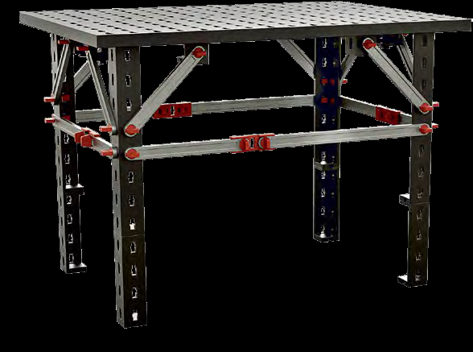

<!--
author: Jan Müller

titel: Mittelstufenschule Themenfeld zur beruflichen Orientierung im Schwerpunkt Mechatronik.

icon: assets/BSO_LOGO_1.png

email:  Jan.Mueller4@schule.hessen.de

version:  0.1.0

language: Deutsch

narrator: Deutsch Female

comment: 

link:     https://cdn.jsdelivr.net/chartist.js/latest/chartist.min.css

script:   https://cdn.jsdelivr.net/chartist.js/latest/chartist.min.js

import: https://raw.githubusercontent.com/liaScript/mermaid_template/master/README.md

-->

# Mittelstufenschule Themenfeld zur beruflichen Orientierung im Schwerpunkt Mechatronik.

Die Lernenden **informieren** sich mittels Unterlagen und Dokumenten über den Ablauf und die Funktionsweise einfacher mechatronischer Systeme.

Die Lernenden **planen** den Aufbau des einfachen mechatronischen Systems. Sie erarbeiten verschiedene einfache Arbeitsschritte zur Umsetzung des Aufbaus.

Die Lernenden **entscheiden** anhand ihrer Planungen, die Auswahl verschiedener mechatronischer Komponenten und wählen die passenden Hilfsmittel zur Umsetzung aus.

Die Lernenden **setzen** den geplanten Aufbau mithilfe der gewählten Hilfsmittel um und nutzen eine geeignete einfache Programmierung ein, um das mechatronische System in Betrieb zu nehmen.

Die Lernenden **kontrollieren und bewerten** anhand der Funktionsweise, ob das mechatronische System die zugrundeliegenden Anforderungen erfüllt und korrigieren und optimieren auftretende Fehler und stellen ihre Arbeitsergebnisse vor.

## Lehrmittel

**Mechanics 2.0**


Dieser Lernbaukasten ist ideal für künftige Maschinenbauer, Techniker oder Ingenieure: Wie funktioniert ein Kardanantrieb oder ein Schaltgetriebe? Was ist ein Planetengetriebe? Wie konstruiert man eine stabile Brücke? Diese und weitere elementare Fragen aus den Themengebieten Mechanik und Statik beantwortet dieser Lernbaukasten anhand von 30 verschiedenen Modellen. Das Set bietet lehrplanrelevante Themen aus den MINT-Bereichen Physik, Technik, Naturwissenschaften und unterstützt Schülerinnen und Schüler beim Erlangen grundlegender Kenntnisse zu mechanischen und technischen Prinzipien. Mechanics 2.0 kann im angeleiteten und freien Unterricht eingesetzt werden und ist schon heute an vielen Schulen im Einsatz.

Das innovative Lehrmaterial fischertechnik unterstützt Sie dabei technisches Verständnis praktisch zu vermitteln und Ihren Schülern, Studierenden oder Auszubildenden näherzubringen.
Das dazugehörige didaktische Begleitheft mit Lehrer- und Unterrichtsmaterial bietet Anschauungsmodelle und Aufgaben zur schnellen Vorbereitung des Unterrichts und enthält Problemstellungen und deren Lösung, Handreichungen und Kopiervorlagen. Die Unterrichtsmaterialien sind als kostenloser Download im eLearning frei abrufbar.

Die insgesamt 500 fischertechnik Bauteile sind übersichtlich in zwei Sortiereinsätze einsortiert. Zusammen mit der leicht verständlichen Bauanleitung für 30 Modelle unterschiedlicher Schwierigkeitsstufen, wird alles in einer stabilen Aufbewahrungsbox geliefert.

## Ablauf

```@mermaid
gantt
    dateFormat M
    axisFormat %m
    tickInterval 1month
    weekday monday
        section Statik
        1.Termin (Verspannungen und Streben)    :1, 1m
        2.Termin (Unter- und Oberzüge)          :2, 1m
        3.Termin (Kräfteparallelogramm)         :3, 1m
        section Mechanik
        4.Termin  (Getriebe)                    :4, 1m
        5.Termin  (Antriebe und Lenkungen)      :5, 1m
        6.Termin  (Hebelgesetze I)              :6, 1m
        7.Termin  (Hebelgesetze II)             :7, 1m
        section Programmierung
        8.Termin                                :8, 1m
        9.Termin                                :9, 1m
        10.Termin                               :10, 1m
```
## Statik

```@mermaid
timeline
          Teilkompetenz Verspannungen und Streben
          : W1 Statik
          : S1 Tisch
          : S2 Bockleiter
          : Die Lernenden verstehen wie mit Verspannungen und Streben Stabilität in statische Systeme gebracht wird.

          Teilkompetenz Unter- und Oberzüge
          : S3 Balkenbrücke
          : S4 Brücke mit Unterzug
          : S5 Brücke mit Oberzug
          : Die Lernenden verstehen wie mit Hilfskonstruktionen statische Systeme stabilisiert werden.

          Teilkompetenz Kräfteparallelogramm
          : W6 Hebelgesetze
          : S6 Schrägseilbrücke
          : Die Lernenden können mit Hilfe des Kräfteparallelogramm die Kräfteverteilung in statischen Systemen nachvollziehen.

          Kompetenz <br> Statik
          : Die Lernenden können die Bauweise von einfachen Statischen Systemen nachvollziehen.
```
### W1 Statik
>Die Statik untersucht die Bedingungen, unter denen die an einem Körper angreifenden Kräfte im Gleichgewicht sind. Sie ist damit die Grundlage aller Berechnungen und Konstruktionen von Bauwerken wie Brücken oder Häusern. Auf Bauteile der Statik wirken unterschiedliche Belastungen. Das Gewicht einer Konstruktion nennt man Eigenlast. Das Gewicht von Personen, Möbeln, Tellern oder sogar Autos nennt man Verkehrslast.

Auch dein Tisch ist ein statischer Gegenstand. Er trägt sowohl sein eigenes Gewicht, also die
Eigenlast, als auch die Verkehrslasten. Das sind Teller, Tassen, Speisen oder Getränke, die auf einem
Tisch stehen, aber auch das versehentliche Anstoßen des Tisches.
Damit ein Tisch alle diese Lasten aufnehmen kann, braucht er eine Menge statischer Besonderheiten.



### S1 Tisch

**Arbeitsauftrag**

1. Baue den Tisch nach der Bauanleitung ab Seite 87 und folgende auf.


2. Achte darauf, dass die Streben richtig verbunden sind.

3. Belaste den Tisch zunächst von oben. Als nächstes drückst du seitlich gegen die Tischplatte, dann gegen eines der Tischbeine. Was passiert jeweils?

       [[___ ___ ___ ___]]

>Die statischen Merkmale deines Modelltisches sind die abgewinkelten Tischbeinen. Sie sind durch den Winkel bereits nach zwei Seiten stabil. Die Rahmenkonstruktion des Tisches ist zusätzlich verstrebt und verspannt. Mit den gelben Streben zwischen den Tischbeinen wird der Rahmen auf Druck und Zug hin stabilisiert. Die Krönung der Statik sind allerdings die Verbindungsstellen, die Dreiecke entstehen lassen. Dreiecke sind auch dann stabil, wenn die Stäbe an den Verbindungsstellen bewegliche Gelenke haben. Solche Dreiecke werden als statische Dreiecke bezeichnet. Dein Modelltisch ist also in dreierlei Hinsicht statisch stabil. Alle Verbindungsstellen nennt man in der Statik Knoten

4. Entferne die Verspannungen und belaste den Tisch. Welche Auswirkung hat das auf die Statik des Tisches?

       [[___ ___ ___ ___]]

5. Füge die Verspannungen wieder hinzu. Entferne die Streben. Belaste den Tisch erneut. Wie stabil ist dein Tisch jetzt?

       [[___ ___ ___ ___]]

6. Nun baue auch die Verspannungen wieder ab. Belaste den Tisch. Was kannst du beobachten?

       [[___ ___ ___ ___]]

### S2 Bockleiter

Einen sehr einfachen statischen Aufbau hat die Bockleiter. Auch sie hat abgewinkelte Beine, Bockleiter die verstrebt sind. Die Verstrebungen dienen als Leitersprossen. Die Bockleiter besteht aus zwei einzelnen Leitern, die oben in einem Drehpunkt verbunden sind. Dazu kommt noch eine Verspannung der beiden Leitern im unteren Teil.

---

**Arbeitsauftrag :-***

1. Baue die Bockleiter nach der Bauanleitung ab Seite 90, zunächst ohne die Verspannung, auf.


2. Richte die Bockleiter auf und belaste sie durch Druck auf die Sprossen und dem oberen Drehpunkt. Bleibt die Leiter stabil?

        [[___ ___ ___ ___]]

3. Montiere nun an deiner Leiter die Verspannung. Führe den Versuch noch einmal durch. Bleibt die Leiter jetzt stehen?

        [[___ ___ ___ ___]]

---

Eine Bockleiter besteht aus zwei gleichen Hälften, die oben mit einem Drehpunkt verbunden sind. Je nach Anstellwinkel der beiden Hälften bleibt die Leiter auch ohne Verspannung stehen. Aber ab einem bestimmten Punkt rutschen die „Füße“ der Leiter und die Leiterhälften werden auseinandergedrückt. Mit der Verspannung wird die Leiter stabilisiert.

### S3 Balkenbrücke

Eine optimale Brücke hat vier Eigenschaften: Sie ist sicher, lang, billig und sieht gut aus. Mit deinem ersten Brückenmodell lernst du einen Klassiker der Brückenbauweise kennen.

---

**Arbeitsauftrag :-***

1. Baue das Brückenmodell nach der Bauanleitung ab Seite 90 auf.


2. Belaste die Brücke in der Mitte.
3. Wo könnte diese Brücke verwendet werden?

       [[___ ___ ___ ___]]

### S4 Brücke mit Unterzug

Die Brücke mit Unterzug erinnert an Hängebrücken die über wilde Schluchten gespannt sind. Mit der Konstruktion einer Hängebrücke hat sie aber fast nichts gemeinsam. Warum das so ist, erfährst du in den Experimenten mit dem Modell.

---

**Arbeitsauftrag:-***

1. Baue die Brücke nach der Bauanleitung ab Seite 95 auf.


2. Belaste die Brücke in der Mitte. Verwende diesmal ein etwas schwereres Gewicht.

Bei den Belastungsversuchen hast du sicher festgestellt, dass deine Brücke sehr stabil ist und große Druckkräfte aufnehmen kann. Die Brücke mit Unterzug funktioniert mit der Fachwerkbauweise. Diese Bauart ist zwar für große Belastungen, nicht aber für große Spannweiten geeignet. Die größten Spannweiten erreicht man mit Hängebrücken, die aber nicht so große Kräfte aufnehmen können. Die Brücke mit Unterzug und die Hängebrücke sehen also nur ähnlich aus. Statisch unterscheiden sie sich vollkommen.

### S5 Brücke mit Oberzug

Wesentlich längere Spannweiten und Belastungen kann die Brücke mit Obergurt (Oberzug) aufnehmen. Auch sie hat eine Fachwerkskonstruktion. Streben, Verspannungen und statische Dreiecke stabilisieren diese Brücke.

---

**Arbeitsauftrag:-***

1. Erweitere dein erstes Brückenmodell zu der Brücke mit Oberzug (siehe Bauanleitung ab Seite 97)


2. Belaste die Brücke wieder in der Mitte.
3. Wie hat sich die Brücke Stabilität der Brücke verändert?

       [[___ ___ ___ ___]]

### W6 Kräfteparallelogramm

!?[Erklärvideo zum Kräfteparallelogramm von the Simple Club](https://youtu.be/QRtDbqEKdM0?feature=shared "*Erklärvideo zum Kräfteparallelogramm von the Simple Club*")

---

**Aufgabe**

Große Schiffe werden oft durch Schlepper in den Hafen gezogen. Die beiden Schlepper ziehen symmetrisch zur Fahrtrichtung jeweils mit einem Kraftbetrag von $10kN$. Die beiden Schleppseile bilden einen Winkel der Weite $α=60°$.


1. Bestimme zeichnerich den Betrag der Kraft, mit der das Schiff in Fahrtrichtung gezogen wird.

---

**Schrägseilbrücke**

An einem Ausschnitt einer Schrägseilbrücke soll nun gezeigt werden, wie die Gewichtskräfte der Fahrbahn in eine Druckkraft auf den Pylon gewandelt werden.


Wir denken uns die Fahrbahn in gleiche Abschnitte aufgeteilt. 

Die Gewichtskraft eines solchen Abschnitts links vom Pylon werde mit $\vec{F_{g,l}}$ bezeichnet. Diese Gewichtskraft kann in eine Komponente parallel zur Fahrbahn $\vec{F_{f,l}}$ und in eine Komponente die längs des Schrägseils zieht $\vec{F_{s,l}}$ zerlegt werden. 

Die Zugkraft $\vec{F_{s,l}}$ kann längs des Seiles nach oben zum Pylon verschoben werden. Entsprechendes gilt für ein Fahrbahnstück rechts vom Pfeiler. 

Die Kräfte $\vec{F_{s,l}}$ und $\vec{F_{s,r}}$ haben als Resultierende eine Druckkraft längs des Pylons, welche von diesem gut *aufgenommen* werden kann. Die Horizontalkräfte links und rechts parallel zur Fahrbahn sind im Gleichgewicht.

### S6 Schrägseilbrücke

Möchtest du noch längere Spannweiten erreichen, als mit den Fachwerkskonstruktionen? Wie wäre es mit einer Schrägseilbrücke? Sie ist sehr lang, sieht hervorragend aus – aber ist sie auch belastbar?

---

**Arbeitsauftrag**

1. Baue die Schrägseilbrücke auf (siehe Seite 101 der Bauanlietung)

       

2. Belaste die Brücke links und rechts des Mittelpfeilers mit einem Gewicht und vergleiche die Stabilität mit den Fachwerkskonstruktionen. Und, wie hat sich deine Schrägseilbrücke im Vergleich geschlagen?


       [[___ ___ ___ ___]]

---

>Wie schafft es die Brücke, so stabil zu sein obwohl sie nur an Seilen hängt? - Ich werde es dir verraten: 

>>Gerade die Seile und deren Anordnung sind der Trick. Die Brücke besteht aus drei Hauptbestandteilen: Mittelpfeiler (Pylonen), Stahlseile und Brückentafel. Und ihre hohe Belastbarkeit verdankt sie einer raffinierten Konstruktion.Die senkrechten Kräfte, die die Brückentafel nach unten ziehen, werden über die Seile in den Mittelpfeiler übertragen, der sie in den Boden ableitet. Damit sieht eine Schrägseilbrücke nicht nur hervorragend aus, sie kann auch schon mal 1000 Meter überspannen – von Stütze zu Stütze.

## Mechanik

```@mermaid
timeline
          Teilkompetenz Getriebe
          : S1 Schneckenradgetriebe (Schranke, Drehtisch)
          : S2 Zahnradgetriebe ( Kurbelgetriebe)
          : Die Lernenden kennen den Aufbau und Funktion von Getrieben in mechatronische Systemen.

          Teilkompetenz Fahrzeugantriebe und Lenkungen
          : S3 Fahrzeugantriebe (Fahrzeug 1 - 4)
          : S4 Bollerwagen
          : Die Lernenden kennen verschiedene Antriebs- und Lenkungsvarianten mechatronische Systeme.

          Teilkompetenz Hebel
          : W5 Hebelgesetze
          : S5 Balkenwage
          : W6 Drehmomente
          : S6 Waage mit Laufgewicht
          : W7 Flaschenzug
          : S7 Seilzug
          : Die Lernenden können den Einsatz von Hebel in mechatronischen Systemen nachvollziehen.

          Kompetenz <br> Mechanik
          : Die Lernenden können die Realisierung einfache mechanische Systeme nachvollziehen
```

### W1 Schneckenradgetriebe

Um eine hohe Drehzahl eines Motors zu drosseln, eignet sich am besten ein Schneckenradgetriebe. 

Dabei wird auf die Motorwelle, das ist die Stange, die aus dem Motorengehäuse herausragt, eine Schnecke aufgesetzt. Die Schnecke treibt ein Zahnrad an. Man verwendet diese Art von Getriebe dort, wo auf engem Raum hohe Umdrehungszahlen herabgesetzt werden sollen.

Ein Schneckengetriebe arbeitet selbsthemmend, d. h. das Schneckenrad kann durch die Schnecke zwar angetrieben werden, umgekehrt sperrt das Getriebe jedoch.

Schranken und Kräne verwenden dieses Getriebe, weil hier die sichere Sperrwirkung der Schnecke verhindert, dass die Schranke oder die anhängende Last den Antrieb „zurückdrehen“.

**Weitere Vorteile des Schenckenradgetriebes:**

- Es ist platzsparend
- Es reduziert die Umdrehungszahl des Antriebs um ein Vielfaches
- Es ist selbsthemmend
- Es steigert die Kraft des Antriebs
- Aber es ändert auch die Richtung der Drehbewegung um 90°.

### S1 Schneckenradgetriebe
 
1. Baue das Schrankenmodell nach!
2. Drehe die Schranke mit der Kurbel nach oben!
3. Wie oft musst du die Kurbel drehen, um die Schranke in die Senkrechte zu bekommen?
4. Versuche, die Schranke mit den Fingern nach unten zu zeihen. Was fällt dir auf?

### W3 Fahrzeugantriebe

**Rückblick Zahnradgetriebe**


Zahnräder gehören zu den ältesten und robustesten Maschinenelementen. Es gibt sie in verschiedenen Arten und Größen.

Mit Zahnradgetrieben kann man Drehbewegungen übertragen und verändern.

Ein Zahnradgetriebe kann:

- eine Drehbewegung weiterleiten
- eine Drehzahl ändern
- eine Drehkraft erhöhen oder verringern
- oder eine Drehrichtung ändern

Eine ähnliche Funktion wie bei einem Zahnradgetriebe kennst du von deinem Fahrrad. Allerdings sind hier die
Zahnräder durch Kettenräder und eine Kette ersetzt.

**[Ausblick Schaltung am Fahrrad](https://www.leifiphysik.de/mechanik/einfache-maschinen/ausblick/schaltung-beim-fahrrad)**

### S3 Fahrzeugantriebe

1. **Bereite die Kabel und Stecker wie folgt (Bauanleitung Seite 6) vor!**


2. **Bereite das Akkupack wie folgt vor (Bauanleitung Seite 7) vor!**


3. **Bearbeite Seite 7 und 8 im Begleitheft!**


***Beantworte die darin befindlichen Fragen schriftlich!***

### W5 Hebelgesetze

!?[Erklärvideo von the simple club über Hebelgesetze](https://youtu.be/-halnFPU5ls?feature=shared "[Erklärvideo von the simple club über Hebelgesetze](https://youtu.be/-halnFPU5ls?feature=shared)")

**Zweiseitiger Hebel**

Bei einem zweiseitigen Hebel erstreckt sich der starre Körper auf beide Seiten der Drehachse. Es können daher auf beiden Seiten der Drehachse Kräfte am Hebel angreifen. Besonders einfach kannst du Größen am zweiseitigen Hebel berechnen, wenn dieser waagerecht steht und die angreifenden Kräfte senkrecht dazu, also senkrecht nach oben oder nach unten wirken. In diesem Fall entspricht der Abstand des Angriffspunktes $P$ einer Kraft $\vec{F}$  von der Drehachse genau dem sogenannten Hebelarm $α$. (siehe Abb. 2).


**Gleichgewichtsbedingung am zweiseitigen Hebel**

Der Hebel ist hier im Gleichgewicht, wenn das Produkt von Kraft und Hebelarm der links von der Drehachse angreifenden Kräfte gleich dem Produkt von Kraft und Hebelarm der rechts von der Drehachse angreifenden Kräfte ist:

$F_1 \cdot \alpha_1 = F_2 \cdot \alpha_2$

**Aufgabe**

Hans und Katrin setzen sich auf eine 3m lange Wippe. Hans hat eine Gewichtskraft von 500N und setzt sich 40cm vom linken Ende entfernt auf die Stange, Katrin hat eine Gewichtskraft von 400N und setzt sich 1,20m rechts vom Drehpunkt entfernt auf die Stange.

1. Berechne, nach welcher Seite die Wippe kippt, wenn sich beide Kinder auf die Waagrechte Stange setzten.
2. Berechne, wo sich Katrin hinsetzten muss, damit Gleichgewicht herrscht.


### S5 Balkenwage

Um den Preis einer Ware zu bestimmen, hat man schon vor 4000 Jahren die Menge der Ware mit Gewichten
verglichen. Das machte man mit Hilfe einer Balkenwaage, mit der die Balance von zwei Gewichtskräften gemessen
wurde. Bei deinem Modell ist es ein im mittleren Drehpunkt gelagerter Balken, der an den Enden zwei
Schalen trägt. Die beiden Zeiger in der Mitte des Waagbalkens müssen beim Gleichgewicht der Kräfte in einer
Linie sein.


**Arbeitsauftrag**

 1. Baue die Balkenwaage anhand der Bauanleitung (s. 68) nach.
 2. Lege auf beide Waagschalen je einen fischertechnik-Baustein. 
        a. Stimmt deine Waage?
 3. Suche nun zwei Gegenstände, die deiner Meinung nach das gleiche Gewicht haben. Lege sie auf die Waagschalen. 
        a. Stimmt deine Vermutung?
 4. Lese den Absatz Zweiseitiger Hebel und bearbeite die darin gestellte Aufgabe schriftlich!

Diese Waage funktioniert nach dem Prinzip der gleichlangen Hebel. Ein Hebel ist ein
gerader, drehbar gelagerter Balken, auf den zwei Kräfte wirken. Die Abstände zwischen
den Ansatzpunkten der Kräfte und dem Drehpunkt heißen Hebelarme. Beide Seiten
neben dem Drehpunkt sind gleich lang und gleich schwer. Das Prinzip dieser Waage
kennst du von einer Wippe. Damit die Hebel im Gleichgewicht sind, muss das Gewicht,
das auf den Hebeln ruht, und ihr Abstand zum Drehpunkt der Waage gleich sein.

### W6 Drehmomente

!?[Erklärvideo von the simple club zum Thema Drehmoment](https://youtu.be/WA0ry1H4LZ4?feature=shared "[Erklärvideo von the simple club zum Thema Drehmoment](https://youtu.be/WA0ry1H4LZ4?feature=shared)")

### S6 Waage mit Laufgewicht

Es braucht schon etwas Geduld, um zwei Gewichte zu finden, die genau gleich schwer sind. Eine Weiterentwicklung der Balkenwaage ist daher die Waage mit einem Laufgewicht. Auch diese Waage arbeitet nach dem Prinzip der gleich langen Hebel, nur wird hier mit den Drehmomenten getrickst. Die beiden Seiten neben dem Drehpunkt sind
die Kraftarme. Je weiter außen ein Gewicht an einem Kraftarm hängt, desto höher ist seine Kraft. Mit Hilfe des Schiebers
kann also das Drehmoment in einem Kraftarm geändert werden. Den Arm mit der Waagschale nennt man Lastarm.


**Arbeitsauftrag**

1. Baue die Waage mit Last- und Kraftarm und Laufgewicht nach.
2. Reguliere das Laufgewicht so, dass die Waage unbelastet im Gleichgewicht ist. Der Zeiger in der Mitte der Waage hilft dir dabei.
3. Belaste die Waagschale mit einem Gewicht. Gleiche mit dem Laufgewicht aus.

Damit ein Hebel im Gleichgewicht ist, muss die Summe der linksdrehenden Drehmomente mit der Summe der rechtsdrehenden Drehmomente übereinstimmen. Das hört sich kompliziert an, doch so schwierig ist es gar nicht. Das Gesetz sagt aus, dass beide Arme, links und rechts des Drehpunkts, gleich schwer, aber nicht gleich lang sein müssen. Je weiter ein Gewicht vom Drehpunkt entfernt ist, desto größer ist die Kraft des Hebels und somit auch sein Gewicht.

### W7 Flaschenzug

!?[Erklärvideo von the simple club zum Thema Flaschenzug](https://youtu.be/_2vn4Im475s?feature=shared "[Erklärvideo von the simple club zum Thema Flaschenzug](https://youtu.be/_2vn4Im475s?feature=shared)")

**Das Wichtigste auf einen Blick**

- Beim Flaschenzug spielt die Anzahl n der tragenden Seile eine wichtige Rolle.
- Je größer die Zahl der tragenden Seile ist, desto weniger Zugkraft $\vec{F_Z}$  musst du aufbringen, um eine Last $\vec{F_L}$  anzuheben. Dafür verlängert sich die notwendige Zugstrecke $s_Z$ um eine Last die Strecke $s_L$ anzuheben.
- Für die Zugkraft gilt $F_Z=\frac{1}{n} \cdot F_L$, für die Zugstrecke hingegen $s_Z=n \cdot s_L$.

Als Flaschenzug bezeichnet man eine geschickte Kombination von einer oder mehreren Rollen, um die ein Seil geschlungen ist. In den Abbildungen rechts siehst du verschiedene, immer komplizierter werdende Flaschenzüge.
Üblicherweise ist entweder das Seil oder aber eine der Rollen an der Decke oder einem starken Balken unterhalb der Decke befestigt. An einer anderen Rolle befindet sich jeweils eine Last, die mit Hilfe des Flaschenzugs angehoben werden soll. Schließlich ist ein Ende des Seils entweder an der Decke oder an einer der Rollen befestigt, an dem anderen Ende des Seils kann man ziehen.

**Größen am Flaschenzug**


Wir nutzen folgende Bezeichnungen:

$$
\begin{aligned}
n &= \text{Anzahl der tragenden Seile} \\
F_L &= \text{Betrag der Kraft der Last} \\
s_L &= \text{Länge der Stecke, um die die Last angehoben wird} \\
F_Z &= \text{Betrag der Kraft, mit der man am Seil ziehen muss} \\
\end{aligned}
$$

**Tragende Seile**

Entscheidend bei der Anordnung der Rolle(n) und des Seils ist es nun, dass die Last nicht mehr nur an einem, sondern an mehreren Teilen des Seils hängt. Man spricht bei diesen Teilen von den **tragenden Seilen**, obwohl es sich natürlich immer nur um das gleiche Seil handelt. Die **tragenden Seile** sind in den Abbildungen jeweils durch rote Punkte markiert, ihre Anzahl bezeichnen wir mit $n$. Je größer die Anzahl $n$ der tragenden Seile eines Flaschenzuges, desto geringer ist die Zugkraft $\vec{F_z}$, die du aufbringen musst, um eine Last anzuheben.

**Aufgabe**

Gegeben sind $F_L=90N$ und $s_L=15cm$

1. Entnimm der Abbildung die Anzahl $n$ der tragenden Seilabschnitte.
2. Berechne $F_z$ und $s_Z$


### S7 Seilrollen-Flaschenzug

Stell dir vor, du möchtest deinen Freund an einem Seil nach oben ziehen. Obwohl er genauso schwer ist wie du, schaffst du es nur mit enormem Kraftaufwand. Die Seilrolle an der Decke hilft dir nur beim Halten, nicht beim Heben. Das Flaschenzugmodell stellt dir aber einige Möglichkeiten vor, wie du es ganz leicht schaffst, auch schwere Lasten zu heben.


**Arbeitsauftrag**


## Programmierung

