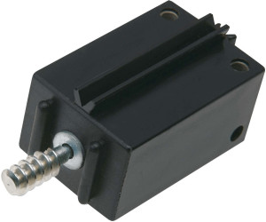
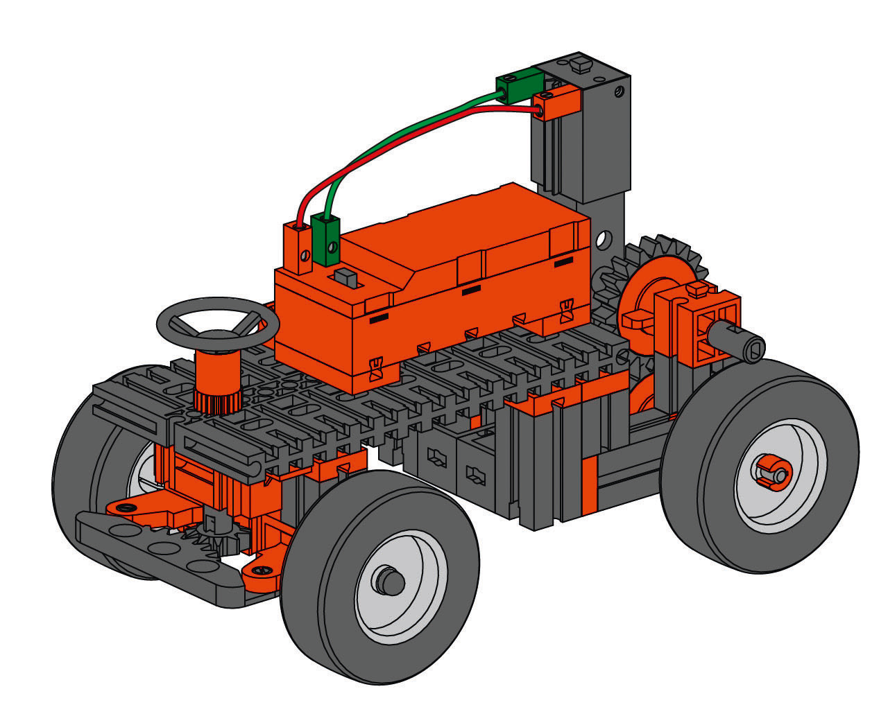
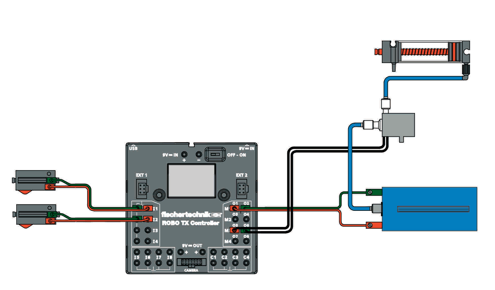

<!--
author: Jan Müller

titel: Mittelstufenschule Themenfeld zur beruflichen Orientierung im Schwerpunkt Mechatronik.

icon: assets/BSO_LOGO_1.png

email:  Jan.Mueller4@schule.hessen.de

version:  0.1.0

language: Deutsch

narrator: Deutsch Female

comment: https://tinyurl.com/mssmechatronik08

link:     https://cdn.jsdelivr.net/chartist.js/latest/chartist.min.css

script:   https://cdn.jsdelivr.net/chartist.js/latest/chartist.min.js

import: https://raw.githubusercontent.com/liaScript/mermaid_template/master/README.md

-->

# Mittelstufenschule Themenfeld zur beruflichen Orientierung im Schwerpunkt Mechatronik. 

>Die Lernenden **informieren** sich mittels Unterlagen und Dokumenten über den Ablauf und die Funktionsweise einfacher mechatronischer Systeme.

>Die Lernenden **planen** den Aufbau des einfachen mechatronischen Systems. Sie erarbeiten verschiedene einfache Arbeitsschritte zur Umsetzung des Aufbaus.

>Die Lernenden **entscheiden** anhand ihrer Planungen, die Auswahl verschiedener mechatronischer Komponenten und wählen die passenden Hilfsmittel zur Umsetzung aus.

>Die Lernenden **setzen** den geplanten Aufbau mithilfe der gewählten Hilfsmittel um und nutzen eine geeignete einfache Programmierung ein, um das mechatronische System in Betrieb zu nehmen.

>Die Lernenden **kontrollieren und bewerten** anhand der Funktionsweise, ob das mechatronische System die zugrundeliegenden Anforderungen erfüllt und korrigieren und optimieren auftretende Fehler und stellen ihre Arbeitsergebnisse vor.

## Lehrmittel

**Mechanics 2.0**


Dieser Lernbaukasten ist ideal für angehende Maschinenbauer, Techniker und Ingenieure. 

- Wie funktioniert ein Kardanantrieb oder ein Schaltgetriebe? 
- Was ist ein Planetengetriebe? 
- Wie konstruiert man eine stabile Brücke? 

Diese und weitere elementare Fragen aus den Themengebieten Mechanik und Statik beantwortet dieser Lernbaukasten anhand von 30 verschiedenen Modellen. 
Das Set bietet lehrplanrelevante Themen aus den MINT-Bereichen Physik, Technik und Naturwissenschaften. Es unterstützt Schülerinnen und Schüler beim Erlangen grundlegender Kenntnisse zu mechanischen und technischen Prinzipien.

Das Lehrmaterial unterstützt dabei, technisches Verständnis praktisch zu erfahren.

Die insgesamt 500 fischertechnik-Bauteile sind übersichtlich in zwei Sortiereinsätzen einsortiert. Zusammen mit der leicht verständlichen Bauanleitung für 30 Modelle unterschiedlicher Schwierigkeitsstufen, wird alles in einer stabilen Aufbewahrungsbox gelagert.

## Ablauf

```@mermaid
gantt
    dateFormat M
    axisFormat %m
    tickInterval 1month
    weekday monday
        section Statik
        1.Termin (Verspannungen und Streben)    :1, 1m
        2.Termin (Unter- und Oberzüge)          :2, 1m
        3.Termin (Kräfteparallelogramm)         :3, 1m
        section Mechanik
        4.Termin  (Getriebe)                    :4, 1m
        5.Termin  (Antriebe und Lenkungen)      :5, 1m
        6.Termin  (Hebelgesetze I)              :6, 1m
        7.Termin  (Hebelgesetze II)             :7, 1m
        section Programmierung
        8.Termin                                :8, 1m
        9.Termin                                :9, 1m
        10.Termin                               :10, 1m
```
## Statik

```@mermaid
timeline
          Teilkompetenz Verspannungen und Streben
          : W1 Statik
          : S1 Tisch
          : S2 Bockleiter
          : Die Lernenden verstehen wie mit Verspannungen und Streben Stabilität in statische Systeme gebracht wird.

          Teilkompetenz Unter- und Oberzüge
          : S3 Balkenbrücke
          : S4 Brücke mit Unterzug
          : S5 Brücke mit Oberzug
          : Die Lernenden verstehen wie mit Hilfskonstruktionen statische Systeme stabilisiert werden.

          Teilkompetenz Kräfteparallelogramm
          : W6 Hebelgesetze
          : S6 Schrägseilbrücke
          : Die Lernenden können mit Hilfe des Kräfteparallelogramm die Kräfteverteilung in statischen Systemen nachvollziehen.

          Kompetenz <br> Statik
          : Die Lernenden können die Bauweise von einfachen Statischen Systemen nachvollziehen.
```
### W1 Statik

**Statik** kannst du dir gut an einem Tisch erklären: Stell dir vor, du sitzt an deinem Schreibtisch und legst deine Arme oder Bücher darauf. Der Tisch bleibt stabil und wackelt nicht, weil seine Beine und die Tischplatte das Gewicht richtig tragen. 

**Was hat das mit Statik zu tun?**  
Die Statik sorgt dafür, dass der Tisch so gebaut ist, dass er das Gewicht aushält, ohne umzukippen oder zusammenzubrechen. Wenn du ein schweres Buch in die Mitte legst, verteilt sich das Gewicht gleichmäßig auf die Beine. Wenn du aber zu viele Sachen an eine Ecke legst, könnte der Tisch kippen – das zeigt, warum die richtige Verteilung der Kräfte wichtig ist.

**Drei Dinge, die die Statik beim Tisch beachtet:**

1. **Eigenlast:** Das ist das Gewicht des Tisches selbst. Je schwerer der Tisch, desto stabiler ist er oft.
2. **Nutzlast (oder Verkehrslast):** Das ist das Gewicht von allem, was du darauflegst – Bücher, dein Laptop oder dein Mittagessen.
3. **Gleichgewicht:** Damit der Tisch stabil bleibt, müssen die Beine so gebaut sein, dass sie das Gewicht gleichmäßig tragen.

**Zusammengefasst:** Die Statik sorgt dafür, dass der Tisch feststeht und dich nicht im Stich lässt, selbst wenn du viele Bücher daraufstapelst. Ohne Statik würden Möbel wackeln oder sogar umkippen! 😊


### S1 Tisch

**Arbeitsauftrag**

1. Baue den Tisch nach der Bauanleitung ab Seite 87 und folgende auf.


2. Achte darauf, dass die Streben richtig verbunden sind.

3. Belaste den Tisch zunächst von oben. Als nächstes drückst du seitlich gegen die Tischplatte, dann gegen eines der Tischbeine. 

    **Was passiert jeweils?**

       [[___ ___ ___ ___]]

> Die statischen Merkmale deines Modelltisches sind die abgewinkelten Tischbeine. Sie sind durch den Winkel bereits nach zwei Seiten stabil. Die Rahmenkonstruktion des Tisches ist zusätzlich verstrebt und verspannt. Mit den gelben Streben zwischen den Tischbeinen wird der Rahmen auf Druck und Zug hin stabilisiert. 
>
> Die Krönung der Statik sind allerdings die Verbindungsstellen, die Dreiecke entstehen lassen. Dreiecke sind auch dann stabil, wenn die Stäbe an den Verbindungsstellen bewegliche Gelenke haben. Solche Dreiecke werden als statische Dreiecke bezeichnet. 
>
> Dein Modelltisch ist also in dreierlei Hinsicht statisch stabil. Alle Verbindungsstellen nennt man in der Statik Knoten.

<!-- TODO: Bild mit Beschriftung Verspannung und Streben einfügen -->

4. Entferne die Verspannungen und belaste den Tisch. 

    **Welche Auswirkung hat das auf die Statik des Tisches?**

       [[___ ___ ___ ___]]

5. Füge die Verspannungen wieder hinzu. Entferne die Streben. Belaste den Tisch erneut. 
   
   **Wie stabil ist dein Tisch jetzt?**

       [[___ ___ ___ ___]]

6. Nun baue auch die Verspannungen wieder ab. Belaste den Tisch. 

   **Was kannst du beobachten?**

       [[___ ___ ___ ___]]

### S2 Bockleiter
Einen sehr einfachen statischen Aufbau hat die Bockleiter. Auch sie hat abgewinkelte Beine, die verstrebt sind. Die Verstrebungen dienen als Leitersprossen. Die Bockleiter besteht aus zwei einzelnen Leitern, die oben in einem Drehpunkt verbunden sind. Dazu kommt noch eine Verspannung der beiden Leitern im unteren Teil.

---

**Arbeitsauftrag**

1. Baue die Bockleiter nach der Bauanleitung ab Seite 90, zunächst **ohne** die Verspannung, auf.


2. Richte die Bockleiter auf und belaste sie durch Druck auf die Sprossen und dem oberen Drehpunkt. 

    **Bleibt die Leiter stabil?**

        [[___ ___ ___ ___]]

3. Montiere nun an deiner Leiter die Verspannung. Führe den Versuch noch einmal durch. 

     **Bleibt die Leiter jetzt stehen?**

        [[___ ___ ___ ___]]

---

>Eine Bockleiter besteht aus zwei gleichen Hälften, die oben mit einem Drehpunkt verbunden sind. Je nach Anstellwinkel der beiden Hälften bleibt die Leiter auch ohne Verspannung stehen. Aber ab einem bestimmten Punkt rutschen die „Füße“ der Leiter und die Leiterhälften werden auseinandergedrückt. Mit der Verspannung wird die Leiter stabilisiert.

### S3 Balkenbrücke

Eine optimale Brücke hat vier Eigenschaften: Sie ist sicher, lang, billig und sieht gut aus. Mit deinem ersten Brückenmodell lernst du einen Klassiker der Brückenbauweise kennen.

---

**Arbeitsauftrag**

1. Baue das Brückenmodell nach der Bauanleitung ab Seite 90 auf.


2. Belaste die Brücke in der Mitte.
3. **Wo könnte diese Brücke verwendet werden?**

       [[___ ___ ___ ___]]

### S4 Brücke mit Unterzug

Die Brücke mit Unterzug erinnert an Hängebrücken die über wilde Schluchten gespannt sind. Mit der Konstruktion einer Hängebrücke hat sie aber fast nichts gemeinsam. Warum das so ist, erfährst du in den Experimenten mit dem Modell.

---

**Arbeitsauftrag**

1. Baue die Brücke nach der Bauanleitung ab Seite 95 auf.


2. Belaste die Brücke in der Mitte. Verwende diesmal ein etwas schwereres Gewicht.

3. **Wie hat sich die Stabilität der Brücke verändert?**

    [[___ ___ ___ ___]]

> Bei den Belastungsversuchen hast du sicher festgestellt, dass deine Brücke sehr stabil ist und große Druckkräfte aufnehmen kann. Die Brücke mit Unterzug funktioniert mit der Fachwerkbauweise. Diese Bauart ist zwar für große Belastungen, nicht aber für große Spannweiten geeignet. Die größten Spannweiten erreicht man mit Hängebrücken, die aber nicht so große Kräfte aufnehmen können. Die Brücke mit Unterzug und die Hängebrücke sehen also nur ähnlich aus. Statisch unterscheiden sie sich vollkommen.

### S5 Brücke mit Oberzug

Wesentlich längere Spannweiten und Belastungen kann die Brücke mit Obergurt (Oberzug) aufnehmen. Auch sie hat eine Fachwerkskonstruktion. Streben, Verspannungen und statische Dreiecke stabilisieren diese Brücke.

---

**Arbeitsauftrag:**

1. Erweitere dein erstes Brückenmodell zu der Brücke mit Oberzug (siehe Bauanleitung ab Seite 97)


2. Belaste die Brücke wieder in der Mitte.
3. **Wie hat sich die Stabilität der Brücke verändert?**

       [[___ ___ ___ ___]]

### W6 Kräfteparallelogramm


!?[Erklärvideo zum Kräfteparallelogramm von the Simple Club](https://youtu.be/QRtDbqEKdM0?feature=shared "[Erklärvideo zum Kräfteparallelogramm von the Simple Club](https://youtu.be/QRtDbqEKdM0?feature=shared)")


---

**Aufgabe**

Große Schiffe werden oft durch Schlepper in den Hafen gezogen. Die beiden Schlepper ziehen symmetrisch zur Fahrtrichtung jeweils mit einem Kraftbetrag von $10kN$. Die beiden Schleppseile bilden einen Winkel der Weite $α=60°$.


1. Bestimme zeichnerich den Betrag der Kraft, mit der das Schiff in Fahrtrichtung gezogen wird.

---

**Schrägseilbrücke**

An einem Ausschnitt einer Schrägseilbrücke soll nun gezeigt werden, wie die Gewichtskräfte der Fahrbahn in eine Druckkraft auf den Pylon gewandelt werden.


Wir denken uns die Fahrbahn in gleiche Abschnitte aufgeteilt. 

Die Gewichtskraft eines solchen Abschnitts links vom Pylon werde mit $\vec{F_{g,l}}$ bezeichnet. Diese Gewichtskraft kann in eine Komponente parallel zur Fahrbahn $\vec{F_{f,l}}$ und in eine Komponente die längs des Schrägseils zieht $\vec{F_{s,l}}$ zerlegt werden. 

Die Zugkraft $\vec{F_{s,l}}$ kann längs des Seiles nach oben zum Pylon verschoben werden. Entsprechendes gilt für ein Fahrbahnstück rechts vom Pfeiler. 

Die Kräfte $\vec{F_{s,l}}$ und $\vec{F_{s,r}}$ haben als Resultierende eine Druckkraft längs des Pylons, welche von diesem gut *aufgenommen* werden kann. Die Horizontalkräfte links und rechts parallel zur Fahrbahn sind im Gleichgewicht.

### S6 Schrägseilbrücke

Möchtest du noch längere Spannweiten erreichen, als mit den Fachwerkskonstruktionen? Wie wäre es mit einer Schrägseilbrücke? Sie ist sehr lang, sieht hervorragend aus – aber ist sie auch belastbar?

---

**Arbeitsauftrag**

1. Baue die Schrägseilbrücke auf (siehe Seite 101 der Bauanlietung)

       

2. Belaste die Brücke links und rechts des Mittelpfeilers mit einem Gewicht und vergleiche die Stabilität mit den Fachwerkskonstruktionen. 

    **Und, wie hat sich deine Schrägseilbrücke im Vergleich geschlagen?**


       [[___ ___ ___ ___]]

---

>Wie schafft es die Brücke, so stabil zu sein obwohl sie nur an Seilen hängt? - Ich werde es dir verraten: 

>>Gerade die Seile und deren Anordnung sind der Trick. Die Brücke besteht aus drei Hauptbestandteilen: Mittelpfeiler (Pylonen), Stahlseile und Brückentafel. Und ihre hohe Belastbarkeit verdankt sie einer raffinierten Konstruktion.Die senkrechten Kräfte, die die Brückentafel nach unten ziehen, werden über die Seile in den Mittelpfeiler übertragen, der sie in den Boden ableitet. Damit sieht eine Schrägseilbrücke nicht nur hervorragend aus, sie kann auch schon mal 1000 Meter überspannen – von Stütze zu Stütze.

## Mechanik

```@mermaid
timeline
          Teilkompetenz Getriebe
          : W0 Maschinen und Dynamik
          : W1 Schneckenradgetriebe
          : S1 Schranke
          : S2 Drehtisch
          : S3 Kurbelgetriebe
          : Die Lernenden kennen den Aufbau und Funktion von Getrieben in mechatronische Systemen.

          Teilkompetenz Fahrzeugantriebe und Lenkungen
          : W4 Antriebe
          : S4 Fahrzeuge mit Zahnradantrieb
          : S5 Fahrzeug mit Kettenantrieb
          : W6 Lenkungsarten
          : S6 Bollerwagen
          : Die Lernenden kennen verschiedene Antriebs- und Lenkungsvarianten mechatronische Systeme.

          Teilkompetenz Hebel
          : W7 Hebelgesetze
          : S7 Balkenwaage
          : W8 Drehmomente
          : S8 Waage mit Laufgewicht
          : W9 Flaschenzug
          : S9 Seilzug
          : Die Lernenden können den Einsatz von Hebel in mechatronischen Systemen nachvollziehen.

          Kompetenz <br> Mechanik
          : Die Lernenden können die Realisierung einfache mechanische Systeme nachvollziehen
```

### W0 Maschinen
    
    {{0-1}}
*******************************************************************

Wer schleppt heute noch schwere Lasten durch die Gegend? Wer bohrt ein Loch mit reiner Muskelkraft in eine Wand? Wer wäscht seine Wäsche noch mit einem Waschbrett? Fast niemand. 

Der Mensch hat viele Geräte erfunden, die ihm das Leben und die Arbeit erleichtern. Angefangen beim Mahlwerk einer Mühle über die Düsentriebwerke eines Jumbo-Jets bis hin zum Computer.


Geräte, die dir eine Arbeit erleichtern oder sogar abnehmen können, nennt man in der Fachsprache Maschinen.

*******************************************************************

    {{1-2}}
******************************************************************
**Was ist Mechanik**

In der Mechanik geht es um Wirkungen und Kräfte, die starre und sich bewegende Körper beeinflussen. Die Mechanik ist in verschiedene Bereiche wie z. B. Statik, Dynamik, Kinetik oder Thermodynamik gegliedert. Wir begrenzen uns auf zwei Bereiche: die Dynamik und die Statik. 

Schon in der Antike haben Wissenschaftler die Bereiche der Mechanik untersucht. Die alten Dombaumeister haben mit immer höheren Kirchen das Gleichgewicht der Kräfte bis zum Äußersten ausgelotet. Heute übernimmt ein Statiker die Berechnungen für die Stabilität eines Bauwerks. Sein Beruf kommt – wie der Name schon sagt – aus dem mechanischen Teilbereich der Statik. Mehr darüber erfährst du im Thementeil Statik. 

Immer dann, wenn Maschinen oder Getriebe in Bewegung gesetzt werden, sind sie dynamisch. Die Dynamik beschreibt die Änderung der Bewegungsgrößen, beispielsweise beim Drehen einer Welle, bei einer Hin- und Herbewegung oder einer Zahnradübertragung. Die Dynamik ist also die Lehre von den Bewegungsänderungen. Was das genau ist, lernst du in den folgenden Kapiteln kennen.

******************************************************************

    {{2}}
******************************************************************

**Der Elektromotor**

Der Motor ist ein möglicher Antrieb für eine Maschine. Man unterscheidet zwei Arten von Motoren: Verbrennungsmotoren und Elektromotoren. Ein Auto z. B. wird von einem Verbrennungsmotor angetrieben. Einen so komplizierten Motor hast du natürlich nicht in deinem Baukasten, dafür aber einen Elektromotor, kurz auch E-Motor genannt. Elektromotoren sind die Antriebe für die meisten Maschinen des Alltags. Sie können überall eingesetzt werden, wo elektrische Energie zur Verfügung steht.


Der Elektromotor in deinem Baukasten hat eine sehr hohe Drehzahl, d. h. er dreht sich so schnell, dass du eine einzelne Umdrehung gar nicht erkennen kannst. Dein Motor ist aber sehr „schwach“, er kann also keine Lasten heben und auch kein Fahrzeug antreiben. Um die schnellen Umdrehungen zu verringern und den Motor „stärker“ zu machen, benötigt man ein Getriebe. 
********************************************************************

### W1 Schneckenradgetriebe

Um eine hohe Drehzahl eines Motors zu drosseln, eignet sich am besten ein Schneckenradgetriebe. 


Dabei wird auf die Motorwelle, das ist die Stange, die aus dem Motorengehäuse herausragt, eine Schnecke aufgesetzt. Die Schnecke treibt ein Zahnrad an. Man verwendet diese Art von Getriebe dort, wo auf engem Raum hohe Umdrehungszahlen herabgesetzt werden sollen.

Ein Schneckengetriebe arbeitet selbsthemmend, d. h. das Schneckenrad kann durch die Schnecke zwar angetrieben werden, umgekehrt sperrt das Getriebe jedoch.

Schranken und Kräne verwenden dieses Getriebe, weil hier die sichere Sperrwirkung der Schnecke verhindert, dass die Schranke oder die anhängende Last den Antrieb „zurückdrehen“.

>**Weitere Vorteile des Schneckenradgetriebes:**
>
>>- Es ist platzsparend
>>- Es reduziert die Umdrehungszahl des Antriebs um ein Vielfaches
>>- Es ist selbsthemmend
>>- Es steigert die Kraft des Antriebs
>>- Aber es ändert auch die Richtung der Drehbewegung um 90°.

### S1 Schneckenradgetriebe
 
1. Baue das Schrankenmodell nach der Bauanleitung ab Seite 8 auf!

       

2. Drehe die Schranke mit der Kurbel nach oben!
   
   **Wie oft musst du die Kurbel drehen, um die Schranke in die Senkrechte zu bekommen?**

       [[___ ___ ___ ___]]

3. Versuche, die Schranke mit den Fingern nach unten zu zeihen. 

   **Was fällt dir auf?**

       [[___ ___ ___ ___]]

### S2 Drehtisch

Der Mechanismus des Schneckengetriebes wird in vielen Maschinen angewendet. Ein einfaches Beispiel dafür ist der Drehtisch, dein nächstes Modell.

Bei diesem Modell soll die Drehzahl verringert und die Drehrichtung geändert werden. Der Widerstand des belasteten Drehtisches darf den Motor nicht anhalten.

1. Baue den Drehtisch nach der Bauanleitung ab Seite 11 auf!

       

2. Stelle deine Fischertechnik Aufbewahrungsbox auf den Drehtisch!
   
   **Kann der kleine Motor die Box tatsächlich drehen?**

       [[___ ___ ___ ___]]


### S3 Kurbelgetriebe

In den folgenden Modellen baust du Zahnradgetriebe mit gerade verzahnten Stirnrädern auf. Stirnräder verwendet man immer dann, wenn die Drehbewegung auf eine parallel liegende Welle übertragen werden soll.

1. Baue das Kurbelgetriebe nach der Bauanleitung ab Seite 15 auf!

       

2. Drehe die Kurbel ein Mal.
   
   **Wie oft dreht sich die Welle mit dem zweiten Zahnrad?**

       [[___ ___ ___ ___]]

3. Drehe die Kurbel im Uhrzeigersinn. 

   **In welche Richtung dreht sich das Abtriebsrad und somit die zweite Welle?**

       [[___ ___ ___ ___]]

    Wenn du auf diese Art ein Fahrzeug bewegen möchtest, würdest du nur sehr langsam von der Stelle kommen.
    Außerdem würdest du rückwärts fahren. Dieses Modell soll dir auch nur zeigen, wie man ein einfaches Getriebe aufbaut und berechnet.

4. **Fülle folgende Tabelle aus:**

|     Beschreibung | Antriebsrad | Abtriebsrad |
| ---------------: | :---------: | :---------: |
|       Rad Nummer |      1      |      2      |
|      Zähneanzahl |  [[ 20 ]]   |  [[ 20 ]]   |
| Umdrehungsanzahl |      1      |  [[  1 ]]   |
|     Drehrichtung |   rechts    |  [[ rechts  | (links) ]] |

5. Baue das Kurbelgetriebe 2 nach der Bauanleitung ab Seite 16 auf!

    

6. Drehe die Kurbel ein Mal.
   
   **Wie oft dreht sich die Welle mit dem zweiten Zahnrad?**

       [[___ ___ ___ ___]]

7. Drehe die Kurbel im Uhrzeigersinn. 

   **In welche Richtung dreht sich das Abtriebsrad und somit die zweite Welle?**

       [[___ ___ ___ ___]]

8. **Fülle folgende Tabelle aus:**

|     Beschreibung | Antriebsrad | Abtriebsrad |
| ---------------: | :---------: | :---------: |
|       Rad Nummer |      1      |      2      |
|      Zähneanzahl |  [[ 30 ]]   |  [[ 20 ]]   |
| Umdrehungsanzahl |      1      |  [[  1,5 ]]   |
|     Drehrichtung |   rechts    |  [[ rechts  | (links) ]] |


### W4 Antriebe

**Rückblick Zahnradgetriebe**


Zahnräder gehören zu den ältesten und robustesten Maschinenelementen. Es gibt sie in verschiedenen Arten und Größen.

Mit Zahnradgetrieben kann man Drehbewegungen übertragen und verändern.

>Ein Zahnradgetriebe kann:
>
>>- eine Drehbewegung weiterleiten
>>- eine Drehzahl ändern
>>- eine Drehkraft erhöhen oder verringern
>>- oder eine Drehrichtung ändern

Eine ähnliche Funktion wie bei einem Zahnradgetriebe kennst du von deinem Fahrrad. Allerdings sind hier die Zahnräder durch Kettenräder und eine Kette ersetzt.

**[Ausblick Schaltung am Fahrrad](https://www.leifiphysik.de/mechanik/einfache-maschinen/ausblick/schaltung-beim-fahrrad)**

### S4 Fahrzeugantriebe

Du hast jetzt schon viel über Getriebe gelernt und kannst dieses Wissen an einem Modell ausprobieren. 

1. Baue das Fahrzeug 1 nach der Bauanleitung ab Seite 23 auf. 

    

    - *Du hast mit dem Motor und dem Getriebe jetzt einen richtigen Fahrzeugantrieb.*

2. Damit es noch schneller geht, baue Fahrzeug 2 nach der Bauanleitung ab Seite 25 auf. 

    - *Dein Mobil fährt nun 1,5 mal so schnell wie sein Vorgänger.*

    - *Dafür hat diese Übersetzung aber ihre Probleme am Berg.*

3. Baue das Fahrzeug 3 nach der Bauanleitung ab Seite 27 auf.

   - Das Fahrzeug 3 hat einen „umgekehrten“ Getriebeaufbau wie das Fahrzeug
   - Wie verändert sich wohl seine Geschwindigkeit im Vergleich zu den anderen Modellen?

        [[___ ___ ___ ___]]

>Mit den drei Zahnradgetrieben hast du einmal eine Übersetzung 1:1 mit gleichbleibender Drehzahl und gleichem Drehmoment geschaffen. Dein zweites Modell hat das Übersetzungsverhältnis 1:1,5 und ein vermindertes Drehmoment. Das bedeutet, dass es schneller ist, aber weniger „Kraft“ hat. Das Fahrzeug 3 hat das Übersetzungsverhältnis 2:1 und fährt somit langsamer als die beiden anderen, deshalb nennt man es Untersetzung. Diese Art von Übertragung hat den Vorteil, dass es „stärker“ ist, also ein höheres Drehmoment hat. Dieser Effekt wird z. B. bei einem Traktor ausgenutzt. Er fährt zwar langsamer als ein Pkw, hat dafür aber viel mehr Kraft.

### S5 Fahrzeug mit Kettenantrieb

Sollen größere Distanzen zwischen zwei Wellen überbrückt werden, verwendet man so genannte Zugmittelgetriebe. Als Zugmittel werden Riemen oder Ketten eingesetzt. Sie verbinden die An- und Abtriebsräder über längere Distanzen miteinander, indem sie die Maschinenteile in einem bestimmten Zusammenspiel halten.

1. Baue das Fahrzeug 4 nach der Bauanleitung ab Seite 29 auf.

    

2. Ersetzte den Motor durch ein Kurbel 

3. Drehe die Kurbel ein Mal. 
   
    **Wie oft dreht sich das Rad?**

        [[___ ___ ___ ___]]

4. Drehe die Kurbel im Uhrzeigersinn. 

    **In welche Richtung dreht sich das Rad?**

        [[___ ___ ___ ___]]

5. **Fülle folgende Tabelle aus:**

|     Beschreibung | Antriebsrad | Abtriebsrad |
| ---------------: | :---------: | :---------: |
|       Rad Nummer |      1      |      2      |
|      Zähneanzahl |  [[ 20 ]]   |  [[ 20 ]]   |
| Umdrehungsanzahl |      1      |  [[  1 ]]   |
|     Drehrichtung |   rechts    |  [[ (rechts)  | links ]] |

### W6 Lenkungsarten

Um Fahrzeuge lenkbar zu machen gibt es verschiedenste Systeme.
Wir betrachten zwei davon. 

Die Achsschenkellenkung deines motorgetriebenen Fahrzeugs und die Drehschemellenkung des Bollerwagens.

Bei der moderneren Achschenkellenkung werden nicht die Räder mitsamt einer durchgehende Achse gedreht, wie noch bei der Drehschemellenkung, sondern schwenkbare Räder mit einem Lenksystem verbunden. 

Das Lenken beginnt mit dem Lenkrad. In diesem steckt eine Stange, an deren Ende ein kleines Zahnrad befestigt ist. Das Zahnrad greift in eine querliegenden Zahnstange ein, die ebenfalls Zähne hat. 

Drehst du jetzt am Lenkrad nach links oder rechts, dreht sich auch das kleine Zahnrad und schiebt die Zahnstange nach links oder rechts. An den Enden der Zahnstange sind schwenkbare Radträger mit Hebeln befestigt. Der Hebel am Radträger ist mit der Zahnstange verbunden. Verschiebt sich die Zahnstange, verdreht sie den Hebel und mit ihm den Radträger mit dem daran befestigten Rad.

!?[Video: Achsschenkellenkung](https://youtu.be/DAvFyDLjz10?feature=shared "[Video: Achsschenkellenkung](https://youtu.be/DAvFyDLjz10?feature=shared)")

### S6 Bollerwagen

Die Drehschemellenkung ist die einfachste und älteste, die der Mensch entwickelt hat. Sie ist einfach aufgebaut, robust und kann sogar aus Holz gefertigt sein. Die Kelten (ca. 600–30 v. Chr.) entwickelten sie vor langer Zeit für ihre Wagen. Gerade weil sie so einfach und robust ist, wird sie auch heute noch bei vielen Anhängewagen, Handkarren und Pferdefuhrwerken verwendet.


Die Drehschemellenkung hat einen schemelartigen Träger für Achse und Räder. Dieser steckt auf einem drehbar gelagerten Zapfen in der Bodenplatte des Wagens. Gelenkt wird mit einem Stab (Deichsel), der am Drehschemel befestigt ist

1. **Baue den Bollerwagen nach der Bauanleitung ab Seite 31 auf.**

    

### W7 Hebelgesetze

!?[Erklärvideo von the simple club über Hebelgesetze](https://youtu.be/-halnFPU5ls?feature=shared "[Erklärvideo von the simple club über Hebelgesetze](https://youtu.be/-halnFPU5ls?feature=shared)")

**Zweiseitiger Hebel**

Bei einem zweiseitigen Hebel erstreckt sich der starre Körper auf beide Seiten der Drehachse. Es können daher auf beiden Seiten der Drehachse Kräfte am Hebel angreifen. Besonders einfach kannst du Größen am zweiseitigen Hebel berechnen, wenn dieser waagerecht steht und die angreifenden Kräfte senkrecht dazu, also senkrecht nach oben oder nach unten wirken. In diesem Fall entspricht der Abstand des Angriffspunktes $P$ einer Kraft $\vec{F}$  von der Drehachse genau dem sogenannten Hebelarm $α$. (siehe Abb. 2).


**Gleichgewichtsbedingung am zweiseitigen Hebel**

Der Hebel ist hier im Gleichgewicht, wenn das Produkt von Kraft und Hebelarm der links von der Drehachse angreifenden Kräfte gleich dem Produkt von Kraft und Hebelarm der rechts von der Drehachse angreifenden Kräfte ist:

$F_1 \cdot \alpha_1 = F_2 \cdot \alpha_2$

**Aufgabe**


Hans und Katrin setzen sich auf eine 3m lange Wippe. Hans hat eine Gewichtskraft von 500N und setzt sich 40cm vom linken Ende entfernt auf die Stange, Katrin hat eine Gewichtskraft von 400N und setzt sich 1,20m rechts vom Drehpunkt entfernt auf die Stange.

1. **Berechne, nach welcher Seite die Wippe kippt, wenn sich beide Kinder auf die waagrechte Stange setzten.**

``` ascii
+---+---+---+---+---+---+---+---+---+---+---+---+---+---+---+---+---+---+---+---+---+---+---+---+---+---+---+---+---+---+
|   |   |   |   |   |   |   |   |   |   |   |   |   |   |   |   |   |   |   |   |   |   |   |   |   |   |   |   |   |   |
+---+---+---+---+---+---+---+---+---+---+---+---+---+---+---+---+---+---+---+---+---+---+---+---+---+---+---+---+---+---+
|   |   |   |   |   |   |   |   |   |   |   |   |   |   |   |   |   |   |   |   |   |   |   |   |   |   |   |   |   |   |
+---+---+---+---+---+---+---+---+---+---+---+---+---+---+---+---+---+---+---+---+---+---+---+---+---+---+---+---+---+---+
|   |   |   |   |   |   |   |   |   |   |   |   |   |   |   |   |   |   |   |   |   |   |   |   |   |   |   |   |   |   |
+---+---+---+---+---+---+---+---+---+---+---+---+---+---+---+---+---+---+---+---+---+---+---+---+---+---+---+---+---+---+
|   |   |   |   |   |   |   |   |   |   |   |   |   |   |   |   |   |   |   |   |   |   |   |   |   |   |   |   |   |   |
+---+---+---+---+---+---+---+---+---+---+---+---+---+---+---+---+---+---+---+---+---+---+---+---+---+---+---+---+---+---+
|   |   |   |   |   |   |   |   |   |   |   |   |   |   |   |   |   |   |   |   |   |   |   |   |   |   |   |   |   |   |
+---+---+---+---+---+---+---+---+---+---+---+---+---+---+---+---+---+---+---+---+---+---+---+---+---+---+---+---+---+---+
|   |   |   |   |   |   |   |   |   |   |   |   |   |   |   |   |   |   |   |   |   |   |   |   |   |   |   |   |   |   |
+---+---+---+---+---+---+---+---+---+---+---+---+---+---+---+---+---+---+---+---+---+---+---+---+---+---+---+---+---+---+
|   |   |   |   |   |   |   |   |   |   |   |   |   |   |   |   |   |   |   |   |   |   |   |   |   |   |   |   |   |   |
+---+---+---+---+---+---+---+---+---+---+---+---+---+---+---+---+---+---+---+---+---+---+---+---+---+---+---+---+---+---+
|   |   |   |   |   |   |   |   |   |   |   |   |   |   |   |   |   |   |   |   |   |   |   |   |   |   |   |   |   |   |
+---+---+---+---+---+---+---+---+---+---+---+---+---+---+---+---+---+---+---+---+---+---+---+---+---+---+---+---+---+---+
|   |   |   |   |   |   |   |   |   |   |   |   |   |   |   |   |   |   |   |   |   |   |   |   |   |   |   |   |   |   |
+---+---+---+---+---+---+---+---+---+---+---+---+---+---+---+---+---+---+---+---+---+---+---+---+---+---+---+---+---+---+
|   |   |   |   |   |   |   |   |   |   |   |   |   |   |   |   |   |   |   |   |   |   |   |   |   |   |   |   |   |   |
+---+---+---+---+---+---+---+---+---+---+---+---+---+---+---+---+---+---+---+---+---+---+---+---+---+---+---+---+---+---+
|   |   |   |   |   |   |   |   |   |   |   |   |   |   |   |   |   |   |   |   |   |   |   |   |   |   |   |   |   |   |
+---+---+---+---+---+---+---+---+---+---+---+---+---+---+---+---+---+---+---+---+---+---+---+---+---+---+---+---+---+---+
|   |   |   |   |   |   |   |   |   |   |   |   |   |   |   |   |   |   |   |   |   |   |   |   |   |   |   |   |   |   |
+---+---+---+---+---+---+---+---+---+---+---+---+---+---+---+---+---+---+---+---+---+---+---+---+---+---+---+---+---+---+
|   |   |   |   |   |   |   |   |   |   |   |   |   |   |   |   |   |   |   |   |   |   |   |   |   |   |   |   |   |   |
+---+---+---+---+---+---+---+---+---+---+---+---+---+---+---+---+---+---+---+---+---+---+---+---+---+---+---+---+---+---+
|   |   |   |   |   |   |   |   |   |   |   |   |   |   |   |   |   |   |   |   |   |   |   |   |   |   |   |   |   |   |
+---+---+---+---+---+---+---+---+---+---+---+---+---+---+---+---+---+---+---+---+---+---+---+---+---+---+---+---+---+---+
``` 

Die Wippe kippt nach **[[ rechts ]]**.
[[?]] Die Wippe kippt immer nach der Seite, bei der das Produkt aus **Kraft** und **Abstand vom Drehpunkt** auf dieser Seite größer ist. Wir berechnen also die Produkte für **Hans** und **Katrin** 
*******************************************************************
**Nach welcher Seite kippt die Wippe?**

Die Wippe kippt immer nach der Seite, bei der das Produkt aus **Kraft** und **Abstand vom Drehpunkt** auf dieser Seite größer ist. Wir berechnen also die Produkte für **Hans** und **Katrin**:

Für **Hans**:

$$
F_{\text{Hans}} \cdot r_{\text{Hans}} = 500 \, \text{N} \cdot 0,40 \, \text{m} = 200 \, \text{N} \cdot \text{m}
$$

Für **Katrin**:

$$
F_{\text{Katrin}} \cdot r_{\text{Katrin}} = 400 \, \text{N} \cdot 1,20 \, \text{m} = 480 \, \text{N} \cdot \text{m}
$$

Da das Produkt auf der rechten Seite (Katrin) mit **480 N·m** größer ist als das Produkt auf der linken Seite (Hans) mit **200 N·m**, wird die Wippe nach **rechts kippen**.

**Antwort zu a:** Die Wippe kippt nach **rechts**.
*******************************************************************

2. **Berechne, wo sich Katrin hinsetzten muss, damit Gleichgewicht herrscht.**


``` ascii
+---+---+---+---+---+---+---+---+---+---+---+---+---+---+---+---+---+---+---+---+---+---+---+---+---+---+---+---+---+---+
|   |   |   |   |   |   |   |   |   |   |   |   |   |   |   |   |   |   |   |   |   |   |   |   |   |   |   |   |   |   |
+---+---+---+---+---+---+---+---+---+---+---+---+---+---+---+---+---+---+---+---+---+---+---+---+---+---+---+---+---+---+
|   |   |   |   |   |   |   |   |   |   |   |   |   |   |   |   |   |   |   |   |   |   |   |   |   |   |   |   |   |   |
+---+---+---+---+---+---+---+---+---+---+---+---+---+---+---+---+---+---+---+---+---+---+---+---+---+---+---+---+---+---+
|   |   |   |   |   |   |   |   |   |   |   |   |   |   |   |   |   |   |   |   |   |   |   |   |   |   |   |   |   |   |
+---+---+---+---+---+---+---+---+---+---+---+---+---+---+---+---+---+---+---+---+---+---+---+---+---+---+---+---+---+---+
|   |   |   |   |   |   |   |   |   |   |   |   |   |   |   |   |   |   |   |   |   |   |   |   |   |   |   |   |   |   |
+---+---+---+---+---+---+---+---+---+---+---+---+---+---+---+---+---+---+---+---+---+---+---+---+---+---+---+---+---+---+
|   |   |   |   |   |   |   |   |   |   |   |   |   |   |   |   |   |   |   |   |   |   |   |   |   |   |   |   |   |   |
+---+---+---+---+---+---+---+---+---+---+---+---+---+---+---+---+---+---+---+---+---+---+---+---+---+---+---+---+---+---+
|   |   |   |   |   |   |   |   |   |   |   |   |   |   |   |   |   |   |   |   |   |   |   |   |   |   |   |   |   |   |
+---+---+---+---+---+---+---+---+---+---+---+---+---+---+---+---+---+---+---+---+---+---+---+---+---+---+---+---+---+---+
|   |   |   |   |   |   |   |   |   |   |   |   |   |   |   |   |   |   |   |   |   |   |   |   |   |   |   |   |   |   |
+---+---+---+---+---+---+---+---+---+---+---+---+---+---+---+---+---+---+---+---+---+---+---+---+---+---+---+---+---+---+
|   |   |   |   |   |   |   |   |   |   |   |   |   |   |   |   |   |   |   |   |   |   |   |   |   |   |   |   |   |   |
+---+---+---+---+---+---+---+---+---+---+---+---+---+---+---+---+---+---+---+---+---+---+---+---+---+---+---+---+---+---+
|   |   |   |   |   |   |   |   |   |   |   |   |   |   |   |   |   |   |   |   |   |   |   |   |   |   |   |   |   |   |
+---+---+---+---+---+---+---+---+---+---+---+---+---+---+---+---+---+---+---+---+---+---+---+---+---+---+---+---+---+---+
|   |   |   |   |   |   |   |   |   |   |   |   |   |   |   |   |   |   |   |   |   |   |   |   |   |   |   |   |   |   |
+---+---+---+---+---+---+---+---+---+---+---+---+---+---+---+---+---+---+---+---+---+---+---+---+---+---+---+---+---+---+
|   |   |   |   |   |   |   |   |   |   |   |   |   |   |   |   |   |   |   |   |   |   |   |   |   |   |   |   |   |   |
+---+---+---+---+---+---+---+---+---+---+---+---+---+---+---+---+---+---+---+---+---+---+---+---+---+---+---+---+---+---+
|   |   |   |   |   |   |   |   |   |   |   |   |   |   |   |   |   |   |   |   |   |   |   |   |   |   |   |   |   |   |
+---+---+---+---+---+---+---+---+---+---+---+---+---+---+---+---+---+---+---+---+---+---+---+---+---+---+---+---+---+---+
|   |   |   |   |   |   |   |   |   |   |   |   |   |   |   |   |   |   |   |   |   |   |   |   |   |   |   |   |   |   |
+---+---+---+---+---+---+---+---+---+---+---+---+---+---+---+---+---+---+---+---+---+---+---+---+---+---+---+---+---+---+
|   |   |   |   |   |   |   |   |   |   |   |   |   |   |   |   |   |   |   |   |   |   |   |   |   |   |   |   |   |   |
+---+---+---+---+---+---+---+---+---+---+---+---+---+---+---+---+---+---+---+---+---+---+---+---+---+---+---+---+---+---+
```
Katrin muss sich **[[ 0,50 ]] m** vom Drehpunkt entfernt setzen, damit das Gleichgewicht herrscht.
[[?]] Für das Gleichgewicht der Wippe müssen die Produkte der **Kraft** und des **Abstandes vom Drehpunkt** auf beiden Seiten gleich sein.
*******************************************************************
**b) Wo muss sich Katrin hinsetzen, damit Gleichgewicht herrscht?**

Für das Gleichgewicht der Wippe müssen die Produkte der **Kraft** und des **Abstandes vom Drehpunkt** auf beiden Seiten gleich sein. Das heißt:

$$
F_{\text{Hans}} \cdot r_{\text{Hans}} = F_{\text{Katrin}} \cdot r_{\text{Katrin}}
$$

Setzen wir die bekannten Werte ein:

$$
500 \, \text{N} \cdot 0,40 \, \text{m} = 400 \, \text{N} \cdot r_{\text{Katrin}}
$$

Nun lösen wir nach $r_{\text{Katrin}}$ auf:

$$
200 \, \text{N} \cdot \text{m} = 400 \, \text{N} \cdot r_{\text{Katrin}}
$$

$$
r_{\text{Katrin}} = \frac{200 \, \text{N} \cdot \text{m}}{400 \, \text{N}} = 0,50 \, \text{m}
$$

**Antwort zu b:** Katrin muss sich **0,50 m** vom Drehpunkt entfernt setzen, damit das Gleichgewicht herrscht.
*******************************************************************

### S7 Balkenwage

Um den Preis einer Ware zu bestimmen, hat man schon vor 4000 Jahren die Menge der Ware mit Gewichten
verglichen. Das machte man mit Hilfe einer Balkenwaage, mit der die Balance von zwei Gewichtskräften gemessen
wurde. Bei deinem Modell ist es ein im mittleren Drehpunkt gelagerter Balken, der an den Enden zwei
Schalen trägt. Die beiden Zeiger in der Mitte des Waagebalkens müssen beim Gleichgewicht der Kräfte in einer
Linie sein.

**Arbeitsauftrag**

    1. Baue die Balkenwaage anhand der Bauanleitung ab s. 68 ?

        

    2. Lege auf beide Waagschalen je einen fischertechnik-Baustein.

         **Stimmt deine Waage?**

        [[___ ___ ___ ___]] 

    3. Suche nun zwei Gegenstände, die deiner Meinung nach das gleiche Gewicht haben. Lege sie auf die Waagschalen.

        **Stimmt deine Vermutung?**

        [[___ ___ ___ ___]]
 

>Diese Waage funktioniert nach dem Prinzip der gleichlangen Hebel. Ein Hebel ist ein gerader, drehbar gelagerter Balken, auf den zwei Kräfte wirken. Die Abstände zwischen den Ansatzpunkten der Kräfte und dem Drehpunkt heißen Hebelarme. Beide Seiten neben dem Drehpunkt sind gleich lang und gleich schwer. Das Prinzip dieser Waage kennst du von einer Wippe. Damit die Hebel im Gleichgewicht sind, muss das Gewicht, das auf den Hebeln ruht, und ihr Abstand zum Drehpunkt der Waage gleich sein.

### W8 Drehmomente

!?[Erklärvideo von the simple club zum Thema Drehmoment](https://youtu.be/WA0ry1H4LZ4?feature=shared "[Erklärvideo von the simple club zum Thema Drehmoment](https://youtu.be/WA0ry1H4LZ4?feature=shared)")

### S8 Waage mit Laufgewicht

Es braucht schon etwas Geduld, um zwei Gewichte zu finden, die genau gleich schwer sind. Eine Weiterentwicklung der Balkenwaage ist daher die Waage mit einem Laufgewicht. Auch diese Waage arbeitet nach dem Prinzip der gleich langen Hebel, nur wird hier mit den Drehmomenten getrickst. 

Die beiden Seiten neben dem Drehpunkt sind die Kraftarme. Je weiter außen ein Gewicht an einem Kraftarm hängt, desto höher ist seine Kraft. Mit Hilfe des Schiebers kann also das Drehmoment in einem Kraftarm geändert werden. Den Arm mit der Waagschale nennt man Lastarm.

**Arbeitsauftrag**

    1. Baue die Waage mit Last- und Kraftarm und Laufgewicht nach Bauanleitung ab Seite 72 auf.

        

    2. Reguliere das Laufgewicht so, dass die Waage unbelastet im Gleichgewicht ist. Der Zeiger in der Mitte der Waage hilft dir dabei.
    3. Belaste die Waagschale mit einem Gewicht. Gleiche mit dem Laufgewicht aus.

>Damit ein Hebel im Gleichgewicht ist, muss die Summe der linksdrehenden Drehmomente mit der Summe der rechtsdrehenden Drehmomente übereinstimmen. Das hört sich kompliziert an, doch so schwierig ist es gar nicht. Das Gesetz sagt aus, dass beide Arme, links und rechts des Drehpunkts, gleich schwer, aber nicht gleich lang sein müssen. Je weiter ein Gewicht vom Drehpunkt entfernt ist, desto größer ist die Kraft des Hebels und somit auch sein Gewicht.

### W9 Flaschenzug

!?[Erklärvideo von the simple club zum Thema Flaschenzug](https://youtu.be/_2vn4Im475s?feature=shared "[Erklärvideo von the simple club zum Thema Flaschenzug](https://youtu.be/_2vn4Im475s?feature=shared)")

**Das Wichtigste auf einen Blick**

- Beim Flaschenzug spielt die Anzahl n der tragenden Seile eine wichtige Rolle.
- Je größer die Zahl der tragenden Seile ist, desto weniger Zugkraft $\vec{F_Z}$  musst du aufbringen, um eine Last $\vec{F_L}$  anzuheben. Dafür verlängert sich die notwendige Zugstrecke $s_Z$ um eine Last die Strecke $s_L$ anzuheben.
- Für die Zugkraft gilt $F_Z=\frac{1}{n} \cdot F_L$, für die Zugstrecke hingegen $s_Z=n \cdot s_L$.

Als Flaschenzug bezeichnet man eine geschickte Kombination von einer oder mehreren Rollen, um die ein Seil geschlungen ist. In den Abbildungen rechts siehst du verschiedene, immer komplizierter werdende Flaschenzüge.
Üblicherweise ist entweder das Seil oder aber eine der Rollen an der Decke oder einem starken Balken unterhalb der Decke befestigt. An einer anderen Rolle befindet sich jeweils eine Last, die mit Hilfe des Flaschenzugs angehoben werden soll. Schließlich ist ein Ende des Seils entweder an der Decke oder an einer der Rollen befestigt, an dem anderen Ende des Seils kann man ziehen.

**Größen am Flaschenzug**


Wir nutzen folgende Bezeichnungen:

$$
\begin{aligned}
n &= \text{Anzahl der tragenden Seile} \\
F_L &= \text{Betrag der Kraft der Last} \\
s_L &= \text{Länge der Stecke, um die die Last angehoben wird} \\
F_Z &= \text{Betrag der Kraft, mit der man am Seil ziehen muss} \\
\end{aligned}
$$

**Tragende Seile**

Entscheidend bei der Anordnung der Rolle(n) und des Seils ist es nun, dass die Last nicht mehr nur an einem, sondern an mehreren Teilen des Seils hängt. Man spricht bei diesen Teilen von den **tragenden Seilen**, obwohl es sich natürlich immer nur um das gleiche Seil handelt. Die **tragenden Seile** sind in den Abbildungen jeweils durch rote Punkte markiert, ihre Anzahl bezeichnen wir mit $n$. Je größer die Anzahl $n$ der tragenden Seile eines Flaschenzuges, desto geringer ist die Zugkraft $\vec{F_z}$, die du aufbringen musst, um eine Last anzuheben.

**Aufgabe**

Gegeben ist folgender Aufbau:


bei folgenden Größen :

- $F_L=90N$ 
- $s_L=15cm$

1. **Entnimm der Abbildung die Anzahl $n$ der tragenden Seilabschnitte.**

   n = [[0 | 1 | (2) | 3]]

2. **Berechne $F_z$ und $s_Z$**

``` ascii
+---+---+---+---+---+---+---+---+---+---+---+---+---+---+---+---+---+---+---+---+---+---+---+---+---+---+---+---+---+---+
|   |   |   |   |   |   |   |   |   |   |   |   |   |   |   |   |   |   |   |   |   |   |   |   |   |   |   |   |   |   |
+---+---+---+---+---+---+---+---+---+---+---+---+---+---+---+---+---+---+---+---+---+---+---+---+---+---+---+---+---+---+
|   |   |   |   |   |   |   |   |   |   |   |   |   |   |   |   |   |   |   |   |   |   |   |   |   |   |   |   |   |   |
+---+---+---+---+---+---+---+---+---+---+---+---+---+---+---+---+---+---+---+---+---+---+---+---+---+---+---+---+---+---+
|   |   |   |   |   |   |   |   |   |   |   |   |   |   |   |   |   |   |   |   |   |   |   |   |   |   |   |   |   |   |
+---+---+---+---+---+---+---+---+---+---+---+---+---+---+---+---+---+---+---+---+---+---+---+---+---+---+---+---+---+---+
|   |   |   |   |   |   |   |   |   |   |   |   |   |   |   |   |   |   |   |   |   |   |   |   |   |   |   |   |   |   |
+---+---+---+---+---+---+---+---+---+---+---+---+---+---+---+---+---+---+---+---+---+---+---+---+---+---+---+---+---+---+
|   |   |   |   |   |   |   |   |   |   |   |   |   |   |   |   |   |   |   |   |   |   |   |   |   |   |   |   |   |   |
+---+---+---+---+---+---+---+---+---+---+---+---+---+---+---+---+---+---+---+---+---+---+---+---+---+---+---+---+---+---+
|   |   |   |   |   |   |   |   |   |   |   |   |   |   |   |   |   |   |   |   |   |   |   |   |   |   |   |   |   |   |
+---+---+---+---+---+---+---+---+---+---+---+---+---+---+---+---+---+---+---+---+---+---+---+---+---+---+---+---+---+---+
|   |   |   |   |   |   |   |   |   |   |   |   |   |   |   |   |   |   |   |   |   |   |   |   |   |   |   |   |   |   |
+---+---+---+---+---+---+---+---+---+---+---+---+---+---+---+---+---+---+---+---+---+---+---+---+---+---+---+---+---+---+
|   |   |   |   |   |   |   |   |   |   |   |   |   |   |   |   |   |   |   |   |   |   |   |   |   |   |   |   |   |   |
+---+---+---+---+---+---+---+---+---+---+---+---+---+---+---+---+---+---+---+---+---+---+---+---+---+---+---+---+---+---+
|   |   |   |   |   |   |   |   |   |   |   |   |   |   |   |   |   |   |   |   |   |   |   |   |   |   |   |   |   |   |
+---+---+---+---+---+---+---+---+---+---+---+---+---+---+---+---+---+---+---+---+---+---+---+---+---+---+---+---+---+---+
|   |   |   |   |   |   |   |   |   |   |   |   |   |   |   |   |   |   |   |   |   |   |   |   |   |   |   |   |   |   |
+---+---+---+---+---+---+---+---+---+---+---+---+---+---+---+---+---+---+---+---+---+---+---+---+---+---+---+---+---+---+
|   |   |   |   |   |   |   |   |   |   |   |   |   |   |   |   |   |   |   |   |   |   |   |   |   |   |   |   |   |   |
+---+---+---+---+---+---+---+---+---+---+---+---+---+---+---+---+---+---+---+---+---+---+---+---+---+---+---+---+---+---+
|   |   |   |   |   |   |   |   |   |   |   |   |   |   |   |   |   |   |   |   |   |   |   |   |   |   |   |   |   |   |
+---+---+---+---+---+---+---+---+---+---+---+---+---+---+---+---+---+---+---+---+---+---+---+---+---+---+---+---+---+---+
|   |   |   |   |   |   |   |   |   |   |   |   |   |   |   |   |   |   |   |   |   |   |   |   |   |   |   |   |   |   |
+---+---+---+---+---+---+---+---+---+---+---+---+---+---+---+---+---+---+---+---+---+---+---+---+---+---+---+---+---+---+
|   |   |   |   |   |   |   |   |   |   |   |   |   |   |   |   |   |   |   |   |   |   |   |   |   |   |   |   |   |   |
+---+---+---+---+---+---+---+---+---+---+---+---+---+---+---+---+---+---+---+---+---+---+---+---+---+---+---+---+---+---+
``` 

   - $F_z$ = [[ 200 ]] N
   - $s_Z$ = [[  45 ]] cm

### S9 Seilrollen-Flaschenzug

Stell dir vor, du möchtest deinen Freund an einem Seil nach oben ziehen. Obwohl er genauso schwer ist wie du, schaffst du es nur mit enormem Kraftaufwand. Die Seilrolle an der Decke hilft dir nur beim Halten, nicht beim Heben. Das Flaschenzugmodell stellt dir aber einige Möglichkeiten vor, wie du es ganz leicht schaffst, auch schwere Lasten zu heben.


**Arbeitsauftrag**

1.  Baue das Flaschenzugmodell mit 2 Seilrollen (eine feste und eine lose Seilrolle).

    - 

    - Hänge an den Haken ein Gewicht.

    - Ziehe am Seil und messe, wie weit du ziehen musst, um deine Last 10 cm anzuheben.

    - Notiere deine Beobachtungen in der unten folgenden Tabelle

2. Erweitere dein Modell zu einem Flaschenzug mit 3 Seilrollen.

    - 

    - Ziehe wieder am Seil und messe, wie weit du jetzt ziehen musst, um deine Last 10 cm anzuheben. Brauchst du dafür mehr oder weniger Kraft als in Aufgabe 1?

    - Notiere deine Beobachtungen in der unteren Tabelle.

3. Erweitere dein Modell zu einem Flaschenzug mit 4 Seilrollen

    - 

    - Ziehe wieder am Seil und messe, wie weit du jetzt ziehen musst, um deine Last 10 cm anzuheben. Brauchst du dafür mehr oder weniger Kraft als in Aufgabe 2?

    - Notiere deine Beobachtungen in der unteren Tabelle.

| Anzahl der Seilrollen | Zuglänge in cm |           Kraftaufwand nach Gefühl           | Anzahl der Seilteile |
| --------------------: | :------------: | :------------------------------------------: | :------------------: |
|                     2 |    [[ 20 ]]    | [[ am wenigsten | mittel | (am meisten) ]] |          3           |
|                     3 |    [[ 30 ]]    | [[ am wenigsten | (mittel) | am meisten ]] |          4           |
|                     4 |    [[ 40 ]]    | [[ (am wenigsten) | mittel | am meisten ]] |          5           |

Um schwere Lasten mit wenig Kraft heben zu können, braucht man Flaschenzüge mit zwei, vier oder sechs Rollen. Wenn man das Gewicht der Rollen und die Reibungskräfte vernachlässigt, reduziert der Flaschenzug die Kraft, je nach Zahl der Rollen, auf die Hälfte, ein Viertel bzw. ein Sechstel.

>Die Physik kennt die Arbeitsweise deines Flaschenzuges und hat dazu ein Gesetz erfunden, man nennt dieses Gesetz die **goldene Regel**. Sie besagt: „Arbeit kann nicht gespart werden, alles was an Kraft gespart wird, muss an Zeit und Weg zugelegt werden!“

## Programmierung

```@mermaid
timeline
          Teilkompetenz
          : W1 Kennenlernen der Entwicklungs- und Testumgebung
          : S1 Programmierte Steuerung eines Motors bei aktiver Sensorik
          : Die Lernenden kennen aktive Sensoren und können dessen Informationen nutzen, um eine programmierte Steuerung für einen Aktor zu erstellen.

          Teilkompetenz 
          : S2 Programmierte Steuerung von einem Motoren bei von passiver Sensorik
          : S3 Programmierte Steuerung von Pneumatik 
          : Die Lernenden kennen passive Sensoren und können dessen Informationen nutzen, um eine programmierte Steuerung für einen Aktor zu erstellen.

          Kompetenz <br> Programmierung
          : S4 Programmierte Steuerung eines einfachen Industriemodells
          : Die Lernenden können eine Steuerung für ein Industriemodell programmieren.
```

### W1 Erste Schritte RoboPro und TXT-Controller

**Arbeitsauftrag:**

1. Melde dich am Laptop mit folgenden Daten an:

    - Benutzername: `bso_lefoo`
    - Passwort: `bso_lefoo` 

2. Schaue dir das Erklärvideo zu den ersten Schritten in der Roboterumgebung an.

     !?[Erklärvideo: Erste Schritte in der Roboterumgebung von Fischertechnik](https://www.youtube.com/watch?v=Bwz9sDOE8J8)

3. Starte das Video erneut, diesmal führe alle Schritte im Video selber aus.

    

4. Wo gab es bei der Umsetzung Probleme?

    [[___ ___ ___ ___]]

### S1 Station 1

**Aufbau:**

1. Lege dir folgende Bauteile bereit:

    

2. Schließe, wie zuvor im Film gezeigt, den **Motor** am Interface an den Interfaceausgang `M1` an und den **Taster** an `I1` an.
   
   

   Eine **Bedienungsanleitung** zum **TXT-Controller** findest du **[hier](https://www.bing.com/ck/a?!&&p=108604b1067f7e4a87d390b0b7a7d9ddf43bad93c16475c391c8f0528679759cJmltdHM9MTcyOTgxNDQwMA&ptn=3&ver=2&hsh=4&fclid=2bed1191-aa52-6af2-1d74-025cabf86b9f&psq=fischertechnik+robotics+txt+bedienungsanleitung&u=a1aHR0cHM6Ly93d3cuZmlzY2hlcnRlY2huaWsuZGUvLS9tZWRpYS9maXNjaGVydGVjaG5pay9maXRlL3NlcnZpY2UvZWxlYXJuaW5nL3NwaWVsZW4vc21hcnR0ZWNoL3R4dC1jb250cm9sbGVyX2RlLnBkZg&ntb=1)**.


3. Öffne die Programmiersoftware **RoboPro** und teste ob du den Motor und den Taster richtig angeschlossen hast. 
   
    - *Hilfe erhältst du in der Programmhilfe.*

---

**Aufgaben:**

1. Programmiere den **Motor** `M1` so, dass er sich zunächst nach Betätigen des **Taster** an `I1` **5 Sekunden nach links dreht**.

   - Verwende dazu folgende Programmierungselemente:

        

2. Nun soll sich der **Motor 5 Sekunden nach rechts drehen**.
3. Schließe einen weiteren **Taster 2** an `I2` an. Jetzt soll der **Motor** `M1` nach Betätigung von **Taster 1 starten** und durch die Betätigung von **Taster 2 stoppen**.
4. Tausche den **Motor** `M1` mir einer **Lampe** aus und verändere das Programmicon so, dass du über den **Taster 1** das **Licht anschaltest** und über den **Taster 2 ausschaltest**.

    

5. Baue nun eine **Endlosschleife** ein, indem du das **Programmicon** `Ende` auf der Programmierung **entfernst**.

---

<details>

<summary>**Musterlösung Aufgabe 1+2 (click to enlarge)**</summary>


</details>

<details>

<summary>**Musterlösung Aufgabe 3 (click to enlarge)**</summary>


</details>

<details>

<summary>**Musterlösung Aufgabe 4 (click to enlarge)**</summary>


</details>

<details>

<summary>**Musterlösung Aufgabe 5 (click to enlarge)**</summary>


</details>

### S2 Station 2

**Aufbau:**

1. Lege dir folgende Bauteile bereit:

    

2. Schließe einen **Motor** an den Ausgang `M1` und eine **Lampe** an `M2` an. Schließe eine **Lichtschranke** an den Ausgang `I3` und einen **Taster** an `I1` an.

    

---

**Aufgaben:**

1. Programmiere den `M1` (Motor 1) so, dass er sich zunächst nach der Unterbrechung von `I3` (Lichtschranke) **5 Sekunden nach links bewegt**. 

   - Verwende dazu folgende Programmierungselemente:
    
    

2. Jetzt soll der `M1` (Motor 1) nach Unterbrechung von `I3` (Lichtschranke) starten und nach Unterbrechung von `I1` (Taster) stoppen.

     

---

<details>

<summary>**Musterlösung Aufgabe 1 (click to enlarge)**</summary>


</details>

<details>

<summary>**Musterlösung Aufgabe 2 (click to enlarge)**</summary>


</details>

### S3 Station 3

**Aufbau:**

1. Lege dir folgende Bauteile bereit:

    

2. Schließe den **Kompressor** an den Ausgang `M1` an. Weiterhin schließt du zwei **Taster** an die Ausgänge `I1` und `I2` an. Das **Ventil** wird mit dem Ausgang `M3` verbunden. Darüber hinaus muss noch ein **Zylinder** eingebaut werden. 

    

---

**Aufgaben:**

1. Starte zunächst den Kompressor. Danach soll nach Betätigung von `I1` (Taster) der Zylinder ausfahren und nach Betätigung von `I2` (Taster) wieder einfahren. Achte darauf, dass das **Ventil** zu Beginn **ausgeschaltet** ist. Verwende zur Realisierung folgende Programmierungselemente:

    

   - ***Für das Ventil muss das Programmicon Motorausgang in Magnetventil geändert werden!***

2. Schließe nun an `I2` eine **Lichtschranke** und eine `M2` eine **Lampe** an. Der Zylinder soll nun durch Unterbrechung der Lichtschranke wieder in seine Ausgangsposition versetzt werden.

     

---

<details>

<summary>**Musterlösung Aufgabe 1 (click to enlarge)**</summary>


</details>

<details>

<summary>**Musterlösung Aufgabe 2 (click to enlarge)**</summary>


</details>

### S4 Station 4

**Funktionsbeschreibung:**

Ein **Werkstück** soll durch eine **Stanzmaschine** bearbeitet werden. Die **Stanzmaschine** besteht aus einem **Motor**, der die **Stanze** antreibt. Zwei **Taster** dienen dabei als **Endlagesensoren**. Das **Werkstück** wird über ein **Transportband** der **Stanze** zugeführt. Jeweils an beiden Enden des **Transportbandes** befindet sich als **Endlagesensoren** einen **Lichtschranke**. Das **Transportband** wird über einen **Motor** angetrieben.


**Belegung der Ein- und Ausgänge:**

| Bezeichnung | Beschreibung                       |
| :---------: | :--------------------------------- |
|     I5      | Fototransitor Ein-/Auslagerstation |
|     I6      | Fototransitor Stanze               |
|     I7      | Taster Stanze oben                 |
|     I8      | Taster Stanze unten                |
|     M1      | Motor Stanze                       |
|     M2      | Motor Transportband                |
|     M3      | Lampen Lichtschranken              |

---

**Aufgabe:**

Programmiere die Stanzmaschine mit Transportband so, dass ein am Anfang des Transportband eingelegtes **Werkstück** durch die **Stanze** bearbeitet wird. Dabei soll das **Transportband** das **Werkstück** zur **Stanze** und nach dem Stanzvorgang wieder weg transportieren. Der **Stanzvorgang** soll **eine Sekunde** lang dauern.

!?[Video Stanzvorgang](assets/Stanzvorgang.mp4 "*Video: Stanzvorgang*")

---

<details>

<summary>**Musterlösung Station 4 (click to enlarge)**</summary>


</details>
