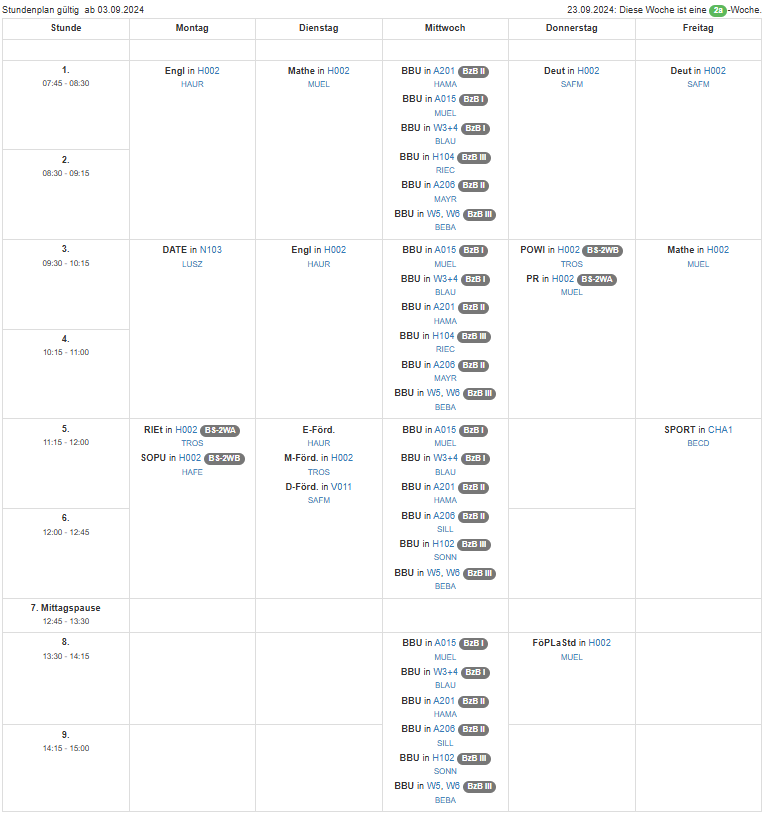

<!--
author: Jan Müller

titel: BzB Elternabend Schuljahr 24/25

icon: assets/BSO_LOGO_1.png

email:  Jan.Mueller4@schule.hessen.de

version:  0.1.0

language: Deutsch

narrator: Deutsch Female

comment: https://liascript.github.io/course/?https://raw.githubusercontent.com/JMueller-edu/SJ2425/main/MatheBzB.md

link:     https://cdn.jsdelivr.net/chartist.js/latest/chartist.min.css

link: https://fonts.googleapis.com/css2?family=Didact+Gothic&display=swap

script:   https://cdn.jsdelivr.net/chartist.js/latest/chartist.min.js

import: https://raw.githubusercontent.com/liaScript/mermaid_template/master/README.md


-->


# Elternabend 10BB2 Schuljahr 24/25


[Homepage der Schule](https://bso-mi.de/)

<div style="page-break-after: always;"></div>

## Ziel

>**§ 1 Aufgaben und Ziele**

>>Die Bildungsgänge zur Berufsvorbereitung sind Bestandteil der Berufsschule. Sie richten sich an Jugendliche ohne Berufsausbildungsverhältnis mit dem Ziel, Schülerinnen und Schülern den Übergang in die Berufsausbildung, in weiterführende Bildungsgänge oder in Arbeitsverhältnisse zu erleichtern. Schülerinnen und Schüler sollen qualifiziert werden, ihre eigenen Fähigkeiten und Berufschancen zu erkennen und ihre Zukunftsmöglichkeiten aktiv mitzugestalten.

[***Verordnung über die Ausbildung und Abschlussprüfungen in den Bildungsgängen zur Berufsvorbereitung Vom 10. August 2006***](assets/vo_bildungsgange_zur_berufsvorbereitung060915.pdf)

<div style="page-break-after: always;"></div>

## Stundenplan



[Live Stundenplan](https://terpsichore.webuntis.com/timetable-classes/5039/2024-09-23)

<div style="page-break-after: always;"></div>

## Termine 

```@mermaid
timeline
    title 1. Halbjahr 24/25
          1. Praktikum
          : 04.11. - 23.11.2024

          Notenkonferenz
          : ??
          : §14/1

          Zeugnisausgabe
          : 07.02.2025
          : §14/1
```


```@mermaid
timeline
     title 2. Halbjahr 24/25             
          Schnupper-/ Informationstag für Berufsfachschule
          : ??

          Prüfungsanmeldung
          : ??
          : §18

          2. Praktikum
          : 17.03. - 05.04.2025

          Vergleichsarbeiten
          : ??

          schriftliche Prüfung
          : ??
          : §19/4

          Projektprüfung 
          : ??
          : §22/1


          Bekanntgabe der Endnoten und Abschlüsse 
          : Freitag drei Wochen vor den Sommerferien.
          : §22/6 §23/12

          Zeugnisausgabe mit Abschlussfeier 
          : Freitag in der vorletzten Woche vor den Sommerferien
          : §19/5
```

[Termine Schuljahr 23/24](assets/BzB_Terminplan_2023-24.pdf)

<div style="page-break-after: always;"></div>

## Praktikum

**So findet man einen Praktikumsplatz**

Ob großes internationales Unternehmen oder Handwerksbetrieb in deiner Region: Mit der Jobsuche der Bundesagentur für Arbeit (BA) findest du tausende aktuelle Praktikumsstellen.

Gib den Ort und einen Beruf oder die Branche ein, in der du dein Praktikum machen möchtest:

[Praktikumsplätze in der Jobsuche](https://www.arbeitsagentur.de/jobsuche/suche?angebotsart=4&was=praktikum&id=10000-1196655870-S)

**Weitere Praktikumsbörsen**

Neben der Jobsuche gibt es noch weitere Möglichkeiten, mit denen du ein passendes Praktikum findest. Wähle zwischen Angeboten in deinem Bundesland, deutschlandweiten Praktikumssuchen oder Praktikumsbörsen für besondere Zielgruppen oder Berufe.

[siehe hier](https://www.arbeitsagentur.de/bildung/praktikum#praktikum-finden)

<div style="page-break-after: always;"></div>

## Kontakte

**Klassenlehrkraft:**

- E-Mail: jan.mueller4@schule.hessen.de

  - wenn Sie eine Telefonnummer hinterlassen rufe ich auch zurück.

**Sekretariat:**

- Telefon: 06061 951-0 

- E:Mail: sekretariat@bso-michelstadt.de


[E-Mail Lehrkräfte](https://bso-mi.de/wp-content/uploads/2023/10/Lehrerliste_091232.pdf)

<div style="page-break-after: always;"></div>

### Getränke für die Party


Du planst eine Party und möchtest genügend Getränke einkaufen. Pro Person werden **0,5 Liter Saft** benötigt, und du lädst **15 Personen** ein. Im Supermarkt gibt es den Saft entweder in **1,5-Liter-Flaschen** oder in **330-Milliliter-Dosen**.

**a) Wie viel Liter Saft brauchst du insgesamt?**

``` ascii
+---+---+---+---+---+---+---+---+---+---+---+---+---+---+---+---+---+---+---+---+---+---+---+---+---+---+---+---+---+---+
|   |   |   |   |   |   |   |   |   |   |   |   |   |   |   |   |   |   |   |   |   |   |   |   |   |   |   |   |   |   |
+---+---+---+---+---+---+---+---+---+---+---+---+---+---+---+---+---+---+---+---+---+---+---+---+---+---+---+---+---+---+
|   |   |   |   |   |   |   |   |   |   |   |   |   |   |   |   |   |   |   |   |   |   |   |   |   |   |   |   |   |   |
+---+---+---+---+---+---+---+---+---+---+---+---+---+---+---+---+---+---+---+---+---+---+---+---+---+---+---+---+---+---+
|   |   |   |   |   |   |   |   |   |   |   |   |   |   |   |   |   |   |   |   |   |   |   |   |   |   |   |   |   |   |
+---+---+---+---+---+---+---+---+---+---+---+---+---+---+---+---+---+---+---+---+---+---+---+---+---+---+---+---+---+---+
|   |   |   |   |   |   |   |   |   |   |   |   |   |   |   |   |   |   |   |   |   |   |   |   |   |   |   |   |   |   |
+---+---+---+---+---+---+---+---+---+---+---+---+---+---+---+---+---+---+---+---+---+---+---+---+---+---+---+---+---+---+
|   |   |   |   |   |   |   |   |   |   |   |   |   |   |   |   |   |   |   |   |   |   |   |   |   |   |   |   |   |   |
+---+---+---+---+---+---+---+---+---+---+---+---+---+---+---+---+---+---+---+---+---+---+---+---+---+---+---+---+---+---+
|   |   |   |   |   |   |   |   |   |   |   |   |   |   |   |   |   |   |   |   |   |   |   |   |   |   |   |   |   |   |
+---+---+---+---+---+---+---+---+---+---+---+---+---+---+---+---+---+---+---+---+---+---+---+---+---+---+---+---+---+---+
|   |   |   |   |   |   |   |   |   |   |   |   |   |   |   |   |   |   |   |   |   |   |   |   |   |   |   |   |   |   |
+---+---+---+---+---+---+---+---+---+---+---+---+---+---+---+---+---+---+---+---+---+---+---+---+---+---+---+---+---+---+
|   |   |   |   |   |   |   |   |   |   |   |   |   |   |   |   |   |   |   |   |   |   |   |   |   |   |   |   |   |   |
+---+---+---+---+---+---+---+---+---+---+---+---+---+---+---+---+---+---+---+---+---+---+---+---+---+---+---+---+---+---+
|   |   |   |   |   |   |   |   |   |   |   |   |   |   |   |   |   |   |   |   |   |   |   |   |   |   |   |   |   |   |
+---+---+---+---+---+---+---+---+---+---+---+---+---+---+---+---+---+---+---+---+---+---+---+---+---+---+---+---+---+---+
|   |   |   |   |   |   |   |   |   |   |   |   |   |   |   |   |   |   |   |   |   |   |   |   |   |   |   |   |   |   |
+---+---+---+---+---+---+---+---+---+---+---+---+---+---+---+---+---+---+---+---+---+---+---+---+---+---+---+---+---+---+
|   |   |   |   |   |   |   |   |   |   |   |   |   |   |   |   |   |   |   |   |   |   |   |   |   |   |   |   |   |   |
+---+---+---+---+---+---+---+---+---+---+---+---+---+---+---+---+---+---+---+---+---+---+---+---+---+---+---+---+---+---+
|   |   |   |   |   |   |   |   |   |   |   |   |   |   |   |   |   |   |   |   |   |   |   |   |   |   |   |   |   |   |
+---+---+---+---+---+---+---+---+---+---+---+---+---+---+---+---+---+---+---+---+---+---+---+---+---+---+---+---+---+---+
|   |   |   |   |   |   |   |   |   |   |   |   |   |   |   |   |   |   |   |   |   |   |   |   |   |   |   |   |   |   |
+---+---+---+---+---+---+---+---+---+---+---+---+---+---+---+---+---+---+---+---+---+---+---+---+---+---+---+---+---+---+
|   |   |   |   |   |   |   |   |   |   |   |   |   |   |   |   |   |   |   |   |   |   |   |   |   |   |   |   |   |   |
+---+---+---+---+---+---+---+---+---+---+---+---+---+---+---+---+---+---+---+---+---+---+---+---+---+---+---+---+---+---+
```
Es werden insgesamt **[[ 7,5 ]] Liter Saft** benötigt.
[[?]] Jeder Gast trinkt **0,5 Liter Saft**
*************************************************************
**Berechnung der insgesamt benötigten Saftmenge**  

- **Wissen:** Jeder Gast trinkt **0,5 Liter Saft**.  

- **Berechnung:**  

$$
\begin{aligned}
\text{Gesamte Saftmenge in Litern} &= \text{Anzahl der Personen} \times \text{Menge pro Person} \\
\text{Gesamte Saftmenge in Litern} &= 15 \times 0,5 \, \text{l} \\
\text{Gesamte Saftmenge in Litern} &= 7,5 \, \text{l}
\end{aligned}
$$  

**Ergebnis:** Es werden insgesamt **7,5 Liter Saft** benötigt. 
*************************************************************

---

**b) Wie viele **1,5-Liter-Flaschen** musst du kaufen?**

``` ascii
+---+---+---+---+---+---+---+---+---+---+---+---+---+---+---+---+---+---+---+---+---+---+---+---+---+---+---+---+---+---+
|   |   |   |   |   |   |   |   |   |   |   |   |   |   |   |   |   |   |   |   |   |   |   |   |   |   |   |   |   |   |
+---+---+---+---+---+---+---+---+---+---+---+---+---+---+---+---+---+---+---+---+---+---+---+---+---+---+---+---+---+---+
|   |   |   |   |   |   |   |   |   |   |   |   |   |   |   |   |   |   |   |   |   |   |   |   |   |   |   |   |   |   |
+---+---+---+---+---+---+---+---+---+---+---+---+---+---+---+---+---+---+---+---+---+---+---+---+---+---+---+---+---+---+
|   |   |   |   |   |   |   |   |   |   |   |   |   |   |   |   |   |   |   |   |   |   |   |   |   |   |   |   |   |   |
+---+---+---+---+---+---+---+---+---+---+---+---+---+---+---+---+---+---+---+---+---+---+---+---+---+---+---+---+---+---+
|   |   |   |   |   |   |   |   |   |   |   |   |   |   |   |   |   |   |   |   |   |   |   |   |   |   |   |   |   |   |
+---+---+---+---+---+---+---+---+---+---+---+---+---+---+---+---+---+---+---+---+---+---+---+---+---+---+---+---+---+---+
|   |   |   |   |   |   |   |   |   |   |   |   |   |   |   |   |   |   |   |   |   |   |   |   |   |   |   |   |   |   |
+---+---+---+---+---+---+---+---+---+---+---+---+---+---+---+---+---+---+---+---+---+---+---+---+---+---+---+---+---+---+
|   |   |   |   |   |   |   |   |   |   |   |   |   |   |   |   |   |   |   |   |   |   |   |   |   |   |   |   |   |   |
+---+---+---+---+---+---+---+---+---+---+---+---+---+---+---+---+---+---+---+---+---+---+---+---+---+---+---+---+---+---+
|   |   |   |   |   |   |   |   |   |   |   |   |   |   |   |   |   |   |   |   |   |   |   |   |   |   |   |   |   |   |
+---+---+---+---+---+---+---+---+---+---+---+---+---+---+---+---+---+---+---+---+---+---+---+---+---+---+---+---+---+---+
|   |   |   |   |   |   |   |   |   |   |   |   |   |   |   |   |   |   |   |   |   |   |   |   |   |   |   |   |   |   |
+---+---+---+---+---+---+---+---+---+---+---+---+---+---+---+---+---+---+---+---+---+---+---+---+---+---+---+---+---+---+
|   |   |   |   |   |   |   |   |   |   |   |   |   |   |   |   |   |   |   |   |   |   |   |   |   |   |   |   |   |   |
+---+---+---+---+---+---+---+---+---+---+---+---+---+---+---+---+---+---+---+---+---+---+---+---+---+---+---+---+---+---+
|   |   |   |   |   |   |   |   |   |   |   |   |   |   |   |   |   |   |   |   |   |   |   |   |   |   |   |   |   |   |
+---+---+---+---+---+---+---+---+---+---+---+---+---+---+---+---+---+---+---+---+---+---+---+---+---+---+---+---+---+---+
|   |   |   |   |   |   |   |   |   |   |   |   |   |   |   |   |   |   |   |   |   |   |   |   |   |   |   |   |   |   |
+---+---+---+---+---+---+---+---+---+---+---+---+---+---+---+---+---+---+---+---+---+---+---+---+---+---+---+---+---+---+
|   |   |   |   |   |   |   |   |   |   |   |   |   |   |   |   |   |   |   |   |   |   |   |   |   |   |   |   |   |   |
+---+---+---+---+---+---+---+---+---+---+---+---+---+---+---+---+---+---+---+---+---+---+---+---+---+---+---+---+---+---+
|   |   |   |   |   |   |   |   |   |   |   |   |   |   |   |   |   |   |   |   |   |   |   |   |   |   |   |   |   |   |
+---+---+---+---+---+---+---+---+---+---+---+---+---+---+---+---+---+---+---+---+---+---+---+---+---+---+---+---+---+---+
|   |   |   |   |   |   |   |   |   |   |   |   |   |   |   |   |   |   |   |   |   |   |   |   |   |   |   |   |   |   |
+---+---+---+---+---+---+---+---+---+---+---+---+---+---+---+---+---+---+---+---+---+---+---+---+---+---+---+---+---+---+
```
Du musst **[[ 5 ]] Flaschen à 1,5 Liter** kaufen
[[?]] Eine Flasche enthält **1,5 Liter**.
*************************************************************
**Anzahl der 1,5-Liter-Flaschen**  

- **Wissen:** Eine Flasche enthält **1,5 Liter**. 
 
- **Berechnung:**  

$$
\begin{aligned}
\text{Anzahl der Flaschen} &= \frac{\text{Gesamte Saftmenge in Litern}}{\text{Inhalt einer Flasche in Litern}} \\
\text{Anzahl der Flaschen} &= \frac{7,5 \, \text{l}}{1,5 \, \text{l}} \\
\text{Anzahl der Flaschen} &= 5
\end{aligned}
$$  

**Ergebnis:** Du musst **5 Flaschen à 1,5 Liter** kaufen.
*************************************************************

---

**c) Wie viele **330-Milliliter-Dosen** musst du kaufen?**

``` ascii
+---+---+---+---+---+---+---+---+---+---+---+---+---+---+---+---+---+---+---+---+---+---+---+---+---+---+---+---+---+---+
|   |   |   |   |   |   |   |   |   |   |   |   |   |   |   |   |   |   |   |   |   |   |   |   |   |   |   |   |   |   |
+---+---+---+---+---+---+---+---+---+---+---+---+---+---+---+---+---+---+---+---+---+---+---+---+---+---+---+---+---+---+
|   |   |   |   |   |   |   |   |   |   |   |   |   |   |   |   |   |   |   |   |   |   |   |   |   |   |   |   |   |   |
+---+---+---+---+---+---+---+---+---+---+---+---+---+---+---+---+---+---+---+---+---+---+---+---+---+---+---+---+---+---+
|   |   |   |   |   |   |   |   |   |   |   |   |   |   |   |   |   |   |   |   |   |   |   |   |   |   |   |   |   |   |
+---+---+---+---+---+---+---+---+---+---+---+---+---+---+---+---+---+---+---+---+---+---+---+---+---+---+---+---+---+---+
|   |   |   |   |   |   |   |   |   |   |   |   |   |   |   |   |   |   |   |   |   |   |   |   |   |   |   |   |   |   |
+---+---+---+---+---+---+---+---+---+---+---+---+---+---+---+---+---+---+---+---+---+---+---+---+---+---+---+---+---+---+
|   |   |   |   |   |   |   |   |   |   |   |   |   |   |   |   |   |   |   |   |   |   |   |   |   |   |   |   |   |   |
+---+---+---+---+---+---+---+---+---+---+---+---+---+---+---+---+---+---+---+---+---+---+---+---+---+---+---+---+---+---+
|   |   |   |   |   |   |   |   |   |   |   |   |   |   |   |   |   |   |   |   |   |   |   |   |   |   |   |   |   |   |
+---+---+---+---+---+---+---+---+---+---+---+---+---+---+---+---+---+---+---+---+---+---+---+---+---+---+---+---+---+---+
|   |   |   |   |   |   |   |   |   |   |   |   |   |   |   |   |   |   |   |   |   |   |   |   |   |   |   |   |   |   |
+---+---+---+---+---+---+---+---+---+---+---+---+---+---+---+---+---+---+---+---+---+---+---+---+---+---+---+---+---+---+
|   |   |   |   |   |   |   |   |   |   |   |   |   |   |   |   |   |   |   |   |   |   |   |   |   |   |   |   |   |   |
+---+---+---+---+---+---+---+---+---+---+---+---+---+---+---+---+---+---+---+---+---+---+---+---+---+---+---+---+---+---+
|   |   |   |   |   |   |   |   |   |   |   |   |   |   |   |   |   |   |   |   |   |   |   |   |   |   |   |   |   |   |
+---+---+---+---+---+---+---+---+---+---+---+---+---+---+---+---+---+---+---+---+---+---+---+---+---+---+---+---+---+---+
|   |   |   |   |   |   |   |   |   |   |   |   |   |   |   |   |   |   |   |   |   |   |   |   |   |   |   |   |   |   |
+---+---+---+---+---+---+---+---+---+---+---+---+---+---+---+---+---+---+---+---+---+---+---+---+---+---+---+---+---+---+
|   |   |   |   |   |   |   |   |   |   |   |   |   |   |   |   |   |   |   |   |   |   |   |   |   |   |   |   |   |   |
+---+---+---+---+---+---+---+---+---+---+---+---+---+---+---+---+---+---+---+---+---+---+---+---+---+---+---+---+---+---+
|   |   |   |   |   |   |   |   |   |   |   |   |   |   |   |   |   |   |   |   |   |   |   |   |   |   |   |   |   |   |
+---+---+---+---+---+---+---+---+---+---+---+---+---+---+---+---+---+---+---+---+---+---+---+---+---+---+---+---+---+---+
|   |   |   |   |   |   |   |   |   |   |   |   |   |   |   |   |   |   |   |   |   |   |   |   |   |   |   |   |   |   |
+---+---+---+---+---+---+---+---+---+---+---+---+---+---+---+---+---+---+---+---+---+---+---+---+---+---+---+---+---+---+
|   |   |   |   |   |   |   |   |   |   |   |   |   |   |   |   |   |   |   |   |   |   |   |   |   |   |   |   |   |   |
+---+---+---+---+---+---+---+---+---+---+---+---+---+---+---+---+---+---+---+---+---+---+---+---+---+---+---+---+---+---+
```
Aufgerundet benötigst du **[[ 23 ]] Dosen**.
[[?]]Eine Dose enthält **330 Milliliter (ml)**. Zuerst wandle die benötigte Menge in **Milliliter** um, dann teile durch das Dosenvolumen.
*************************************************************
 **Anzahl der 330-Milliliter-Dosen**  

- **Wissen:** Eine Dose enthält **330 Milliliter (ml)**. Zuerst wandle die benötigte Menge in **Milliliter** um, dann teile durch das Dosenvolumen.  

- **Berechnung:**  

$$
\begin{aligned}
\text{Gesamte Saftmenge in Millilitern} &= \text{Gesamte Saftmenge in Litern} \times 1.000 \\
\text{Gesamte Saftmenge in Millilitern} &= 7,5 \, \text{l} \times 1.000 \, \text{ml/l} \\
\text{Gesamte Saftmenge in Millilitern} &= 7.500 \, \text{ml}
\end{aligned}
$$  

$$
\begin{aligned}
\text{Anzahl der Dosen} &= \frac{\text{Gesamte Saftmenge in Millilitern}}{\text{Inhalt einer Dose in Millilitern}} \\
\text{Anzahl der Dosen} &= \frac{7.500 \, \text{ml}}{330 \, \text{ml}} \\
\text{Anzahl der Dosen} &\approx 22,73 \, \text{Dosen}
\end{aligned}
$$  

Aufgerundet benötigst du **23 Dosen**.  
*************************************************************
### Embed HTML
??[embed html](assets/12BFITLF14Klausur1HJ2425.html)
